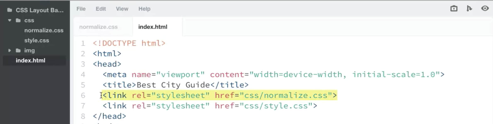

# CSS Layout

CSS reset method: normalize.css, help create cross-browser compatibility.



---

Giving the wrapper a width prevents the layout from stretching too wide. Setting the left and right margins to the value auto centers the wrapper in the browser.

One advantage to using \<body> as the wrapper is that you don’t have to add an extra \<div> in your markup to contain your layout.

If you want to give your page a full background color or image, you'll need to apply it to the \<html> element, and you can't place any elements outside of the \<body>.

Using a wrapper \<div> is more appropriate if your site has elements that need to be placed outside the wrapper.

---

If there is no content, padding, or border area to interrupt two touching margins, the margins collapse to the largest of the two margin values.

You may experience margins collapsing in adjacent elements like paragraphs and divs.

If a div's bottom margin is larger than the top margin of the div below it, the margin area between the divs collapses to the largest of the two margin values.

---

Depending on your design, you may want the header and footer in your layout to stretch from edge to edge of the browser so the left and right sides won't appear cut off.

One approach is to create a wrapper the main content and an inner wrapper for the content inside the header and footer.

You can leave 'outer' elements like the header and footer at their default 100% width.

It's common to have more than one wrapper on a page and even to have containers inside of containers.

---

Mobile layouts are usually simple one column layouts.

When you use a mobile-first layout approach, you define all the common layout styles before adding any media queries.

box-sizing: border-box; forces any padding and borders into the width and height of an element instead of expanding it.

---

If a page’s content is shorter than the height of the browser, the page may display a big, undesirable gap between the bottom of the viewport and the footer. In the markup, add a new \<div> that wraps the header and main container elements.

```css
<div class="wrap">
  <div class="main-header">
    <div class="container">
      ...
    </div>
  </div>

  <div class="container">
    ...
  </div>
</div> <!-- /.wrap -->
```

vh: viewport relative unit, view height

Use calc() to write a mathematical expression that will subtract the footer height from the viewport's total height.

```css
.wrap {
  min-height: calc(100vh - 89px);
}
```

---

Inline elements, like images, links and span tags, do not create line breaks in a layout; they appear on the same line as the content and elements beside them.

Block-level elements, like divs, paragraphs and headings, stack on top of each other and expand to fill their parent.

The browser does not apply width and height properties, or top and bottom margin settings to inline elements.

An inline element will only accept left/right margins and any padding value.

---

The display value inline-block generates an element that's like a block element but it's also flowed with surroundings as if it were an inline element.

Setting an \<a> element's display value to block lets you apply top and bottom padding values.

Note: When you lay out multiple elements side-by-side with inline-block display, the vertical alignment might look different if the elements have varying heights. For example, you may notice that some elements are vertically aligned to the bottom, while others are aligned to the top edge of their parent.

One way to adjust the alignment of an inline-block element is using the vertical-align property:

```css
.item {
  ... vertical-align: top;
}

.item-two {
  ... vertical-align: bottom;
}
```

---

Remove Gaps Between Inline and Inline-Block Elements

When working with elements set to display: inline, or display: inline-block, you may notice whitespace (or gaps) between each element.

For example, the navigation list items displayed inline-block appear to have small, un-clickable gaps between each item.


The browser adds default whitespace because it interprets the line breaks and spaces in the HTML as content. For example, words in a paragraph are inline with each other and have spaces before and after them. The browser adds spaces between inline and inline-block items just like it adds spaces between words.

To better demonstrate, place the closing \</li> and opening \<li> tags of the .main-nav list next to each other in the markup, like so:

```css
<ul class="main-nav">
  <li><a href="#">ice cream</a></li><li>
  <a href="#">donuts</a></li><li>
  <a href="#">tea</a></li><li>
  <a href="#">coffee</a></li>
</ul>
```

The gaps disappear because you've manually deleted the spaces between the closing and opening \<li> tags.

This is a valid technique for removing the gaps. However, writing your HTML this way can be difficult (and non-intuitive) to read and maintain.

---

Remove the Gaps with CSS

If you choose to remove the gaps from your design, there are two common CSS techniques you can use: a negative margin or zero out the parent element's font-size value.

Negative Margin

Apply a small negative margin to the elements. For example, 5 pixels:

```css
.main-nav li {
  margin-right: -5px;
}
```

This method "undoes" the default whitespace. The negative margin pulls the list items towards each other to close the gaps.

The parent element's font-size affects the size of the gaps between inline and inline-block elements -- the larger the font size, the more you'll need to increase the negative margin value. Because of this, specifying the margin value in em units is more flexible because the margin would automatically adjust to any font-size changes:

```css
.main-nav li {
  margin-right: -0.3125em; /* 5px */
}
```

"Zero Out" Parent Element Font Size

As mentioned in the example above, the size of the character spaces (or gaps) between inline and inline-block elements is determined by the parent element's font-size value.

In this case, the parent element is the \<ul> with the class main-nav. Setting the font-size of the parent to 0 also makes the size of the character spaces 0:

```css
.main-nav {
  font-size: 0;
}
```

With this approach, you'll need to reset the font-size value of the inline or inline-block child elements back to your desired size. For example:

```css
.main-nav {
  font-size: 0;
}

.main-nav li {
  font-size: 1rem; /* root element font size */
}
```

You'll often add more space between navigation links to create a clear visual separation between the links. For instance:

```css
.main-nav li {
  margin-right: 12px;
}
```

---

By default, browsers display elements in the order they appear in the HTML source code. This order is called the normal document flow.

Elements in the normal document flow are either block or inline; they appear stacked on top of each other or on the same line as the content and elements beside them.

When you apply a float to an element, the element gets taken out of the normal document flow and shifted to the left or right side of its container.

Any content next to the float flows -- or wraps -- around its left or right side.

---

The float property accepts the values left, right, and none.

A floated element is technically a block-level element (it accepts any width, height, padding or margins values), but it behaves like an inline element because it doesn't exist on a line of its own, and surrounding content flows around it.

If you’re ever curious about how your floated layout actually works, apply a dark border or background to the elements to see what’s going on behind the scenes.

---

With floats, we don't have to worry about the the extra whitespace that can appear when using inline or inline-block display.

Floated elements will sit adjacent to each other regardless of the HTML whitespace between them.

If a block-level element contains floated elements, its height collapses.

---

A parent container with floated elements may not always collapse to no height at all; if the container includes a padding or height value, it'll have some visible height.

There are a two common ways to force a collapsed element to expand to the full height of its floated child elements:

1. Setting the parent element's overflow value to hidden or auto

2. Clearing the floats with a CSS pseudo-element

A clearfix fixes the collapsing issue by forcing a container to expand and contain the floated elements.

```css
/*::after means pseudo element */
.clearfix::after {
  content: ""; /*generate a blank pseudo element after an element from within the CSS*/
  display: table; /*display pseudo element as a block level table*/
  clear: both; /*both: clear collapsed space created by floats on both side of container*/
}
/*it moves non-floating element below all floated elements, prevents the container's height from collapsing*/
```

---

Gutters

In web design, the spaces between columns are called gutters. Developers create gutters using padding, like so:

```css
.col {
  padding-right: 1em;
  padding-left: 1em;
}
```

Or margins:

```css
.col {
  margin-right: 1em;
  margin-left: 1em;
}
```

Column layout tips

To add a left gutter to all but the first column, you can use this:

```css
.col + .col {
  padding-left: 1em;
}
```

To remove the right gutter from the column closest to the right edge of the page, use :last-child

```css
.col:last-child {
  padding-right: 0;
}
```

Bringing it all together

This snippet floats all columns left and applies a right gutter. It applies a left gutter to all but the first column, so the first column will be flush with the left margin of the page. Then it removes the right gutter from last column, so that it's flush with the right margin of the page.

```css
.col {
  float: left;
  padding-right: 1em;
}

.col + .col {
  padding-left: 1em;
}

.col:last-child {
  padding-right: 0;
}
```

You can also apply a gutter using just a left padding or margin value, like this:

```css
.col {
  float: left;
}

.col + .col {
  padding-left: 1.5em;
}
```

Use inline-block to lay out navigation items side by side or create a simple two-column layout

Use inline-block when you need control over center and vertical alignment

Use floats to flow content along the left or right side of an element

Floats do not create default horizontal white space between elements

Be aware of collapsing containers

---

Elements with absolute positioning are neither affected by or do not affect other elements in the normal flow of the page.

They are like layers in Photoshop or Illustrator; you're free to place them anywhere you wish on the page.

Positioned elements rely on you telling the browser where to place them, using values called positioning offsets, for the element's top, right, bottom or left position.

When you use absolute positioning, you place the absolutely positioned elements in relation to a parent container; the parent container is the positioning context.

You can change the positioning context to other containing elements; this lets us position elements precisely where we want them.

---

Absolute and relative positioning work hand in hand.

An element with relative positioning gives you the control to absolutely position elements anywhere inside it.

An element with absolute positioning is always relative to the first parent that has a relative position.

If no parent element has a relative position, the browser viewport is the positioning context by default.

---

When you position elements with offset values, a negative offset value moves the element in the opposite direction.

Instead of moving the positioned element away from the top, right, bottom or left edges of its relative container, a negative value it moves it towards the top, right, bottom or left edges.

It's best to practice using different positioning offsets and relative containers to see how it affects your layout.

```css
figcaption {
  position: absolute;
  top: 0;
  width: 100%;
}
```

---

Unlike absolute positioning, an element with fixed positioning stays fixed to one spot on the page, regardless of the size of the browser window.

Fixed headers and navigation bars are common in web design. For example, the navigation bar on Twitter.

Fixed positioning is always relative to the browser's viewport. Like absolute positioning, you determine the fixed spot using offset values.

When you use relative, absolute or fixed positioning on elements, you may end up with several elements occupying the same space. This can make elements overlap or completely cover up other elements from view.

```css
body {
  padding-top: 68px;
}
.main-header {
  position: fixed;
  background: #fff;
  box-shadow: 0 1px 4px rgba(0, 0, 0, 0.4);
  width: 100%;
  top: 0;
}
```

---

Positioned elements follow a stacking order that determines which elements display above or below other elements.

By default, the stacking order of positioned elements is the order they appear in the source code.

Elements appearing later in the code sit on top on elements appearing earlier in the code.

The z-index property is directly related to stacking order and it's what prevents elements from overlapping other elements.

An element with a higher z-index value overlaps an element with a lower z-index value.

Positioned elements have a z-index of 0 by default.

z-index works only on elements with a position property set to absolute, fixed, or relative.

If you set a z-index on an element with no position, it will do nothing.
