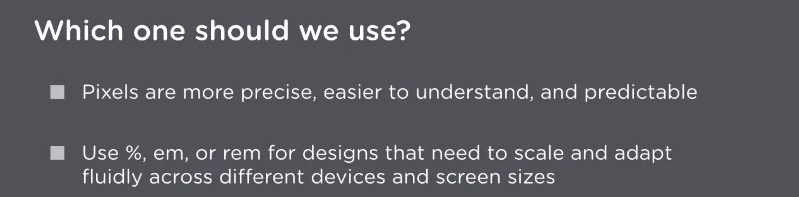
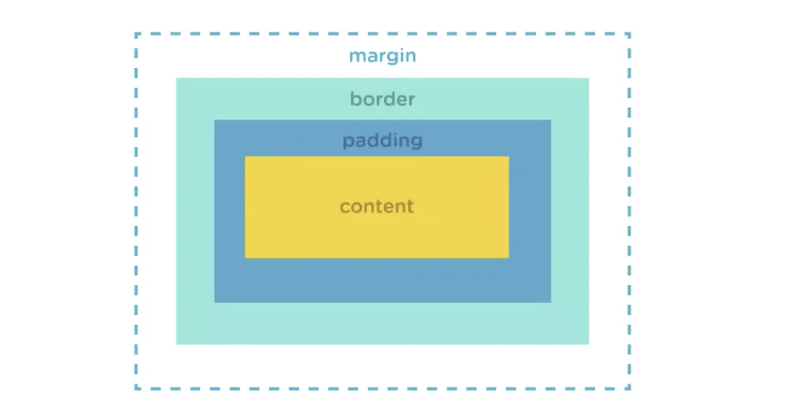

# CSS Basic

```html
<head>
  <title>title</title>
  <link rel="stylesheet" href="path" />
  <style>
    @import "path";
  </style>
</head>
```

```md
universal selector \* {} - select every element, overrides other selectors.
type selector - select an element type.
id/class selector #/. {}
descendant selector
pseudo-class selector
attribute selector
```

```css
/*CSS comment*/
rgba(255, 255, 255, .5)
```

data type: type of CSS value



1em is equal to the font-size value of the parent element.

rem: only relative to root element(html)

text-align:
Let's us control the horizontal alignment of text.

text-transform:
Changes the case of text – whether it's uppercase, lowercase, or capitalized.

text-decoration:
Sets the line decoration of elements. We'll commonly use this property to remove underlines in links.

font-weight:
Sets how thick or thin the characters are displayed.

CSS font stacks: are prioritized lists of fonts that the browser will cycle through until it finds a font that is installed on the user’s system.

font-family:
Defines a typeface for our text.

font-style:
Allows italic or oblique faces to be selected within a font family.

use the line-height property in the body element to set the overall line-height of the page. Defines the verticle spacing between lines of text.

For example:

```css
body {
  line-height: 1.5;
}
```

The browser multiplies the font size of each element by 1.5 to determine their line height.

font
A shorthand property that lets us write all the font properties in one value.

```css
body {
  font: normal 1em/1.5 "Helvetica Neue", Helvetica, Arial, sans-serif;
}
```


box-model

```css
.wildlife {
  padding: 100px 120px 50px 20px;
  margin: 105px 0 60px 0; /* auto */
}
```

The order of the values is: Top, Right, Bottom, Left. Think clockwise.

border-width:
Sets the width of a border.

border-style:
Sets the style of the element’s borders.

border-color:
Sets the color of a border.

border:
Shorthand property for setting the individual border property values in one place.

display:
none, block, inline(can't use margin), inline-block(can use margin)

width, height: just define the width for the content area

box-sizing:
Alters the default CSS box model used to calculate widths and heights of elements.

```css
width: 850px;
padding-right: 50px;
box-sizing: border-box;
/*force padding & border into the width & height of the element instead of expanding it*/
```

max-width:
Sets the maximum width of an element. It prevents the used value of the width property from becoming larger than the value set for max-width.

background-image:
Sets one or several background images for an element.

background-size:
Sets the size of a background image.

background-repeat:
Controls whether or not the image is tiled and how it gets tiled both vertically and horizontally. The value repeat-y repeats the image vertically, while repeat-x repeats the background image horizontally.

background-position:
Controls the background position of a background image. Relative to height & width of the background area.

background:
Shorthand for setting the individual background values in one place.

cover:
The cover value adjusts the background area so that it's completely covered by the background image, while maintaining its width and height proportions:

```css
.main-header {
  background-image: url("../img/mountains.jpg");
  background-size: cover;

  background: orange url("../img/mountains.jpg") no-repeat center / cover;
}
```

Floats are one of the most commonly used methods for laying out a page with CSS. When an element is floated, the element is taken out of the normal flow of the page and placed along the left or right side of its container.

The following will float an element over to the right side of its container:

```css
.tips {
  float: right;
}
```

The following will place the element along the left side of its container:

```css
.tips {
  float: left;
}
```

if block element contains floated children, it's height will collapse.

To clearing floats:

```css
.secondary-content {
  overflow: auto; /*may cause scroll bars appear*/
}
/*Float Clearfix*/
.group:after {
  content: "";
  display: table;
  clear: both; /*clear any collapsed space created by floats on both sides of the container*/
}
/*it generate blank pseudo-element after content of div, with the class group*/
```

list-style-type:
Sets the appearance of a list item.

list-style-position:
Sets the position of a list marker in a list item. By default, the browser displays the list markers outside the list items.

list-style:
The shorthand property for setting list-style-type, list-style-image and list-style-position.

---

The text-shadow property accepts three length unit values followed by a color value:

```css
h1 {
  text-shadow: 2px 2px 1px #222;
}
```

The first value sets the horizontal offset of the shadow. The second value sets the vertical offset. The third is an optional value that sets the blur radius of the shadow. The fourth value is the color value.

---

The order of values for box-shadow is exactly like the order of values for the text-shadow property:

```css
.wildlife {
  box-shadow: 15px 15px 10px 20px rgba(0, 0, 0, 0.8);
}
```

The first value sets the horizontal offset of the shadow. The second value sets the vertical offset. The last value sets the color of the box shadow.

The optional third value defines the blur radius in a box shadow. The optional fourth value defines the spread distance of a box shadow.

Inner shadows:
By default, box shadows are created as drop shadows outside of the element. To create an inner shadow, we can add the keyword value inset:

```css
.wildlife {
  box-shadow: inset 0 0 50px 10px rgba(0, 0, 0, 1);
}
```

Multiple values:
Just like the text-shadow property you can use multiple box-shadow values separated with a comma like so:

```css
.wildlife {
  box-shadow: 15px 15px 10px 20px rgba(0, 0, 0, 0.8), inset 0 0 50px 10px rgba(0, 0, 0, 1);
}
```

---

The border-radius property is the shorthand property for:

```css
.box {
  border-top-left-radius: 20px;
  border-top-right-radius: 10px;
  border-bottom-right-radius: 20px;
  border-bottom-left-radius: 10px;
}
```

So, instead of writing each declaration, we can simply use the border-radius property to define the curve of each corner:

```css
.box {
  border-radius: 20px 10px 20px 10px;
}
```

The top-left and bottom-right values are the same, and the top-right and bottom-left value are as well. So we can shorten this further:

```css
.box {
  border-radius: 20px 10px;
}
```

If we want to set an even border-radius for each side, we'll simply need to define one value:

```css
.box {
  border-radius: 20px;
}
```

---

```css
@font-face {
  font-family: "My Webfont";
  src: url("my-webfont.woff") format("woff"), url("my-webfont.ttf") format("truetype");
}
```

letter-spacing

media queries:

```css
@media (max-width: 960px) {
  body {
    background: royalblue;
  }
}
```

```css
/*Using the viewport meta tag to control layout on mobile browsers*/
<head>
    <meta name="viewport" content="width=device-width">
    /*The width property controls the size of the viewport.*/
</head>
```

cascade is what determines which styles are assigned to an element.
