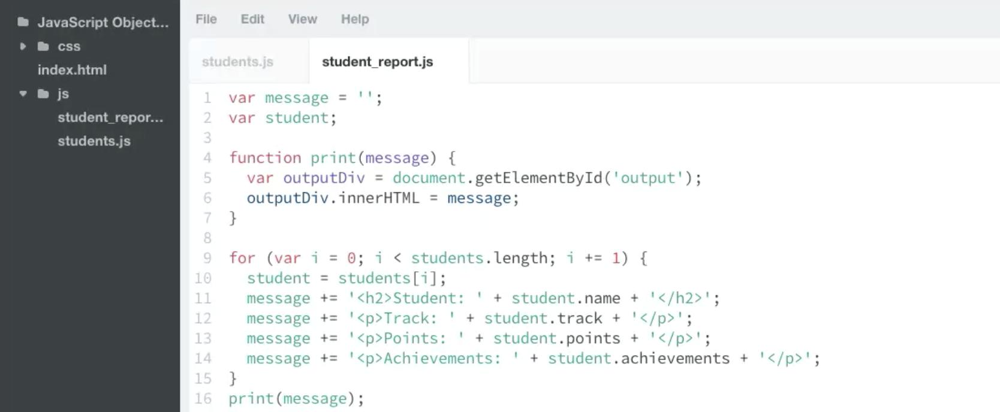

# JS Basics

```js
alert("Hello. Thanks for visiting!");
console.log("Hello from the console.");
document.write("<h1>Welcome to my web page.</h1>");
var firstName = prompt("first name?");
```

JS Engine: A program (or interpreter) built into the browser that execute JS code.

```md
<script src="js/script.js"></script>

// link to near the bottom of the html page
```

Browsers run JavaScript code as soon as they encounter it. Putting the code after the page content assures that the page will display before the program runs.

In JS, strings are not only type of data, they're also objects that have properties (ex: length). property is like variable that store value.

methods can use on object (ex: toUpperCase()).

```js
const name = prompt("Hi");
```

string concatenation: the process of combining two or more strings into a single string.

template literal: interpolation

```js
const name = prompt("name?");
const message = `<h2>Hello, ${name}.
It's ${2 * 3} o'clock.</h2>`;

document.querySelector("main").innerHTML = message;

/*
document is a built in object, querySelector is a method that access main element in index.html file, innerHTML is a property that replace the existing contents of an element with new content.
*/
```

unary plus opreator

Example: loop that runs 10 times

```js
var counter = 1;
while (counter <= 10) {
  console.log(counter);
  counter += 1;
}
```

```js
function randomNumber(upper) {
  return Math.floor(Math.random() * upper) + 1;
}
let counter = 0;
while (counter < 10) {
  let randNum = randomNumber(6);
  document.write(randNum + " ");
  counter += 1;
}
```

```js
let upper = 10000;
let randomNumber = getRandomNumber(upper);
let guess;
let attempts = 0;

function getRandomNumber(upper) {
  return Math.floor(Math.random() * upper) + 1;
}

while (guess !== randomNumber) {
  guess = getRandomNumber(upper);
  attempts += 1;
}
document.write(`<p>random number: ${randomNumber}, guest counts: ${attempts}`);
```

```js
let randomNumber = getRandomNumber(10);
let guess;
let guessCount = 0;
let correctGuess = false;

function getRandomNumber(upper) {
  let num = Math.floor(Math.random() * upper) + 1;
  return num;
}

do {
  guess = prompt("number?");
  guessCount += 1;
  if (parseInt(guess) === randomNumber) {
    correctGuess = true;
  }
} while (!correctGuess);
document.write(`guess count: ${guessCount}, number: ${randomNumber}`);
```

```js
let html = "";
for (let i = 1; i <= 10; i += 1) {
  html += `<div>${i}</div>`;
}
document.write(html);
```

The break statement

```js
while (true) {
  // this is an endless loop
  break;
  // but break, lets you "break out" of the loop
}
```

```js
let html = "";
let red;
let green;
let blue;
let rgbColor;

red = Math.floor(Math.random() * 256);
green = Math.floor(Math.random() * 256);
blue = Math.floor(Math.random() * 256);
rgbColor = `rgb(${red},${green},${blue})`;
html += `<div style="background-color: ${rgbColor}"></div>`;

document.write(html);
```

---

Add items to the end of an array with .push()

```js
var items = ["Hat", "Ball", "Shoes"];
items.push("Socks", "Scarf");
// items is now ['Hat', 'Ball', 'Shoes', 'Socks', 'Scarf']
```

Add items to the beginning of an array with .unshift()

```js
var items = ["Hat", "Ball", "Shoes"];
items.unshift("Socks", "Scarf");
// items is now ['Socks', 'Scarf', 'Hat', 'Ball', 'Shoes']
```

Remove the First Item from an array with .shift()

```js
var items = ["Hat", "Ball", "Shoes"];
var firstItem = items.shift();
// firstItem now holds 'Hat'
// and items is now ['Ball', 'Shoes']
```

Remove the Last Item from an array with .pop()

```js
var items = ["Hat", "Ball", "Shoes"];
var lastItem = items.pop();
// lastItem now holds 'Shoes'
// and items is now ['Hat', 'Ball']
```

```js
function print(message) {
  document.write(message);
}

function printList(list) {
  let listHTML = "<ol>";
  for (let i = 0; i < list.length; i++) {
    listHTML += `<li> ${list[i]} </li>`;
  }
  listHTML += `</ol>`;
  print(listHTML);
}
printList(playList);
```

join()

concat()

indexOf()

two dimensional array

```js
let questionList = [["q1", "a1"], ["q2", "a2"], ["q3", "a3"]];
let userAnswer;
let correct = [];
let wrong = [];
let correctNum = 0;
let wrongNum = 0;
let html;

function print(message) {
  document.getElementById("output").innerHTML = message;
  // document.querySelector("div").innerHTML = message;
  // document.write(message);
}

function buildList(arr) {
  let listHTML = `<ol>`;
  for (let i = 0; i < arr.length; i++) {
    listHTML += `<li> ${arr[i]} </li>`;
  }
  listHTML += `</ol>`;
  return listHTML;
}

function question(question) {
  for (let i = 0; i < question.length; i++) {
    userAnswer = prompt(`${question[i][0]}`);
    if (userAnswer === question[i][1]) {
      correct.push(question[i]);
      correctNum += 1;
    } else {
      wrong.push(question[i]);
      wrongNum += 1;
    }
  }

  html = `
    You got ${correctNum} questions right
    <h2>Correct: </h2>
    ${buildList(correct)}
    You got ${wrongNum} questions wrong
    <h2>Wrong: </h2>
    ${buildList(wrong)}
  `;

  print(html);
}

question(questionList);
```

---

Using for in to Loop Through an Object's Properties

```js
for (var prop in person) {
  console.log(prop, ": ", person[prop]);
}
// only bracket notation will work
```

---

Using const with Arrays and Objects

When working with numbers, strings, and booleans, you learned that you could not change (or manipulate) the value of a constant through reassignment. The same goes for any value of a constant variable. You cannot reassign objects and arrays, either.

Unlike strings, numbers, and booleans, objects and arrays have methods and properties that modify the object or array. Let's review how objects and arrays work with const

const and Arrays

Consider the following code:

```js
const days = ["Monday"];
```

The value of the variable days is an array holding one item. Even though days is a constant, you're able to modify the array assigned to it. For example, to add another day to the array, you can use the .push() method:

```js
const days = ["Monday"];
days.push("Tuesday");
console.log(days); // ["Monday", "Tuesday"]
```

Logging the value of days to the console returns ["Monday", "Tuesday"].

const and Objects

Let's see the results of modifying an object assigned to a constant:

```js
const person = {
  first_name: "Patrick"
};
```

To add a last_name property to the person object, use person.last_name, like so:

```js
const person = {
  first_name: "Patrick"
};
person.last_name = "Hope";
console.log(person); // {first_name: "Patrick", last_name: "Hope"}
```

Again, no Uncaught TypeError as would happen if you try to reassign a constant. Logging person to the console returns the new object: {first_name: "Patrick", last_name: "Hope"}.

---

Remember, const does not prevent the arrays and objects assigned to variables from being modified; it only prevents the variable itself from being reassigned or overwritten completely. For example, attempting to override person to equal another object literal throws an error:

```js
const person = {
  first_name: "Patrick"
};
person = { first_name: "Jesse" };
// Uncaught TypeError: Assignment to constant variable.
```

This is because you're attempting to reassign person to a new object. However, if you modify the first_name property by assigning it a new value, it does not produce errors:

```js
const person = {
  first_name: "Patrick"
};
person.first_name = "Jesse";
person.last_name = "Hope";
// {first_name: "Jesse", last_name: "Hope"}
```

---

JSON: javascript object notation.

JSON is a string that's formatted like a JavaScript object literal.


