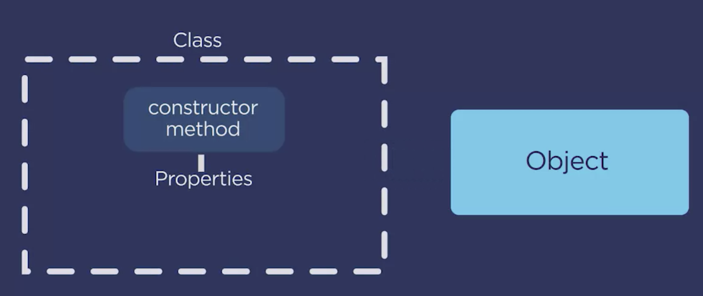

# Object-Oriented JavaScript

DOM: document object model: the object that represents the HTML document your JS interacts with. DOM elements are objects and have properties and methods.

An object’s states are represented by properties(key-value pairs) and it’s behaviors are represented by method(function).

Encapsulation describes consolidating an object’s properties and methods into a package and attaching it to a variable.

putting all of these properties and methods into a package and attaching it to a variable is called Encapsulation.

---

Object Literals Referring to Themselves

Many times, when writing methods for objects, you might want to refer to one of that object's properties. For example, consider the following code:

```js
const teacher = {
  firstName: "Ashley",
  lastName: "Boucher"
};
```

I may want to add a method to this object literal called printName(). To access the value of these properties inside the method, I'll use the 'this' keyword instead of the variable name. This way, you'll always be access the property values attached to that particular object:

```js
const teacher = {
  firstName: "Ashley",
  lastName: "Boucher",
  printName: function() {
    console.log(this.firstName + this.lastName);
  }
};
```

---

JSON and Bracket Notation

JSON, short for JavaScript Object Notation, is a data-interchange format. It has a special syntax that looks a lot like the syntax for JavaScript objects. Sometimes, keys in JSON might be more than one word. Take a look at this sample JSON data:

```json
var data = {
   "First Name" : "John",
   "Last Name" : "Doe"
}
```

To access the first name or last name properties of this JSON data, you would use bracket notation:

```js
var first = data["First Name"];
var last = data["Last Name"];
```

```js
const ernie = {
    age: '1',
    breed: 'pug',
    bark: function(){console.log('Woof')};
}
console.log(ernie['breed']);
ernie.bark();
ernie['bark']();

let prop = 'breed';
ernie[prop];

ernie.age = 2;
ernie['age'] = 2;

ernie.color = 'black';
```

---



declare a class and add a constructor method.

```js
class Pet {
  constructor(animal, age, sound) {
    this.animal = animal;
    this.age = age;
    this.sound = sound;
  }

  speak() {
    console.log(this.sound);
  }
}
const ernie = new Pet("dog", 1, "woof");
ernie.speak();
```

---

getters & setters: methods allow us to create & retrieve or update object's properties respectively.

getter: method used when you want to have a property that has a dynamic or computed value.

```js
class Pet {
  constructor(animal, age) {
    this.animal = animal;
    this.age = age;
  }
  get activity() {
    const today = new Date();
    const hour = today.getHours();

    if (hour > 8 && hour <= 20) {
      return "playing";
    } else {
      return "sleeping";
    }
  }

  get owner() {
    return this._owner;
  }

  set owner(owner) {
    this._owner = owner; //backing property
    console.log(owner);
  }
}

console.log(ernie.activity);
ernie.owner = "Ashley";
console.log(ernie.owner);
```

setter: receives a value and can form logic on that value. always receive one parameter(the value of property we set).

```js
set major(major) {
    if ( this.level === 'Senior' || this.level === 'Junior') {
      this._major = major;
      return this._major;
    } else {
      this._major = 'none';
    return this._major;
    }
  }
```

```js
class Owner {
  constructor(name, address) {
    this.name = name;
    this.address = address;
  }
  set phone(phone) {
    const phoneNormalized = phone.replace(/[^0-9]/g, "");
    this._phone = phoneNormalized;
  }
  get phone() {
    return this._phone;
  }
}

ernie.owner = new Owner("Ashley", "123 Main Street");
ernie.owner.phone = "(555) 555-5555";

console.log(ernie.owner.name);
console.log(ernie.owner.phone);
```

The name of a setter method cannot be equal to the name of an existing property.

The value returned from a getter method is stored nowhere.
