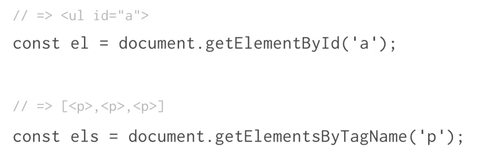

# JavaScript and the DOM

Babel

Many JavaScript developers turn to tools like Babel to manage the varying stages of browser support for new JS features. Babel can be used for other environments besides browsers too.

JavaScript's global environment is full of controls your code can use to make things happen. These controls come in the form of JavaScript objects and functions. Inside a browser, they allow your code to see and manipulate web pages.

global scope - window object

global variables(object) - document object(property of the window object)(representing the HTML and content of a web page)

You can use the document object to select and control elements of the currently loaded webpage.

DOM stands for Document Object Model. The DOM is a representation of a webpage that JavaScript can use. Changes that JavaScript makes to the DOM alter the web page.

The DOM is a representation of the document that JavaScript uses to navigate and make changes to a webpage.

---

```js
const myHeading = document.getElementById("myHeading");
const myButton = document.getElementById("myButton");
const myTextInput = document.getElementById("myTextInput");
myButton.addEventListener("click", () => {
  myHeading.style.color = myTextInput.value;
});
```

Accessing the value of an input element

Use the value property to get the text that has been entered into an input element. For example, if you have a text input stored in a variable myInput, you can retrieve any text the user has typed into that input like this:

```js
myInput.value;
```



```js
const myHeading = document.getElementsByTagName("h1")[0];
```

```js
const myList = document.getElementsByTagName("li");

for (let i = 0; i < myList.length; i += 1) {
  myList[i].style.color = "purple";
}
```

```js
const myList = document.getElementsByClassName("className");
```

```js
document.querySelector('tag' or '#id' or '.class' or '[attribute=label]'); //only return first matching element
document.querySelectorAll();
```

```js
// with CSS pseudo-class selectors
const evens = document.querySelectorAll("li:nth-child(even)");

for (let i = 0; i < evens.length; i += 1) {
  evens[i].style.color = "purple";
}
```

---

```js
Element.textContent;
Element.innerHTML;
Element.attribute;
Element.className;
Element.style.prop;
//style property itself is an object, properties on style obj represent the CSS properties.(only refer to the element inline style)
```

```js
const input = document.querySelector("input");
const p = document.querySelector("p.description");
const button = document.querySelector("button");

button.addEventListener("click", () => {
  p.textContent = input.value + ":";
  // p.innerHTML = input.value + ":";
});
```

```js
let ul = document.querySelector("ul");
ul.innerHTML = "<li>red cabbage</li>";
```

---

```html
<input type="text" class="description" />
<button class="description">Button</button>
```

```js
const input = document.querySelector("input");
input.type; //"text"
input.className; //"description"
input.type = "checkbox";
```

---

```js
var inputValue = document.querySelector("#linkName").value;
```

```js
const toggleList = document.getElementById("toggleList");
const listDiv = document.querySelector(".list");

toggleList.addEventListener("click", () => {
  if(listDiv.style.display === "none";) {
      toggleList.textContent = 'Hide list';
      listDiv.style.display = "block";
  } else {
      toggleList.textContent = 'Show list';
      listDiv.style.display = "none";
  }
});
```

```js
document.createElement("div"); //doesn't appear on page
Node.appendChild(childElement);
Node.removeChild(childElement);
```

---

```html
<input type="text" class="addItemInput" />
<button class="addItemButton">Add item</button>
<button class="removeItemButton">Remove item</button>
```

```js
const addItemInput = document.querySelector("input.addItemInput");
const addItemButton = document.querySelector("button.addItemButton");
const removeItemButton = document.querySelector("button.removeItemButton");

addItemButton.addEventListener("click", () => {
  let ul = document.getElementsByTagName("ul")[0];
  let li = document.createElement("li");
  li.textContent = addItemInput.value;
  ul.appendChild(li);
  addItemInput.value = "";
});

removeItemButton.addEventListener("click", () => {
  let ul = document.getElementsByTagName("ul")[0];
  let li = document.querySelector("li:last-child");
  ul.removeChild(li);
});
```

---

Any time you interact with a webpage, you generate all kinds of events. An event is something you do on the web page, like moving your mouse around, scrolling, or clicking a link. Browsers "listen" for events and, with JavaScript, we can do something in response to an event.

The window object has a setTimeout function we can use to delay the execution of a function.

```js
window.setTimeout(
  (num1, num2) => {
    console.log(num1 + num2);
    //anonymous function
    //callback function: we want to call it back after a certain amount of time has passed.
  },
  3000,
  num1,
  num2
);
```

An event received by an element doesn't stop with that one element. That event moves to other elements like the parent, and other ancestors of the element. This is called "event bubbling".

The event handler must be placed on a direct ancestor to the target element. A parent experiences the same event a child does because of event bubbling.

```js
EventTarget.addEventListener("click", event => {
  //event is an object with info & methods
  //Event.target: a reference to the element that first received the event
});
```

```js
const listItems = document.getElementsByTagName("li");

for (let i = 0; i < listItems.length; i++) {
  listItems[i].addEventListener("mouseover", () => {
    listItems[i].textContent = listItems[i].textContent.toUpperCase();
    //callback function: event handler, purpose is to handle event.
  });
  listItems[i].addEventListener("mouseout", () => {
    listItems[i].textContent = listItems[i].textContent.toLowerCase();
  });
}

//

const listDiv = document.querySelector(".list");

listDiv.addEventListener("mouseover", event => {
  if (event.target.tagName === "LI") {
    event.target.textContent = event.target.textContent.toUpperCase();
  }
});
listDiv.addEventListener("mouseout", event => {
  if (event.target.tagName === "LI") {
    event.target.textContent = event.target.textContent.toLowerCase();
  }
});
```

---

DOM Traversal: Selecting an element based on its relationship to another element within the DOM.

```js
Element.parentNode;
Element.previousElementSibling;
Element.nextElementSibling;
ul.insertBefore(li, prevLi);
ParentNode.firstElementChild;
ParentNode.lastElementChild;
ul.children;
```

```js
const listUl = listDiv.querySelector("ul");

listUl.addEventListener("click", event => {
  if (event.target.tagName === "BUTTON") {
    if (event.target.className === "remove") {
      let li = event.target.parentNode;
      let ul = li.parentNode;
      ul.removeChild(li);
    }
    if (event.target.className === "up") {
      let li = event.target.parentNode;
      let prevLi = li.previousElementSibling;
      let ul = li.parentNode;
      if (prevLi) {
        ul.insertBefore(li, prevLi);
        //the insert will run only if there is a previous sibling
      }
    }
    if (event.target.className == "down") {
      let li = event.target.parentNode;
      let nextLi = li.nextElementSibling;
      let ul = li.parentNode;
      if (nextLi) {
        ul.insertBefore(nextLi, li);
        //if it is the last child, nextLi would be null
      }
    }
  }
});
```

```js
var list = document.getElementsByTagName("ul")[0];

list.addEventListener("click", function(e) {
  if (e.target.tagName == "BUTTON") {
    e.target.previousElementSibling.className = "highlight";
  }
});
```

```js
const lis = listUl.children;

function attachListItemButtons(li) {
  let up = document.createElement("button");
  up.className = "up";
  up.textContent = "Up";
  li.appendChild(up);

  let down = document.createElement("button");
  down.className = "down";
  down.textContent = "Down";
  li.appendChild(down);

  let remove = document.createElement("button");
  remove.className = "remove";
  remove.textContent = "Remove";
  li.appendChild(remove);
}

for (let i = 0; i < lis.length; i += 1) {
  attachListItemButtons(lis[i]);
}

addItemButton.addEventListener("click", () => {
  let ul = document.getElementsByTagName("ul")[0];
  let li = document.createElement("li");
  li.textContent = addItemInput.value;
  attachListItemButtons(li);
  ul.appendChild(li);
  addItemInput.value = "";
});
```

```js
const firstListItem = listUl.firstElementChild;
const lastListItem = listUl.lastElementChild;
```
