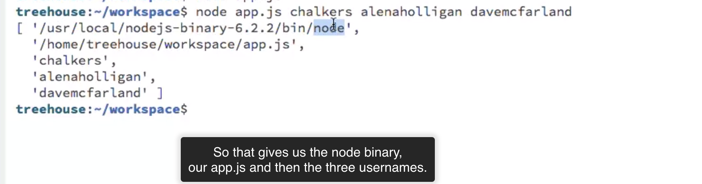

# Node.js Basics

Commands
Running a node application

```cmd
node <filename>
```

Running the node REPL (Read-Eval-Print-Loop)

```cmd
node
```

To exit the REPL use CTRL+D once or CTRL+C twice.

```js
console.error("wrong"); //wrong
console.dir({ name: "Andrew", age: 33 });
//{ name: "Andrew", age: 33 }
```

Node.js allows you to write JavaScript programs outside of the browser.

Native Objects

Ex: String, Array, Date, Math.
Native objects are those objects that are part of the JavaScript programming language and are available in both Node.js and the Browser.

Host Objects

Ex: Window, Document, History, XMLHttpRequest.
Host objects are those objects that are only available in a single environment. For example the DOM, or Document Object Model is not available in Node.js but are available in the Browser. Likewise, the host objects to access the local file system is not available in the Browser but are in Node.js.

Node.js Host Objects

Ex: http, https, fs(file system), url, os.
Node.js allows you to do all sorts of things that you can't do in the browser.

The coupling of the js V8 engine with the APIs is known as the Node.js platform or Node.js environment.

API: application programming interface, the documentation explains the API, or how you interface with the objects in the language, environment, or framework that you're working in. the API is the object and methods that you can use in any given environment. In the browser, the API is called the document object model to interface with web pages. With node.js, the API is what you interface with the file system, or other APIs like making HTTP requests.

In the Node.js documentation I can use the stability Index to help me decide what APIs I should use. Node.js can perform other tasks whilst it waits on others to complete (non-blocking).

---

if you add .json to the end of the URL, you get a REST API endpoint.

Types of events:

1. user events: mouseclick.

2. system events: setTimeOut function, readystatechange of an Ajax request.

system events in Node.js: data events, completion events, error events.

```js
const https = require("https");
//require https module

function printMessage(username, badgeCount, points) {
  const message = `${username} has ${badgeCount} total badge and ${points} points in JS`;
  console.log(message);
}

function getProfile(username) {
  //Connect to the API URL
  const request = https.get(
    `https://teamtreehouse.com/${username}.json`,
    response => {
      let body = "";
      //read the data
      response.on("data", data => {
        body += data.toString();
      });
      //non-blocking, get data fragment, need end event to know all data had collected.
      //now body is native object.
      response.on("end", () => {
        //parse the data
        //use the native JSON object to parse the string and assign it to profile.
        const profile = JSON.parse(body);
        printMessage(username, profile.badge.length, profile.points.JavaScript);
      });
    }
  );
}

getProfile("chalkers");

const users = ["chalkers", "alenaholligan"];
// const users = process.argv.slice(2);
users.forEach(getProfile);
```

the process of converting a string into a data structure is called parsing.

Capturing Command Line Arguments:



just like there's a window object with JS in the browser, there's another global object for node JS and that's called process. And we don't want first two items, so we use slice method. The command line arguments can be accessed through argv property on the process object.

---

the errors emitted by asynchronous calls. Many asynchronous nodeJS APIs give you an error event to listen to. We should implement the error callback.

error event: on request object.

```js
//request: request to the API
//on: on an event
//error: error event, all error objects have a message property
//emitted events error type
request.on("error", error => {
  console.error(`Problem with request: ${error.message}`);
});
```

```js
const https = require("https");
const http = require("http");
//require http module for status codes

function printError(error) {
  console.error(error.message);
}
//use try-catch to check before we successfully send request
//exceptions error type
function getProfile(username) {
  try {
    const request = https.get(
      `https://teamtreehouse.com/${username}.json`,
      response => {
        if (response.statusCode === 200) {
          let body = "";
          response.on("data", data => {
            body += data.toString();
          });
          response.on("end", () => {
            try {
              const profile = JSON.parse(body);
              printMessage(
                username,
                profile.badge.length,
                profile.points.JavaScript
              );
            } catch (error) {
              printError(error);
            }
            //if user name not exist and profile shows Not found, and application try to parse the string Not found, there's no JSON object be parsed.
          });
        } else {
          //we want to print out an error message for status code
          const message = `There was an error getting the profile for ${username} (${
            http.STATUS_CODES[response.statusCode]
          })`;
          //The HTTP module has a statusCode object that returns an english string from a status code
          const statusCodeError = new Error(message);
          //create a new statusCode error by create a new error object
          printError(statusCodeError);
        }
      }
    );
    request.on("error", error => {
      console.error(`Problem with request: ${error.message}`);
    });
  } catch (error) {
    printError(error);
  }
}
```

```js
try {
  var jsonString = "This is not a JSON String";
  var jsonObject = JSON.parse(jsonString);
} catch (error) {
  console.error(error.message);
}
```

STATUS_CODES

1. 200: OK
2. 500: internal server error
3. 301: moved permanently
4. 404: not found

The STATUS_CODES array is not on the https object. STATUS_CODES can be found on the http object. To include the STATUS_CODES use the following code:

```js
const http = require("http");

http.STATUS_CODES;
```

```js
https
  .get("https://wwwteamtreehouse.com/chalkers.json", function(response) {
    console.log(response.statusCode);
  })
  .on("error", function(error) {
    console.error("Something went wrong with the connection!");
  });
//it will print out the error "Something went wrong with the connection!" because of the URL www.
```

```js
//in another file to retrieve the getProfile function
const profile = require("./profile.js");

const users = process.argv.slice(2);
users.forEach(profile.getProfile);
```

```js
//in profile.js file to create a module
module.exports.get = getProfile;
//if now export the module, the API that I would have created would be just get
//so we need to rename the function from getProfile to get.
module.exports.get = get;
```

when creating a module, you need to explicity state what you want to have available to someone who requires it. In this case, we want users to access the get method. (with the name of your API you want to have accessible: get)

```js
function sayGreeting() {
  console.log("Hello World");
}
module.exports.say = sayGreeting;

//you access the functionality from another file
const greeting = require("./greeting");
greeting.say();
```

You call toString() to convert many objects in to strings, like a buffer.

the property argv on the process object that lists all arguments passed in to the command line.

process is the global object we can access the current version of node and arguments passed in to the command line

---

app.js

```js
const weather = require("./weather");

const query = process.argv.slice(2).join(" ");
//generated from the command line arguments

//query: 90201
//query: Los Angeles

weather.get(query);
//pass the query into the weather module's get function
```

weather.js

```js
const http = require("http");
const https = require("https");
const querystring = require("querystring");
const api = require("./api.json");
//require JSON file to store configuration you don't want to include in your git repo(API key)

// Print out temp details
function printWeather(weather) {
  const message = `Current temperature in ${weather.name} is ${weather.main.temp}F`;
  console.log(message);
}
// Print out error message
function printError(error) {
  console.error(error.message);
}

function get(query) {
  try {
    //check if the URL in malformed
    const parameters = {
      APPID: api.key,
      units: "imperial"
    };

    const zipCode = parseInt(query);
    if (!isNaN(zipCode)) {
      parameters.zip = zipCode + ",us";
    } else {
      parameters.q = query + ",us";
    }

    const url = `https://api.openweathermap.org/data/2.5/weather?${querystring.stringify(
      parameters
    )}`;
    console.log(url);

    const request = https.get(url, response => {
      if (response.statusCode === 200) {
        let body = "";
        // Read the data
        response.on("data", chunk => {
          body += chunk;
        });
        response.on("end", () => {
          try {
            //Parse data
            const weather = JSON.parse(body);
            //Print the data
            printWeather(weather);
          } catch (error) {
            //Parser error
            printError(error);
          }
        });
      } else {
        // Status error code
        const statusErrorCode = new Error(
          `There was an error getting the message for "${query}". (${
            http.STATUS_CODES[response.statusCode]
          })`
        );
        printError(statusErrorCode);
      }
    });
  } catch (error) {
    printError(error);
  }
}

module.exports.get = get;

//TODO: Handle any errors
```
