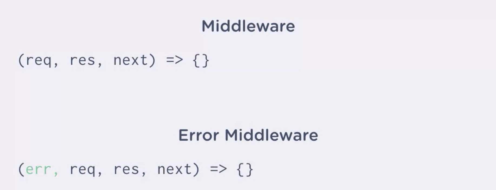

# Express Basics

Express is a web framework for node.js.

web framework: a set of software tools to create dynamic web applications.

patterns: solutions for common problems in software.

routing: how you specify what content is to be returned based on the URL requested.

Web Frameworks Tools:

1. Templating: for dynamic layouts and content
2. URL Mapping / Routing
3. User Input Processing

---

To start a node project in a directory without a package.json file run the following command: npm init

```npm
npm init -y
npm install express@4.15.2 --save
node app.js

npm install -g nodemon
```

```js
const express = require("express");
```

---

setting up a server with Express:

express sets up its server, a server is a program that runs on a remote computer, its job is to wait for HTTP requests from clients. Request is what is happening when you type in a URL into a browser. Your browser is making a request to a server at the URL address you typed in. When a browser or client makes an HTTP request to the server, the server brings into action, putting together a response.

```js
const express = require("express");
// require the express module
const app = express();
// create Express application
app.listen(3000);
// setup the development server, port number 3000
```

This code will create a server. When I run it, the server will run on my machine. And I can send a request through a URL called localhost.

---

Creating a Route with Express:

express handles request through routes. From user's perspective, a route is like a URL. From application perspective, a route also called an end point, is a command to run a specific function, which in turn sends a response back to the client.

route: It's the path a user takes to access data on a server.

When type URL into browser, the browser sends get request to the server (you're asking to view or get a web page)(get: HTTP verb, represents what the client wants the server to do)

The URL (noun, or called resource) tells the server what to get for client. A server responds to a get request by sending information off in a web page.

The browser can also send information to the server, like submit a form, called the post request.

when the client makes a request to a route, if the server isn't set up to respond to, server will send back an 404 error.

To create a route, use get method on the app object. get method is used to handle the get requests to a certain URL.

```js
//indicate root route
//first parameter is called the location parameter
app.get("/", (request, response) => {
  //callback will run when the client request this route
  response.send("<h1>I love treehouse!</h1>");
});
```

---

A template provides the basic HTML for your app and serves it to the users. Templates also lets you vary the output to provide customized responses. For example, displaying different usernames.

When a request comes into a given route, the server decides how to handle the request. For instance, using the res.send method to send the string I love Treehouse to the browser. A server can send back a response containing HTML derived from a template.

Templates are a special type of file that have their own syntax and language. They live on the server, and act as some kind of form letter for your HTML. So, it's like an HTML page with holes or blanks in it. You can fill in those blanks with custom content by adding variables to the template.

The result is a full HTML page sent to the client. The process is called rendering the template. Because rendering a template results in what the viewer sees on their screens, templates are often called views.

Most templates in languages resemble HTML. The most popular template in languages for JavaScript developers are, Handlebars, EJS, which standards for embedded JavaScript, and Pug.


Steps to using pug:

1. Download Pug with npm
2. Update code in app to use Pug
3. Create templates file
4. Render templates with response.render()

```npm
npm install pug --save
//add pug engine to project
```

```js
app.set("view engine", "pug");
//set the view engine to the parameter pug
//The app.set method defines different settings in Express.
```

This line(pug) just tells Express which template engine to use. By default, Express will look in a folder called Views in the root of your project. If you want to name your folder something else, or nest it into another folder, you'll need to define the view setting and point Express to the right place.

Anytime we ask express to render a template response, it will grab the template from here (views folder). index.pug is the template that will render when the user visits the root URL.

```js
// basic pug code
doctype html
html(lang="en")
  head
    title Landing Page
  body
```

Now, to use the template we just created, we can replace the res.send method with res.render method in our index route. For this render method, I can enter the name of my Pug template as a parameter, index.

```js
app.get("/", (req, res) => {
  res.render("index");
});
```

```js
res.render(view [, local][, callback])
```

To see how to pass in variables to the template. The response.render method takes in two optional parameters. The square brackets indicate that they are optional. The second parameter is called locals. Placing an object here will define locals for the view. Locals is the name for variables we want the view to have access to when it's being rendered. The properties of the object we pass in as the second argument will define the locals in the template.

```js
app.get("/cards", (req, res) => {
  res.render("card", { prompt: "Who is buried in Grant's tomb?" });
});
```

Another way to create the same local variable name for our template. We can add properties to the res.locals, to pass in values to the template. The name of the property will define the local variable name.

```js
res.locals.user = req.user;

app.get("/cards", (req, res) => {
  res.locals.prompt = "Who is buried in Grant's tomb?";
  res.render("card");
});
```

To interpolate, or add variables to static text, you use the hash symbol with curly brackets. The curly brackets surround the variable whose value you want to combine with the text. Note that interpolation doesn't work for attributes though. You'll need to concatenate strings with any values you want to put into attributes, or use template literals.


```js
app.get("/cards", (req, res) => {
  res.render("card", {
    prompt: "Who is buried in Grant's tomb?",
    hint: "hint"
  });
});
```

```js
header
    h1 Flash Cards
section#content
    h2= prompt
    if hint
    // if no longer a hint value, we hide "Hint:"
        p
            i Hint: #{hint}
    else
        p There is no hint.
footer
    p An app to help you study
```

```js
section#content
        ul
            each color in colors
                li=color
        h2= prompt
        if hint
            p
                i Hint: #{hint}
```

We're telling pug for each color in the color's array, then render a list item element that holds the text of the color.

Pug lets you include a template into another template. The child, or the included template, is extended, or nested, within the layout.

The thing I need in my layout is the block content keywords. This lets Pug know that any template extending the layout can inject its HTML there.

```js
doctype html
html(lang="en")
  head
    title Flash Cards
  body
    include includes/header.pug
    block content
    include includes/footer.pug
```

```js
extends layout.pug

block content
    section#content
        h2= prompt
        if hint
            p
                i Hint: #{hint}
```

---

Req

A get request simply asks for data, like a web page from a server. But when a client sends data to the server, it's called a post request.

```js
extends layout.pug

block content
    h2 Welcome, student!
    form(action="/hello", method="post")
        label Please enter your name:
            input(type="text", name="username")
        button(type="submit") Submit
```

The value of the action attribute is the URL that they form post to. That is the route that the browser will send form data to. The method is the HTTP verb that we want to use. The name attribute is vital to ensure that our app can read the form submission.

To put the form responses into the req.body property(default is undefined), we'll need what is called Middleware. Middleware is basically some code that fits in the middle of a request or a response. Middleware does something to the incoming data and hands the result off to the rest of your application.

middleware: body parser, and it will process the incoming form submission data into a format that's easier for our program to read.

```npm
npm install body-parser --save
```

```js
const bodyParser = require("body-parser");
```

Body-parser contains several parses, the different ways the clients can send data. HTML forms normally encode the data they send the same way URLs do. So, we'll need to use the urlencode parser.

```js
app.use(bodyParser.urlencoded({ extended: false }));
```

body property on req contains form data once body-parser is installed.

What is body-parser doing? In case you're curious, here's a little code that reads the body of an incoming request and logs it to the console.

```js
let bodyString = "";
req.on("data", chunk => (bodyString += chunk.toString()));
req.on("end", () => {
  console.log(bodyString);
});
```

Note that even after bodyString has been read completely, it still needs to be turned from a string into data your application can use, all of which is taken care of by body-parser.

---

Res

While the request object allows the application to look at the request that the client has made, the response object offers ways to shape the response back to the client. we'll use the name received from the form and send it back in a message that greets the user.

Sometimes clients don't want all the presentation of HTML and CSS, they just want the data. We use JSON method to send back data to the client.

```js
app.post("/hello", (req, res) => {
  res.json(req.body);
});
```

```js
app.post("/hello", (req, res) => {
  res.render("hello", { name: req.body.username });
});
```

```js
block content
    if name
        h2 Welcome, #{name}!
    else
        form(action="/hello", method="post")
            label Please enter your name:
                input(type="text", name="username")
            button(type="submit") Submit
```

When we make a get request to the application, the name won't be defined and will render the get route. But when a post request comes in, or when the form is submitted, the name will be defined.

The browser refreshes the last post request from the form. Including the data for the request.

The response object’s render method is used to turn templates into HTML.

The request object gives us access to data the client has sent to the server, such as values of fields from a form submission. The response object is focused on what data the app wants to send back, not what data the app has received.

---

HTTP is called a stateless protocol. This fundamental principle of HTTP means that the server doesn't track the relationship between one request and another. Each transaction with a server is independent and unrelated, at least from the server's perspective.

Consider a web form, as you fill it out, you set the text, check boxes, and other inputs to hold information. The information you enter is the state of the form. forms don't retain the state between refreshes, or at least by default.

Clients and servers have stateless interactions. A server retains no memory of the client after sending a response. This means a client has to send complete information to the server every time it makes a request.

But sometimes we need to save the state of a request and remember it later. One of the most common methods for saving states on the web is a cookie. A cookie is a piece of data that the server stores on the client, for example, in your web browser. After receiving the cookie information from the server, when the client makes another request of the server, the client sends the cookie information too. It will even send other cookies that have been previously set perhaps by other web pages on that site. This way, the client can remind the server of any information it should hand back in its response.

So for example, when a user puts some item into the cart, the server writes an item into a cookie. And it hands it back to the client in the response. The next time the client sends a request, it includes the cookie. This way the server can continue to include the item in the cart.

Cookies are stored in your browser by domain. This means that one domain cannot access another domain's cookies. For example, Netflix can't see cookies set by Amazon or vice versa. The cookies stored by that domain are private to that domain.

We can use the cookie method on Express's response object. The cookie method takes a name and a value. You can also pass in an options object as a third parameter.

When the user submits the form to the post route.

```js
app.post("/hello", (req, res) => {
  res.cookie("username", req.body.username);
  res.render("hello", { name: req.body.username });
});
```

This will send a cookie to the browser after we submit the form.


Now the browser will automatically send this cookie with every request it makes.

To read the cookie from the request, we need the cookie's property on the request object. We'll need another piece of middleware that reads the cookies, called cookie-parser.

```npm
npm install cookie-parser --save
```

```js
const cookieParser = require("cookie-parser");

app.use(cookieParser());

app.get("/hello", (req, res) => {
  res.render("hello", { name: req.cookies.username });
});
```

---

Redirects

redirecting In terms of HTTP, it represents a series of specific events.

When a client request of resource from a server that is protected or perhaps is being moved, the server will often respond with the response call that redirect which contains a URL. The client receiving this response will usually make a second instant request to the new URL. redirects are often used to make the same work page available from several URLs.

```js
app.post("/hello", (req, res) => {
  res.cookie("username", req.body.username);
  res.redirect("/");
});

app.get("/", (req, res) => {
  const name = req.cookies.username;
  if (name) {
    res.render("index", { name });
  } else {
    res.redirect("/hello");
  }
});

app.get("/hello", (req, res) => {
  const name = req.cookies.username;
  if (name) {
    res.redirect("/");
  } else {
    res.render("hello");
  }
});

app.post("/goodbye", (req, res) => {
  res.clearCookie("username");
  res.redirect("/hello");
});
```

```js
extends layout.pug
block content
    section#content
        h2 Welcome, #{name}!
        form(action="/goodbye", method="post")
            button(type="submit") goodbye
```

---

middleware

Basic form of Express middleware

```js
(req, res, next) => {
  // do something
  next();
};

app.use((req, res, next) => {
  req.message = "message";
  next();
});

app.use((req, res, next) => {
  console.log(req.message);
  next();
});
```

Earlier middleware functions, runs before the later ones. BodyParser for example, creates a body property on the request object, and then we can use that to respond to the client.

First, next signals the end of middleware functions. If we ignore next(), the app hangs when middleware is not closed out with a next. The app is waiting indefinitely for next to be called. Express relies on the next function to know when to move forward.

But next isn't the only way to end a middleware function. The main thing to remember is that you end middleware by either calling next or sending a response.

---


When a user makes a GET request to a route, say hello, Express runs the first piece of middleware, the body-parser. There's nothing for the body-parser to do, but it does run. Then the cookie-parser runs. Now, Express runs this middleware function logging out hello. When next is called, this piece of middleware is executed and world is logged out.

```js
app.get("/", (req, res) => {
  //callback will run when the client request this route
  const name = req.cookies.username;
  if (name) {
    res.render("index", { name });
  } else {
    res.redirect("/hello");
  }
});
```

Now, Express checks to see if the URL matches the root route, it doesn't so this middleware is skipped.

```js
app.get("/hello", (req, res) => {
  const name = req.cookies.username;
  if (name) {
    res.redirect("/");
  } else {
    res.render("hello");
  }
});
```

Express finds this URL does match though, so it executes this middleware, then render is called, and then the middleware function terminates itself. The request response cycle also ends here, and the response is sent to the client. This process happens for every request Express receives.

---


How is next being called? Notice, these functions are being called. They are called as Express sets up the server and returns middleware functions. An outer function that returns an inner function is a common occurrence in JavaScript, and it's also known as a closure.

---

when we made request of the app, the client received a 404 error back from our route. This meant, Express didn't have the page that we requested. More specifically, it meant that there was no get route for our app matching the URL we requested.

In Express, you can use the next function to signal an error in your app. By passing an object as a parameter to next, Express knows there is an error to handle. Express will then immediately terminate and handle the error.

```js
app.use((req, res, next) => {
  console.log("hello");
  const err = new Error("err");
  //This is JavaScript's native error constructor.
  //We're creating a custom error object and storing it in ERR.
  next(err);
});
```

This output is coming from Express's built in error handler.



When an object is passed into the next call, Express jumps to the first middleware it can find, with four parameters. So far, we don't have any of those in our app. So Express invokes its own native handler inside its code base. We can overwrite that behavior by putting in our own error handler, which will serve a custom template back to the client. The template is where we can format the error to be more readable than the text that we currently see.

```js
app.use((err, req, res, next) => {
  res.render("error", err);
});

app.use((err, req, res, next) => {
  res.locals.error = err;
  res.render("error");
});
```

```js
extends layout

block content
    h1= error.message
    h2= error.status
    pre= error.stack
```

The error object has properties that hold the data about the error. Notice we don't have a status code on our object. That's because that HTTP codes aren't parts of JS's native error objects.

```js
app.use((req, res, next) => {
  console.log("hello");
  const err = new Error("err");
  err.status = 500;
  next(err);
});

app.use((err, req, res, next) => {
  res.locals.error = err;
  res.status(err.statue);
  res.render("error");
});
```

In our error handler, we can set the status of the response using the status method on the response object. The status method takes the number of the code. Normally if there's an error in the code on the server it will throw a status 500, this is a general error, that just means that the server couldn't fulfil the request because something was unexpected. This might be a bug in our server code.

The error object is just like any of the JavaScript object and properties can be set on it.

When an app gets a request, it will go from one app.use call to the next looking for a match. If it gets to the end without finding a route and there are no errors, Express' native handler will send a 404 back to the client with some plain text. If we catch the request before it gets to the end of the line, we can send users a better page.

```js
app.use((req, res, next) => {
  const err = new Error("Not Found");
  err.status = 404;
  next(err);
});
```

We want to access the request at the end of our app and before the error handler. This middleware will just be responsible for creating the error object and handing off to the error handler. Now, any requests that makes it this far will run this function and trigger the error handler. The error handler itself will send the page out to the user in that event.

---

```js
const express = require("express");
const router = express.Router();

router.get("/", (req, res) => {
  //callback will run when the client request this route
  const name = req.cookies.username;
  if (name) {
    res.render("index", { name });
  } else {
    res.redirect("/hello");
  }
});

module.exports = router;
```

```js
const mainRoutes = require("./routes");
const cardRoutes = require("./routes/cards");

app.use(mainRoutes);
app.use("/cards", cardRoutes);
```

With Express, I'll use the router constructor to create a new router. A router is kind of like a mini app in Express. You can add middleware and routes to it. express.Router() creates an object that behaves similar to the app object.

Because we're directing traffic into app.js file from the cards path in the app.js file, every route in cards.js file would start with cards.

---

Using and maintaining data is normally handled by connecting the app to a database.

```js
const { data } = require("../data/flashcardData.json");
// const data = require("../data/flashcardData.json").data;
const { cards } = data;
// const cards = data.cards;

router.get("/:id", (req, res) => {
  res.render("card", {
    prompt: cards[req.params.id].question,
    hint: cards[req.params.id].hint
  });
});
```

A route parameter is a variable that a user can put right into the URL to point to a particular resource. In express, we can indicate a route parameter right here(route) where we declared the URL. I can use a colon to tell express to treat this part of the URL as a variable. And if I put :id for example, Express will treat this portion(id) of URL as a variable or a route parameter named id. The value for the route parameter from the URL will be stored in the request object params property.

```md
/cards/3?key=value&key2=value2
```

```js
router.get("/:id", (req, res) => {
  const { side } = req.query;
  const { id } = req.params;
  const text = cards[id][side];
  const { hint } = cards[id];

  const templateData = { text };

  if (side === "question") {
    templateData.hint = hint;
  }

  res.render("card", templateData);
});
```

A query string goes at the end of a URL and it starts with a question mark. After the question mark, you can pass the server a key value pair separated by an equal sign. You can separate additional key value pairs with an ampersand.

you get query string information from a URL by req.query


What happens when an object is passed into the next function? Execution is passed to the next error handling middleware function.

---

Static Assets

Static files like images and style sheets don't need to be processed by the application. They just need to be delivered to the browser.

When a browser makes a get request to the index route of our application, it receives HTML. But as we've seen, there's no file called index.html in any of the folders in our application. When the app receives the request, it has to assemble and render the HTML from templates and data. This allows the application to serve customized web pages to different clients.

As you know, browsers use HTML, CSS, and JavaScript to display a web page. The CSS and client-side JavaScript files will always be the same, no matter who requests them, or what the application state is. In fact, they're literally our complete files sitting on the web server in one or more directories. Express doesn't need to build them, like it does the HTML in our application. For this reason, these files are called static assets.

We've been writing our Express application in JavaScript. This is different from the client-side JavaScript our web page might use. Our Express app and our browser app are two different environments and play different roles in what the end-user sees. In fact, the static JavaScript files don't even look like JavaScript to Express. They might as well be long strings of nonsense as far as Express is concerned. These files are just handed straight over to the browser without even being attempted to be interpreted by Express. The browser knows what to do with these files and turns them into all kinds of magical user interactions.

To send images plain CCS and JavaScript files from the server's file system to the client, Express uses something called a Static Server. Because these files are prebuilt and won't change on the server, passing them through all of Express's routing and template rendering would be a waste of time. The Static Server just sends them straight to the client saving Express time and effort.

```js
app.use("/static", express.static("public"));
//route the static server to static
```

```js
doctype html
html(lang="en")
  head
    title Flash Cards
    link(rel="stylesheet", href="/static/stylesheets/style.css")
```

When expressed renders layout template, it sends the HTML to the browser, the browser will see the link tag and make a request to the static/stylesheets/style.css.

Because we set up the static server, the public folder's contents is at /static. Any path in the folder will automatically be available to static.
