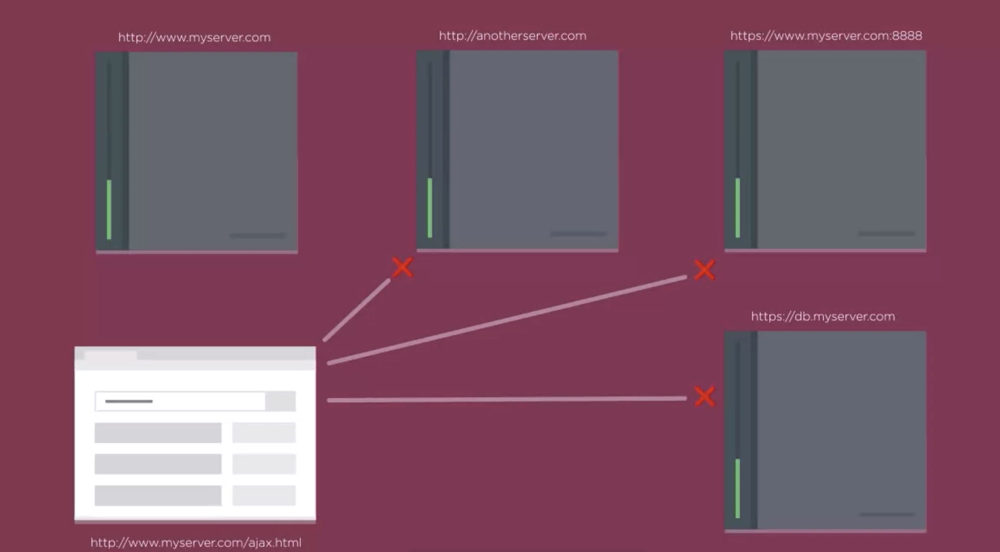
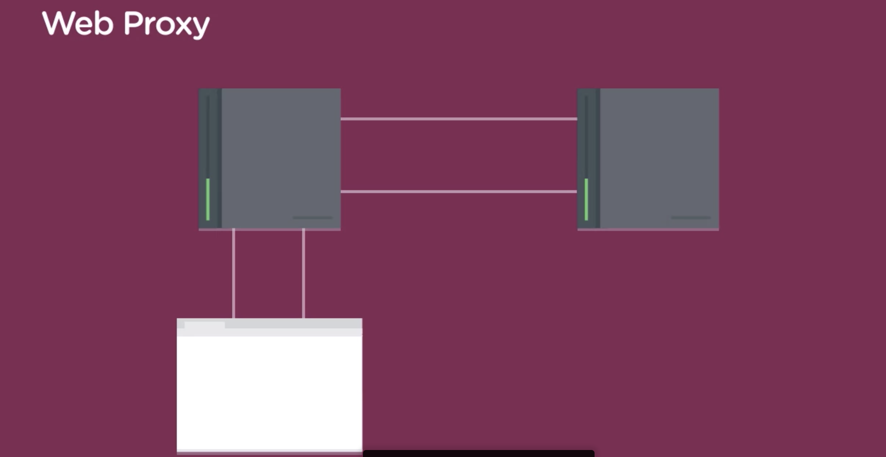
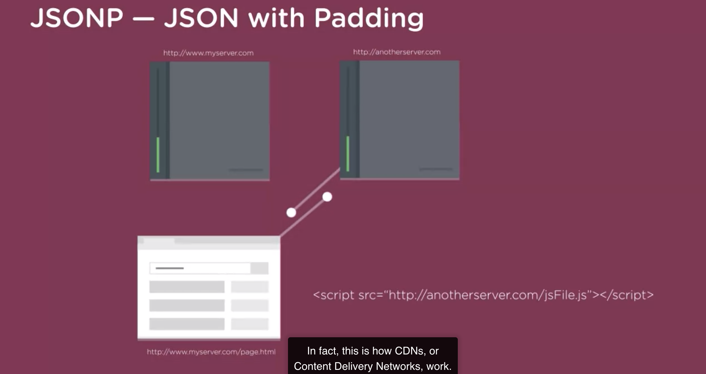
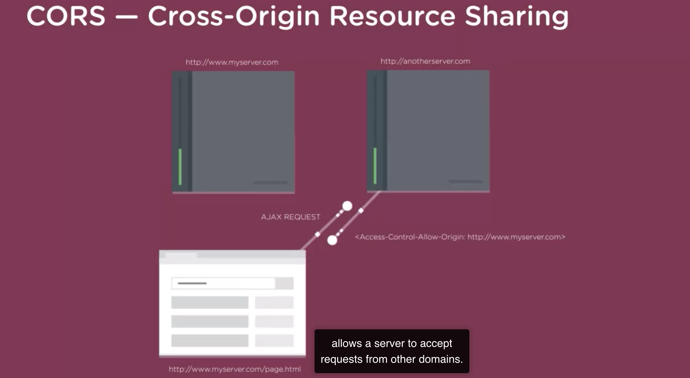

# AJAX Basics

AJAX stands for Asynchronous JavaScript and XML. AJAX lets you update HTML without loading a new webpage. AJAX lets you build you web pages that ask for information from a web server. The web server returns data to the web browser, and JavaScript processes that data to selectively change parts of the web page.

XHR, short for XML HTTP requests.

AJAX is the process of using JavaScript to send a request to a web server, and receive a response back, and then do something with that response.

The X in AJAX stands for XML or Extensible Markup Language. HTML and XML both use tags to mark up information.

1. Create XMLHttpRequest Object
2. Create callback function
3. Open request
4. Send request

```html
<script>
  var xhr = new XMLHttpRequest();
  xhr.onreadystatechange = function() {
    if (xhr.readyState === 4 && xhr.status === 200) {
      document.getElementById("ajax").innerHTML = xhr.responseText;
    }
  };
  xhr.open("GET", "sidebar.html");
  function sendAJAX() {
    xhr.send();
    document.getElementById("load").style.display = "none";
  }
</script>

<button id="load" onclick="sendAJAX()">Send</button>
```

In fact, for each ajax request, you should create a new XHR object.

The most important is the onreadystatechange event. This event is triggered whenever there's a change in an AJAX request. Like opening a new request, sending it, or receiving a response.

For this call-back function we're only interested in the final change of state. That's when the server sends back its response. The XML http request object keeps track of the state using a special property named ready state. That property contains a number including the current state of the request and that property holds the number four. Then the request is done and the server has sent back a response.

Step three, open a request. An XHR object has a method or function called open. This function prepares the browser for sending the request. You give the function two pieces of information. The first is the HTTP method that you're going to use. The URL is where the request is going(file or others web server programming).

There are two common methods for sending HTTP requests:

GET. Used for most requests. Browser uses the GET method whenever it requests a new web page, CSS file, image, and so on. Use GET when you want to "get" something from the server. All of the data is sent in the URL.

POST. Used frequently with web forms to send data to store in a database. Use POST when sending data that will store, delete or update information from a database. The post method sends data in what's called the body of the request.

POST sends its data in the "body" of the request. GET sends data in the URL.

The process of breaking a file up into easily accessed parts is called parsing.

---

AJAX Security Limitations: Web browsers prevent certain types of AJAX requests, such as requests to other web sites.



web browser's same-origin policy



web proxy: It allows you to bypass a web browser's same-origin policy by retrieving data from another server, while keeping AJAX requests within the same domain.





---

To handle possible errors, we can expand the conditional statement a bit by checking another property of the request object, the status property. The status property is a number sent from the server. 404 is the status for a file not found. You would get a 401 response if you're not authorized to access a URL because it requires some kind of login or other permissions to access. A status of 500 pops up when the server has some kind of error, often the server-side program that's processing the request isn't working.

```html
<script>
  var xhr = new XMLHttpRequest();
  xhr.onreadystatechange = function() {
    if (xhr.readyState === 4) {
      if (xhr.status === 200) {
        document.getElementById("ajax").innerHTML = xhr.responseText;
      } else {
        alert(xhr.statusText);
      }
    }
  };
  xhr.open("GET", "sidebar.html");
  function sendAJAX() {
    xhr.send();
    document.getElementById("load").style.display = "none";
  }
</script>
```

JSON's Property names and string values both require double quotes. JSON is transmitted over the web as plain text. To make it useful for a JavaScript program, you need to parse it, or convert it from a string to JavaScript.

The information that the web server returns is contained in a property named response text. It's a property of our xml http request object, so we access it using Xhr.responseText. The JavaScript typeof operator looks at the item that is listed next.

```js
var xhr = new XMLHttpRequest();
xhr.onreadystatechange = function() {
  if (xhr.readyState === 4) {
    var employees = JSON.parse(xhr.responseText);
    var statusHTML = '<ul class="bulleted">';
    for (let i = 0; i < employees.length; i++) {
      if (employees[i].inoffice === true) {
        statusHTML += '<li class="in">';
      } else {
        statusHTML += '<li class="out">';
      }
      statusHTML += employees[i].name;
      statusHTML += "</li>";
    }
    statusHTML += "</ul>";
    document.getElementById("employeeList").innerHTML = statusHTML;
  }
};
xhr.open("GET", "data/employees.json");
xhr.send();
```

Json.parse is a method that's built into all current web browsers. The Json.parse method takes a string and tries to convert it into a JavaScript object. In this example, the text response we get from the server is a Json formatted string from the employees.json file. Remember that Json formatted data must be an array of items or an object full of key value pairs. Or a combination of those two. The Json.parse method won't work unless the string is formatted as correct Json. Arrays are considered a type of object in JavaScript.
