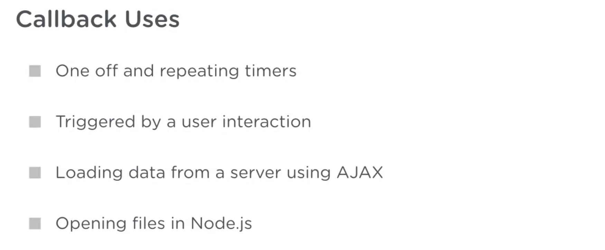

# Callback Function



callback: you're passing the name of the function to another function to execute.

Callback Syntax

```js
function everySecond(callback) {
  // This function runs the callback every second
}

function getStockData() {
  // This function gets stock data from the NYSE
}

everySecond(getStockData);
```

the getStockData function is a callback function since it's being invoked by the everySecond function. Callbacks are just regular functions used by another function at some other time in the future. This can be at regular intervals or from user interaction.

The easiest way to spot a callback is if it has the name of a function and is being passed into another function call.

```js
function sayHello() {
  console.log("hello");
}
function executeCallback(callback) {
  callback();
}

executeCallback(sayHello);
```

Anonymous Functions

An anonymous function is a function without a name.

```js
function ( ) {
  //Do something
}
```

Arrow Functions

Arrow functions are a common way you'll see anonymous functions being written.

```js
() => {
  console.log("Hello");
};
() => console.log("Good bye");
```

Syntax:

```js
setTimeout(callback, delay);
```

Where callback is a function and delay is the number of milliseconds until the callback is invoked.

Canceling a Timeout:

To cancel a timeout before the callback is executed assign the timeout to a variable and call the clearTimeout function.

```js
const timeoutID = setTimeout(callback, delay);

//Clears the timeout immediately
clearTimeout(timeoutID);
```

```js
const randomTime = Math.random() * 4000;
setTimeout(showSurprise, randomTime);
```

Syntax

```js
setInterval(callback, delay);
```

Where callback is a function and delay is the number of milliseconds between each invocation.

Canceling a Timeout

To cancel a interval at any time assign the interval to a variable and call the clearInterval function.

```js
const intervalID = setInterval(callback, delay);

//Clears the interval immediately
clearInterval(intervalID);
```

The setTimeout function only runs the callback one time. There is another function will repeatedly call a call back after a delay continually. And that's the setInterval function.

```js
const clockSection = document.getElementById("clock");

function getTime() {
  function pad(number) {
    if (number < 10) {
      return "0" + number;
    } else {
      return number;
    }
  }

  const now = new Date();

  const hh = pad(now.getHours());
  const mm = pad(now.getMinutes());
  const ss = pad(now.getSeconds());

  return `${hh}:${mm}:${ss}`;
}

function tickClock() {
  clockSection.textContent = getTime();
}

tickClock();
setInterval(tickClock, 1000); //we can't wait only after 1s for setInterval to call callback function
```

setInterval doesn't invoke the callback immediately. you have to invoke the callback yourself first manually if you want it to run immediately.

---

DOM and Event Listeners

An element has a method called addEventListener.

```js
element.addEventListener(eventType, callback);
```

eventType could be a keyboard key press or a mouse event—like a mouse click. 'focus' is the event when the cursor appears in a text input or text area, and when the form control loses 'focus', the 'blur' event is triggered.

An event callback looks like this:

```js
function (event) {
  // Do something
}
```

Or...

```js
event => {
  // Do something
};
```

The event object has a type property for the type of event that triggered the callback('click'), and a target property for the element from the event object.

Type lets you know what type of event triggered the callback. Target is the element that the event was triggered on.

```js
const focusHandler = event => {
  event.target.className = "highlight";
};
const blurHandler = event => {
  event.target.className = "";
};
nameInput.addEventListener("focus", focusHandler);

nameInput.addEventListener("blur", blurHandler);
```

Functions are often referred to as first class objects in JavaScript. All this means is that a reference to the function can be passed around just like any other variable. Remember, a callback function is like any other. Instead of call by you in the code it's being triggered by a system event.

use event.target to access the element from the event object triggered by the addEventListener method.
