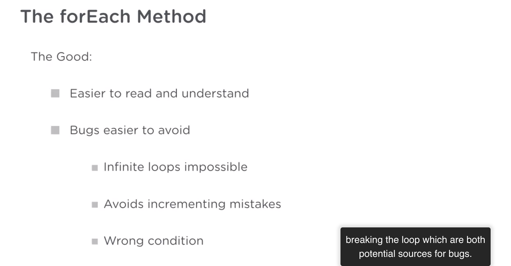
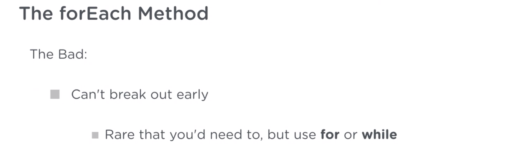
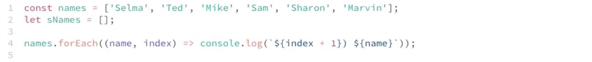
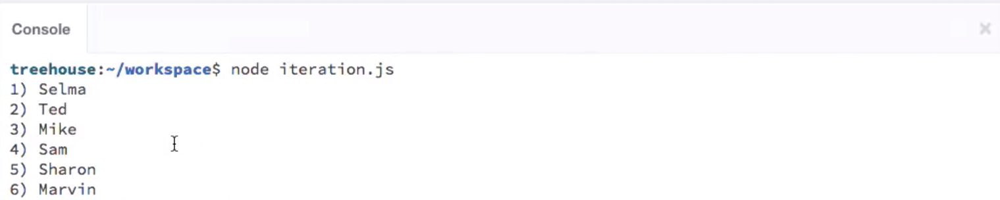

# JS Array Iteration

forEach:

```js
fruits.forEach(fruit => console.log(fruit));
```




```js
names.forEach(name => {
  if (name.charAt(0) === "S") {
    sNames.push(name);
  }
});
```




---
