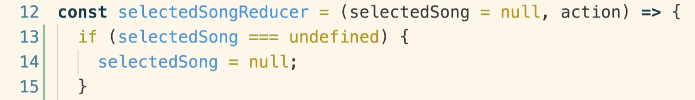

# 20200629 Redux Store Design


Rule 2:

Reducers are supposed to produce or return state or data that is going to be used inside of our application, and the reducer has to do so using only the previous state from the last time that it was called, and the action object that has been dispatched, and is being passed into a given reducer.


Ｗ hen you first start up the redux application, each reducer is going to be automatically called exactly one time. So it is a automatic invocation that essentially allows your reducers to specify some default state value.

The first time your reducer gets called during that initialization process, it's going to receive two arguments. The first argument is going to have a value of undefined. And then the second argument will be some action object that we might refer to as action number one, because it is the first action that the reducer is going to see.

So it is then up to the reducer to take these two arguments and return some initial state value.


Imagine that the code for invoke at one time was placed right here.

So redux internally did something like:

```js
selectedSongReducer(undefined, { type: "abcdef" });
```

the second object is going to be some initialization action object. We don't really know what type that this action is going to have. We just know that it's going to be an action object with some mystery type property that we don't really know.

So the first time that our reducer gets called, we're going to essentially look at that first argument and very quickly realize that it is undefined.



That's why we put a default value for selectedSong. It's a little bit of ES2015 syntax that is essentially the equivalent of saying: if selectedSong is equal to undefined, then change the value of selectedSong to be null instead.

So again the very first time we call the reducer, first argument is undefined. We don't really want to deal with that value of undefined, so we are going to default it's value to instead be null, and that defaulting is only going to take place the very first time that our reducer gets invoked.

All the equals null is check to see if selectedSong is equal to undefined, if it does, it's going to update the value of that argument to be null instead.

We're not going to always default a argument like this to be equal to null, in many cases we will instead default it to be an empty array or an empty string or some number. It really just comes down to the purpose of the reducer that we are working on to decide on the default value


The second time that this reducer gets called, the first argument is no longer going to be equal to the value undefined. Instead it's going to be whatever the reducer returned the last time that it was ran. So the second time that the reducer gets called The first argument will then be equal to state v1.

So essentially that first argument into your reducer is always going to be whatever it returned the last time it was ran.

So you can imagine that we've got this kind of acyclic action where our reducer just keeps on getting called with its own value that is returning over and over again.

And the only real change inside there is the action object. The only thing that changes each time the reducer gets called is that action object and the type & payload property inside of it.

Our reducer must return some data or some state using only the previous state value that it returned and the action object.

---

Rule 3:


A reducer must not reach out of itself or out of its own function to decide what value to return.

Anytime that we call a reducer with an action and our previous state value, we're not supposed to reach out of this function whatsoever, we are not supposed to go off and make an API request or to try to read some file off our hard drive or to solicit the user for some input or to reach into the DOM and try to pull some value out of a div or a label or input or something like that.

When a reducer gets called, it is only supposed to look at the previous state value and the action object to decide what to return.


We're never going to try to return the result of making some network requests.

The only thing that we're ever going to return is going to be some computation done on the two arguments. We would return some type of combination or variation based upon the state plus action objects.

Now this entire idea right here is what we refer to as keeping a reducer pure.

So with a pure function or a pure reducer we are only ever going to return values that use it's input arguments.
