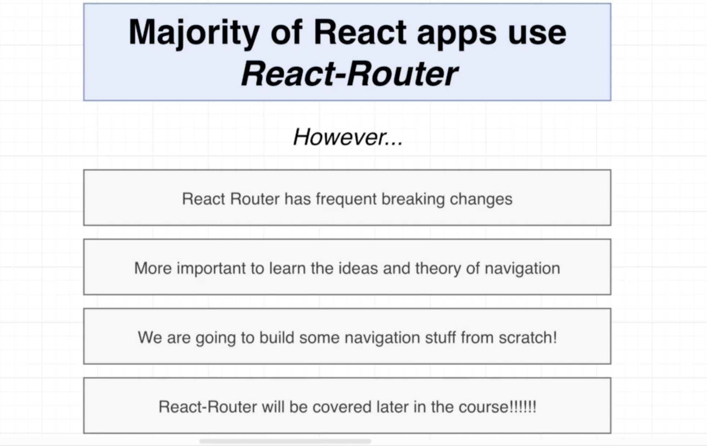
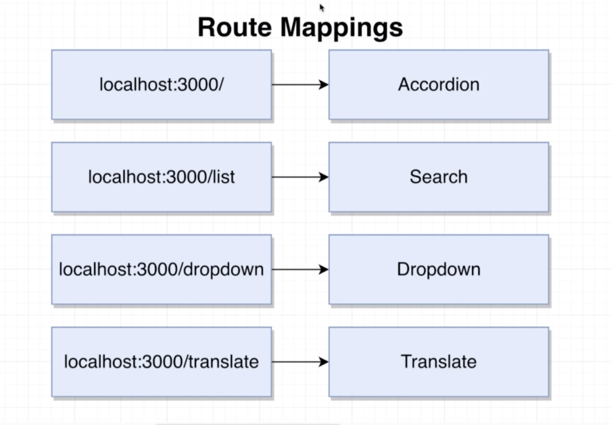
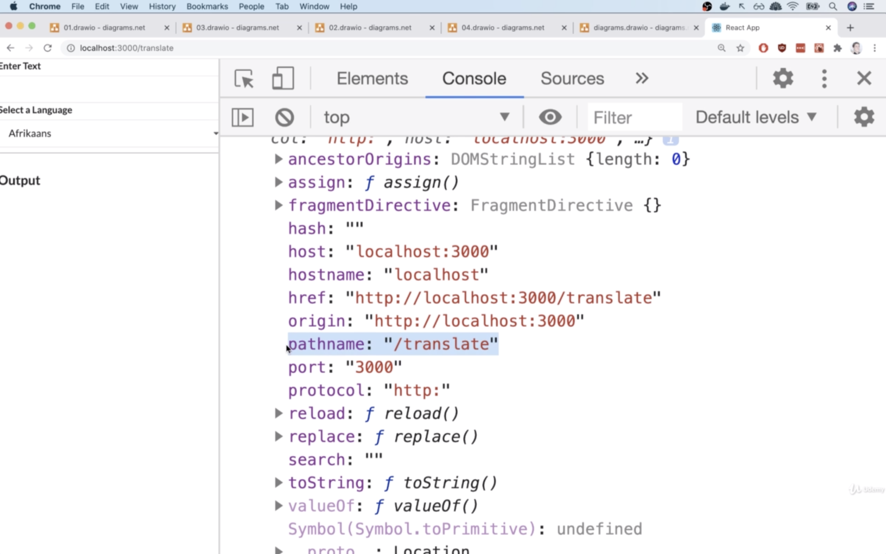
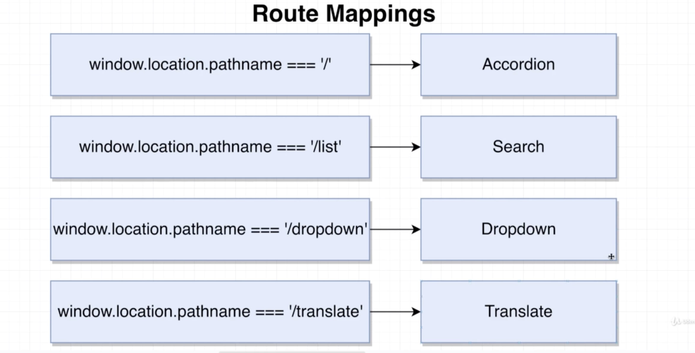

# 20200728 Navigation From Scratch

So we say that we are going to navigate a user around or implement navigation. We are saying that we are going to show different components to the user based upon the current URL that they are visiting. Our root route or the home page, whenever user goes there, we will show the accordion.

to implement navigation instead of react up, we usually make use of a very popular library called React Router.

So the first thing we need to understand is how to determine what URL we are actually at. I'm gonna go back over to my browser and go to the address bar and manually edit URL to http://localhost:3000/translate
Then once here, I'm going to open up my console, and I'm going to type out window.location.

Window dot location is an object that is built into your browser. This object is going to be automatically updated anytime you navigate around to a different URL. Inside this object, you're going to see a lot of information that has been extracted from the current URL.

So path name is everything inside the URL after the domain(localhost) and the port(3000). So whenever we are at the root route or localhost:3000 with no path whatsoever, we still have a path name of forward slash.

We want to show the accordion whenever window location path name is equal to forward slash.
