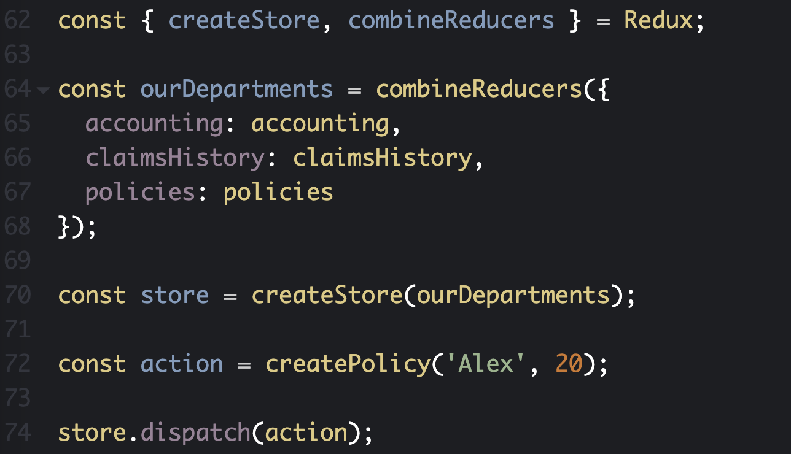
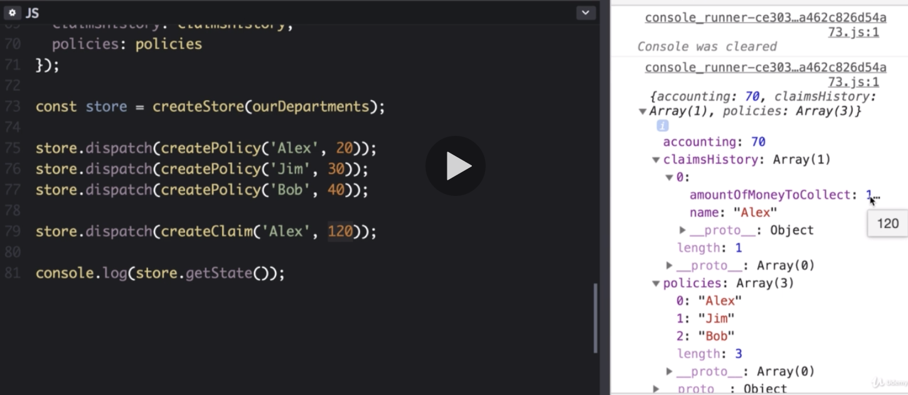
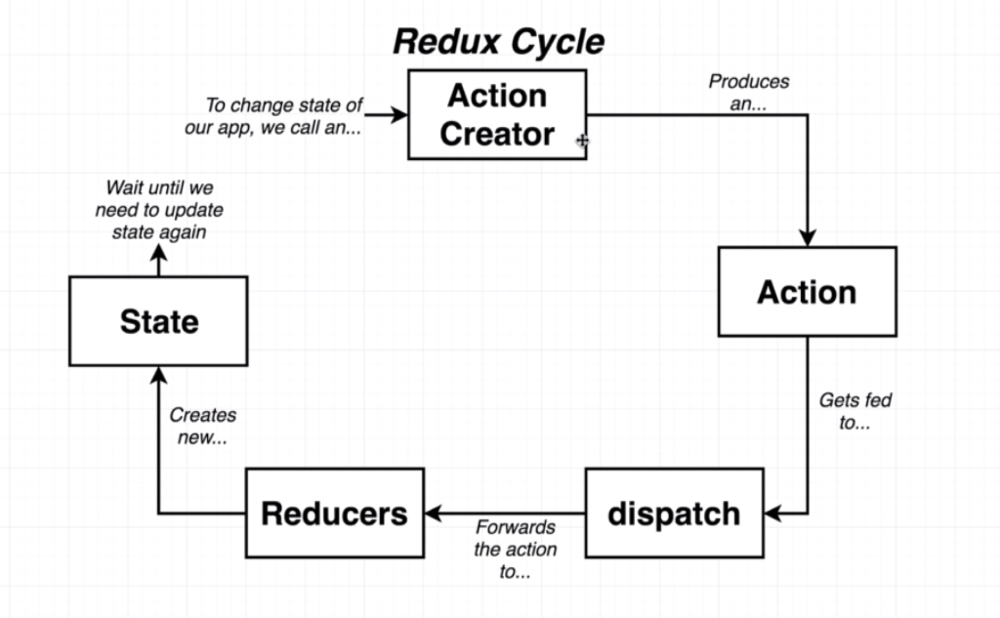
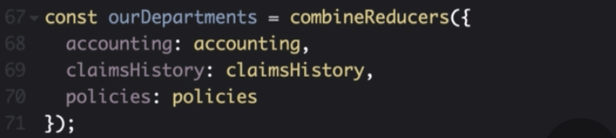
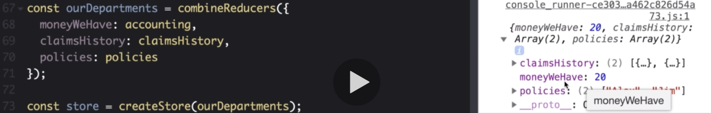
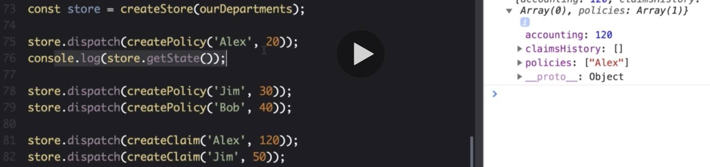
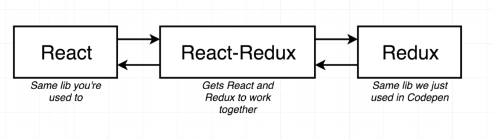

# 20200612 Redux

a store in redux is essentially the assembly of a collection of different reducers and action creators.

```js
const { createStore, combineReducers } = Redux;
```

We're going to pull off two specific functions from the library called create store and combine reducers, and that's going to come from redux.

---



To wire together all of our reducers we're going to use this combinedReducers function.

The store object represents our entire redux application.
It contains references to all of our different reducers and to all of our state & data produced by those reducers.

The store object has a couple of different functions on it, one of the functions is the dispatch function (form receiver).

So we want to pass the dispatch function an action, the dispatch is going to make a copy of it and then send it off to each of the different reducers inside our application.

So in order to call dispatch we first have to pass in an action.

When we take store.dispatch and pass the action, that action will be forwarded off to each reducer.



As soon as we called store.dispatch, each of our different reducer functions or departments essentially ran and process that action or that form.

store.getState() is a function (object) that's going to essentially get our entire assembled repository of data for our company.

We can call all of our different action creators pass the action that gets returned to store.dispatch and that's going to incrementally modify exactly how the state of our company looks. That is all contained inside of the store.



Any time we want to change the state or the data of our application we're going to call an action creator, calling an action creator is going to produce an action object.

This action object describes exactly how we want to change data inside of application.

That action object gets fed to the dispatch function which in turn is going to make copies of the action object and feed those copies to each of our different reducers.

In turn the reducers are going to run, They're going to process those actions or the forms that came in modify their data and then eventually return some new data.

That data that gets returned gets formed into some new state object. So then we wait until we need to somehow updates our state again at some point in the future.



The purpose of this combineReducers call : The different reducers we put together were simple functions, all these different functions need to be somehow wired up together. We wire up all the different reducers together by making use of the combineReducers function.

We have different keys on here of accounting claims history and policies. Because we used these very specific key names, we ended up with a state object.



We ended up with properties on our state object equal to those key names so we can absolutely feed keys into this object with names different from our reducer (value).

For example I can change this key of accounting to moneyWeHave and you'll see state object now has a different key for the accounting reducer.

We do not always have to name these reducers (value) exactly after the keys (key), but usually by convention we're going to have them be very similar. (You can change the keys if you ever want to end up with different state property names)



Each dispatch is essentially running one of these entire cycles (Redux cycle).
(So we’re calling an action creator, getting an action, feed into dispatch, that runs our reducers and we get out some each state)

So each of these dispatches is a separate execution of that entire cycle. We can printout our state object in total in between each of those dispatches.

We don't have to run all the dispatches and then only after that get access to our state object.

So at any point in time along our application, we can take the store object (上圖第一行的 store) and pull our state out of it and read the current state or the current data for our application.

We can only modify this state object or this kind of assembly of all the data through the use of the dispatch function and the action creators and actions.

There is no way that we can somehow manually reach into this store and modify the state in there manually. (We cannot get direct access to our state property and modify it, we're only ever going to modify our state by dispatching an action that has been created by an action creator.)

People can only modify data inside of your app by calling these different action creators.



npm install --save redux react-redux
