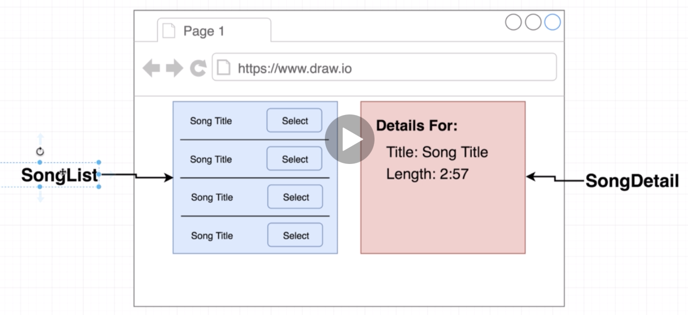
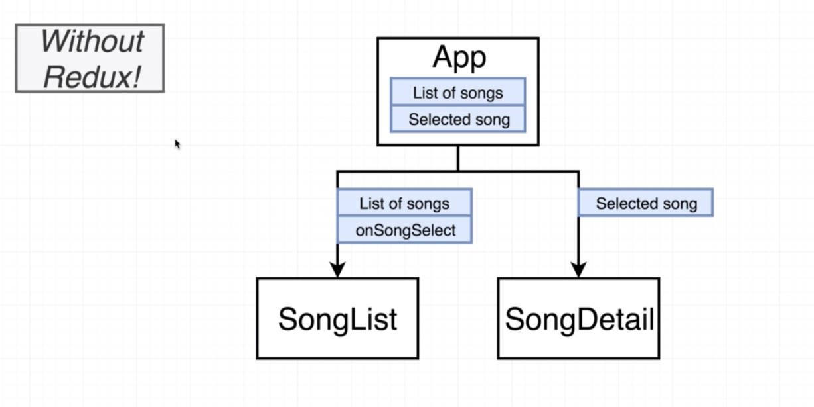
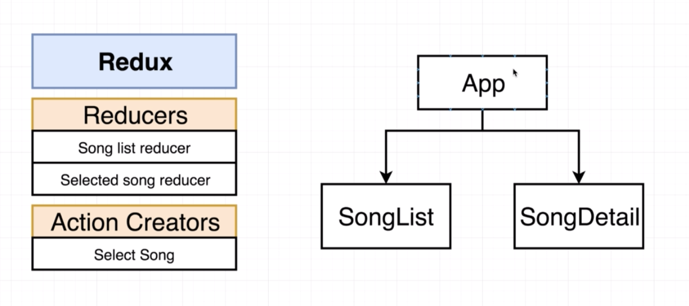

# 20200613

we usually make use of class based components any time that we want a component to build to make use of state.

Now that we are making use of redux, we're going to see that we make use of component level state much less frequently.
Instead we're going to generally store all of our data inside of redux.

there are some scenarios where we want to have state or data inside of redux and state inside of our react components as well.

the app component would have a list of songs and it would probably also record what the currently selected song was.
The app component would then probably pass down that list of songs to the SongList, so that the SongList knew what to show on the screen.

In addition it would probably pass down a callback like onSongSelect, so that any time the user clicks on select button, the SongList could tell the app component that the user just selected some particular song.

the only thing that the SongDetail really needs to know is what the currently selected song is, so the App component would pass that down to the SongDetail as a prop and the SongDetail would simply render the details for that song out on the screen.

---

the app component is going to be passing very little information down to the song list and the song detail.
Instead we're going to abstract out all these ideas of creating a list of songs and selecting a song and what the currently selected song is into the redux side of our application.

So we're going to create a reducer that is going to produce a list of songs and a reducer that records what the currently selected song is.(That's the two pieces of state inside of our application —> The list of songs and the currently selected song.)

Finally we're going to have an action creator so that we can change our state.(that's the only way we change our state inside of a redux app —> call an action creator.)

So if you want to change what the currently selected song is, we're going to call an action creator that will dispatch an action and tell this Selected song reducer to update its data and reflect the new current present picked song.

SongList reducer is going to be passed creating a static list of songs like a fixed array of objects. So technically this doesn't really need to be data that is stored in redux at all.
