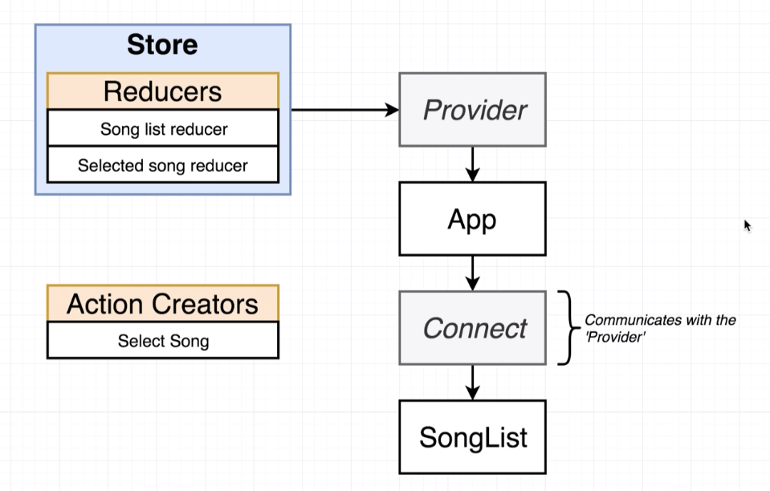
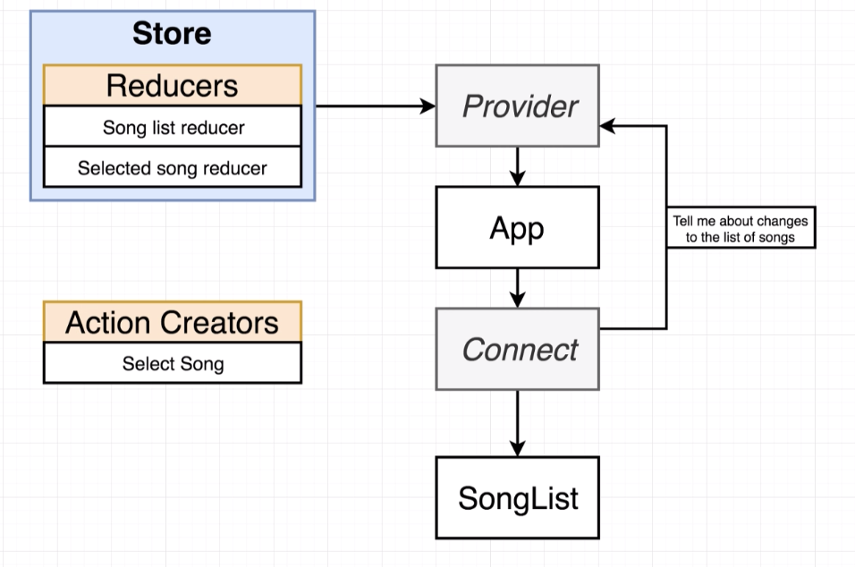
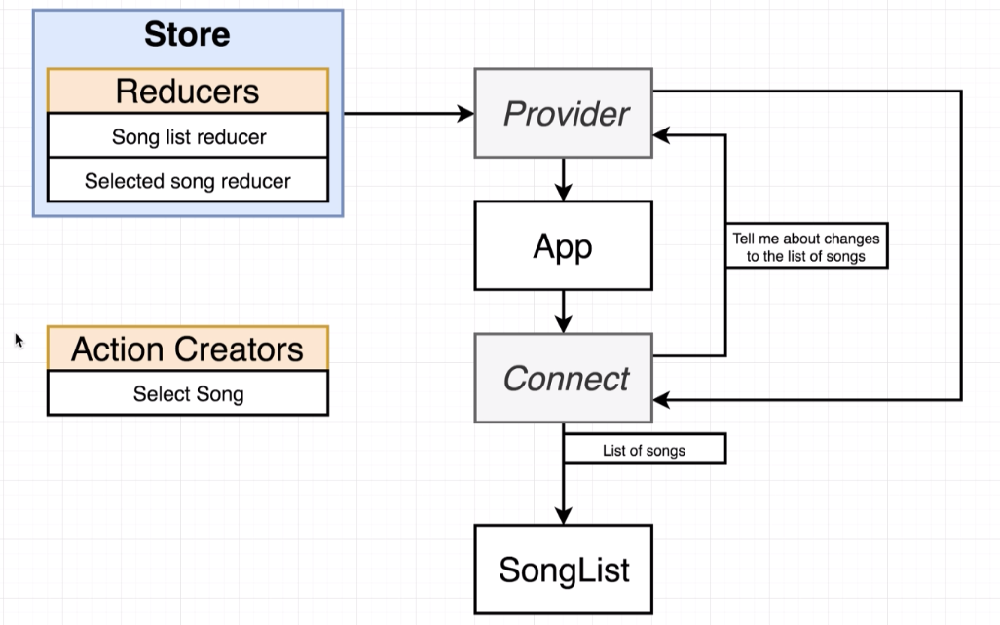
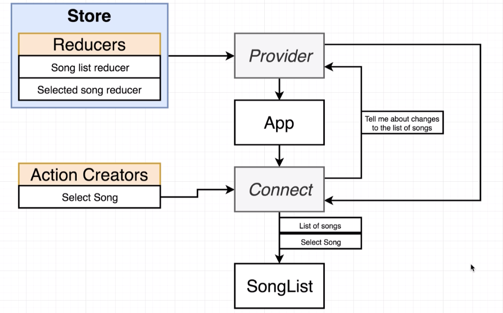

# 20200614 React-Redux

Using React-Redux, we're going to create two new components. These components are called the provider and the connect (both are created by React-Redux). We are going to create instances of them and pass some props into both them.

The redux store is what contains all of our reducers and all the state of our application. We are going to take that store and pass it as a prop into this provider.

The provider is going to be rendered at the very top of our application hierarchy, even above the app component. So technically we're going to show the app inside of this provider. The provider is then going to have that eternal reference to the store. The word provider essentially means it is providing information to all of the different components inside of our app.

After wiring up this provider, we're then going to find every component inside of our application that needs to somehow access the data that is stored inside of our store. The SongList needs to know about the list of songs that is produced by Song list reducer. So we're going to create an instance of the connect component right above the SongList. So we're going to wrap this SongList component with Connect.

The connect component (connect function / connect tag) can communicate with the provider tag at the very top of our hierarchy. It communicates with that provider not through the props system but through the context system (different system of communication inside of React).

The context system essentially allows any parent component(Provider) to communicate directly with any child component(Connect) even if there are other components in between them such as the App.

So at some point in time, when we put that Connect tag in there, we're going to configure the Connect tag and tell it that when it gets rendered on the screen. And then when it renders the SongList as a child, it needs to reach back up to that provider and tell the provider that it needs to get the list of songs that are contained within our store. (The Connect is essentially going to send a message up say : tell me any time that the list of song changes)

And so the provider is going to send that list of songs back down to the connect component. The connect component in turn is going to take that list of songs and pass it as a prop down into our SongList component.
(that's what's going on with the data that is inside of our store.)

---

The action creators are not stored in any way inside of our store. Instead we call an action creator, we take the action that gets returned and we send it into the store.dispatch function (that's how we change data in the redux side of our application).

We're going to tell the connect function that we want to be able to call the Select Song action creator from SongList component.

the connect component is going to make sure that the action creator (Select Song) is sent down to SongList component as a prop.

---

So this entire flow essentially all we have to do is create the provider, pass it a reference to our redux store, then any time that we have a component that needs to interact with the redux store in any way, we're going to wrap it with this connect function.

We'll then configure this connect function by telling it what different pieces of states we want out of our store and what different action creators we want to have wired up as well.

That connect function is going to do all the magic for us and make sure that all that data (both the state and the action creators) show up inside of our component (SongList) as props.
