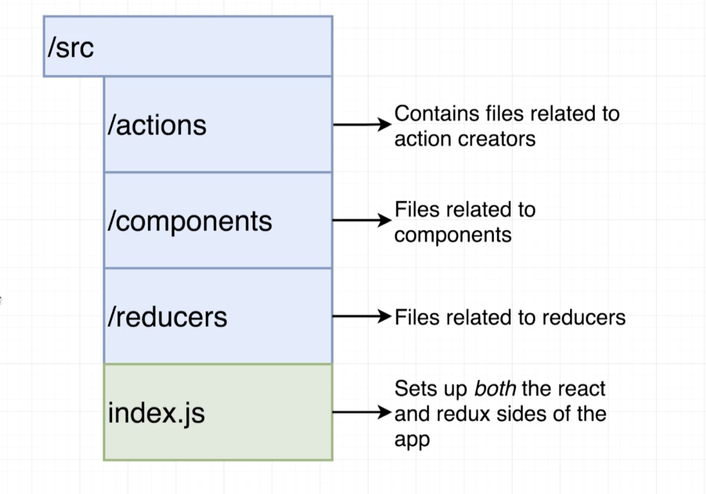
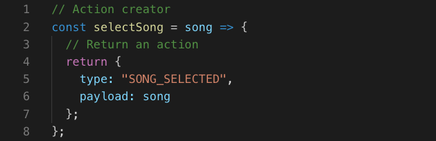

# 20200615 React-Redux



Web-packed is the dependency or the tool that is joining all of our different files together.
If you don't specify a file on import (if you only specify a directory --> import actions from '../actions'), web-packed is going to automatically give you the index.js file. And so when we create a index.js file inside of some directory it's really just a shortcut. We usually call the root file inside of actions directory (and reducers directory) the index.js file.



I'm going to assume that we're going to pass in the song that we're trying to select as an argument to the action creator.

```js
// Action creator
export const selectSong = song => {
  // Return an action
  return {
    type: "SONG_SELECTED",
    payload: song
  };
};
```

As we start to write multiple action creators inside this file, we might want to export multiple different functions. So rather than creating a default export, we're going to instead create a named export which allows us to export many different functions from a single file. To do so, all we have to do is place the export keyword right in front of that function declaration.

```js
import { selectSong } from "../actions";
```

An example of how we would import this selectSong action creator into another file.

So the curly braces right here specifically mean that we want to import a named export from index.js file.

If we had a export default in index.js file instead (like --> export defaults selectSong) then we would not need those curly braces (like --> import selectSong from "../actions";).

If it is a default export no need for the curly braces, if it's nameed export you need the curly braces.

```js
const songsReducer = () => {
  return [
    { title: "No Scrubs", duration: "4:05" },
    { title: "Macarena", duration: "2:30" },
    { title: "All Star", duration: "3:15" },
    { title: "I Want it That Way", duration: "1:45" }
  ];
};
```

From this reducer I'm going to return an array of objects where every object represents a different song. Every song has a title & duration property.

The only reason I made these durations strings was just to expect or express a duration easily with like our minutes colon and then the second.

```js
const selectedSongReducer = (selectedSong = null, action) => {
  if (action.type === "SONG_SELECTED") {
    return action.payload;
  }
  return selectedSong;
};
```

This is going to be called with a first argument of the currently selected song. I'll defaulte it to be null to indicate that when our application first starts up, we are not going to have any selected song, it's just null.

And then as a second argument will be our action object. So we're going to look at that action object and inspect its type. If its type is song selected, then we're going to return its payload property. Because our selectSong action (in actions index.js) has a payload of the song that the user is trying to select. And if that's not the case then I will return whatever are currently selected song is.

As we have written out this reducer, we only have one action creator inside of our application right now, but we've still written out an if statement assuming that we might have other actions at some point in the future (So technically for our current app we don't really need this if statement).

```js
import { combineReducers } from "redux";
```

Then we're going to import the redux library into this file (Notice this is an example of a named export) and wire up these reducers to each other with that combine reducers function.

When to use the curly braces and when not to if we are importing code from some other library : the only answer is you need to look at the documentation for that library.

When you are importing code from your own files, you will always know by looking at the file contents if you are doing a named export or a default export.

```js
export default combineReducers({
  songs: songsReducer,
  selectedSong: selectedSongReducer
});
```

The keys of this object are going to be the keys that show up inside of our state object.
