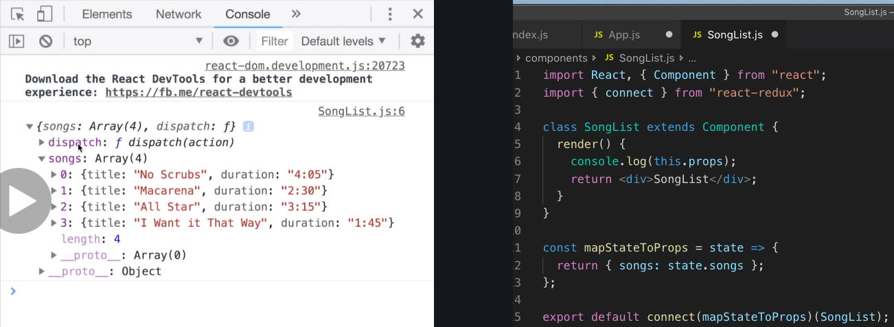

# 20200616 React-Redux

```js
import { Provider } from "react-redux";
```

First off I'm going to import a provider components from react redux. This is technically a component that is made by the re-act redux library. Notice how this is also a named export, and that I named it with a capital P because it is a component, and by convention we'd label component variable names as capitals.

```js
import { createStore } from "redux";
```

Next up I'm going to also import the createStore function from redux.

```js
ReactDOM.render(
  <Provider store={createStore(reducers)}>
    <App />
  </Provider>,
  document.querySelector("#root")
);
```

We had passed createStore our set of reducers and returned back to us a redux store that contained all of our reducers and all of our applications data or state.

Now the last thing I'd do is create an instance of the provider and wrap it our app component with it.

And then I'm going to pass the provider component a single prop called store. The store is going to be the result of calling createStore and passing in our reducers.

When we make use of the react-redux library, we don't usually mess around with the store directly. Instead we pass it off to this provider, and the provider takes care of everything from there. So in a typical redux application, you're actually very rarely going to interact directly with the store.

We've now wired up our provider and now any component inside of our component hierarchy can implement (or make use of) connect component.

So now any component inside of our application can somehow get access to that redux store through the provider tag.

The purpose of the connect component is to somehow communicate with the provider, and thus communicate with all the data inside of our Redux store.

```js
import React from "react";
class SongList extends React.Component {}
```

```js
import React, { Component } from "react";
class SongList extends Component {}
```

There's an alternate way that we can write out React.Component by named export. We could directly import the component base class from the react library. So we have both a default export and a named export on a single line. Right next to extents, we can write out simply Component instead of React.Component.

---

```js
import { connect } from "react-redux";
```

This connect component (react component) is going to be defined directly inside of our SongList component file, because only the SongList needs to create this connect function that reaches up to provider and gets that list of songs.

```js
export default connect()(SongList);
```

To create a instance of the connect component, I'm going to go down to export default, and add "connect()", and then put a second set of parentheses around SongList.

```js
function connect() {
  return function() {
    return "Hi there!";
  };
}

connect(); // 1
connetc()(); // 2 Hi there!
```

1. Whenever I call that original function connect(), I don't see anything out.

2. If I add on a second set of parentheses, I see that text 'Hi there!'.

All it's doing is returning a function, and when we call the function that gets returned, we put on the second set of parentheses right after.

So connect function the first set returns a function. The second set invokes the function that got returned.

---

We're going to specifically tell this connect function that we want to get a list of songs out of our redux store from the provider. So anytime that our list of songs inside of our store changes that provider is going to automatically notify our connect function, and the connect function is then going to pass our list of songs down to our song list component.

```js
const mapStateToProps = () => {};
function mapStateToProps() {}
```

By convention we normally call this function the mapStateToProps function (this can be an arrow function or it could be a function keyword).

mapStateToProps: This is saying that we're going to take our state object (essentially all of the data that's inside of our redux store), and we're going to run some calculation on it or some computation that's going to cause that data to eventually show up as props inside of our component.

(we can call this anything we want to call it)

This mapStateToProps function is going to be called with all of the state inside of our redux store. So that state is essentially going to be our entire list of songs from the song list reducer, and our currently selected song from the selected song reducer (all of the data inside of our redux store).

```js
export default connect(mapStateToProps)(SongList);
```

After defining mapStateToProps function, I'm then going to pass it (mapStateToProps) as the first argument to this connect function.


We've got selectedSong that has all the data that was returned from our selected song reducer which by default was null. And then we've got songs array as well, that has those four song objects that we had defined.

```js
import React, { Component } from "react";
import { connect } from "react-redux";

class SongList extends Component {
  render() {
    // this.props === { songs: state.songs }
    return <div>SongList</div>;
  }
}

const mapStateToProps = state => {
  return { songs: state.songs };
};

export default connect(mapStateToProps)(SongList);
```

So the object that we return from the mapStateToProps function is going to show up as props inside of our component.

Inside of our SongList component, if we say this.props it's going to be equal to exactly that object.
(It's going to be an object that has a songs property and that will contain the list or the array of all of our songs)

So that is how we make use of the react-redux library to get data from our redux store into a component.

It's always going to be the exact same scenario.

1. we're always going to import connect at the top.

2. We're always going to call connect and then pass in our component as the second function call.

3. We're always going to define mapStateToProps. mapStateToProps is always going to get a first argument of state, and we're always going to return an object that is going to show up as props inside of our component.



There is the list of songs. We also got a reference to the dispatch function from our redux store as well. This is the same dispatch function that we use previously inside of code pen to manually dispatch an action after calling an action creator.

So if you ever want to change some data inside of our application, we can make use of this dispatch function.

---

```js
renderList() {
    return this.props.songs.map((song) => {
        return(

        );
    });
}
```

We're going to map over our this.props.songs array (that contains the list of song objects). And for every song inside there we're going to return some JSX that's going to represent that song on our list.

I'm going to add in a new helper method to the SongList component. The goal of this method is to just take our list of songs, map over them, and return a big blob of JSX.

I'm going to pass the mapping function a inner function that's going to be called with each song object inside of that array.

You've got the two return key words inside of renderList. The inner return statement is returning some amount of JSX for the mapping function. The map statement overall is going to produce a brand new array of JSX elements, and after we produce that array we want to return that array from the renderList method.

Key is highly recommended anytime that you are building out a list of elements. We don't have an ID inside of these song objects (each song object only has a title and a duration), so in this case I'm just going to use the title as the key because it's sufficiently unique for each song that we're trying to render.
