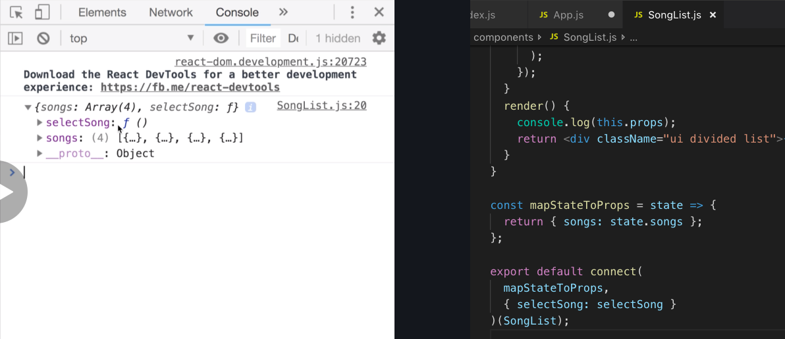
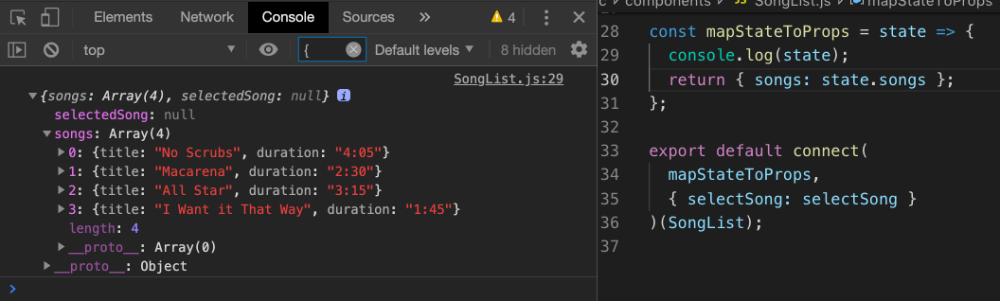
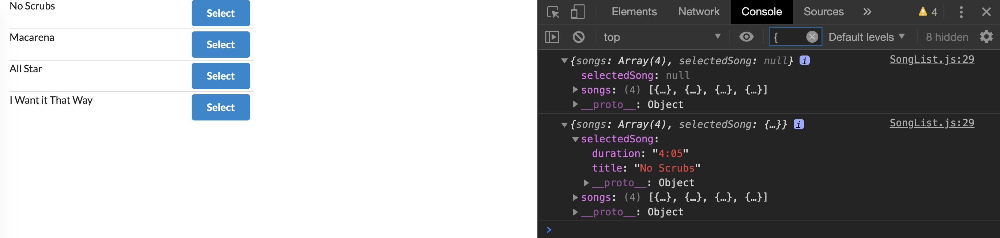

# 20200617 React-Redux

```js
<div className="right floated content"></div>
```

The keyword of the className floated is what gets this div and everything inside of it to appear to the right hand side of each list item.

---

the connect function is going to be used not only to get data out of our store, but also be used to get action creators correctly into our SongList component.

```js
export default connect(
  mapStateToProps,
  { selectSong: selectSong }
)(SongList);
```

We're going to pass action creator into that connect function. As a second argument to the connect function, I'm going to pass in an object. This object is going to have a key of selectSong and a value of the action creator.

```js
export default connect(
  mapStateToProps,
  { selectSong }
)(SongList);
```

Notice now that the key and the value inside this object are identical. So we can use a little bit of ES2015 syntax to shorten this up



Now that we are passing in a second argument, the connect function is going to take that selectSong action creator and pass it into our component as a prop.

Now inside of my console log, this is all my prop's object. I have a function here called selectSong, that's our action creator. And if we call it, it's going to automatically take the action that gets returned and send it into redux's dispatch function.

```js
<button
  className="ui button primary"
  onClick={() => this.props.selectSong(song)}
>
  Select
</button>
```

To make sure that we correctly call the action creator. On the button elements we'll pass in a onClick event handler. So anytime that someone calls this, I want to run a function that's going to call this.props.selectSong(), and I'm going to pass in the current song that we are iterating over.

In order to see our changing state, one thing we could do very easily is go down to our mapStateToProps function, this function gets called with all the data inside of our redux store.

Anytime that we change our redux state or any time that we rerun our reducers and produce some new state object, the mapStateToProps function is going to rerun with the newly created state object.

So in other words every time that we click on that select button, mapStateToProps function should rerun and it's going to be called with the new state object a second time.



We add in a console.log to mapStateToProps, so this is all of our state inside of the Redux store. We have our list of songs and default selected song of null.



If I now click on the select button, I'm going to see another console log, and I correctly have a selected song with a title and a duration.

Anytime that we click on the button, we should see a new console log and we should see the new selected song printed up inside that state object. Any time we click on a button, we are updating the state inside our Redux store.
