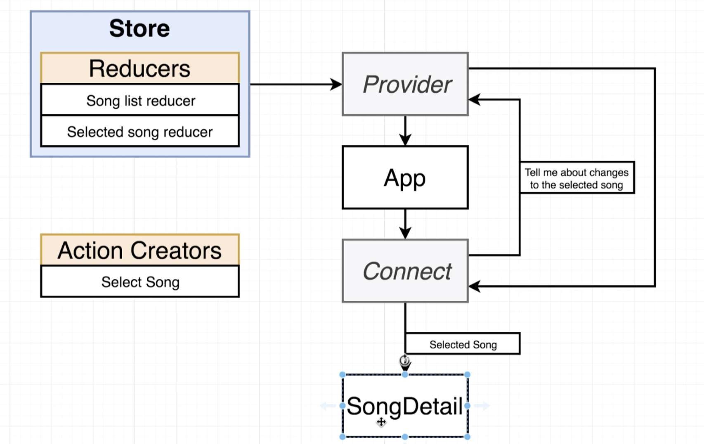
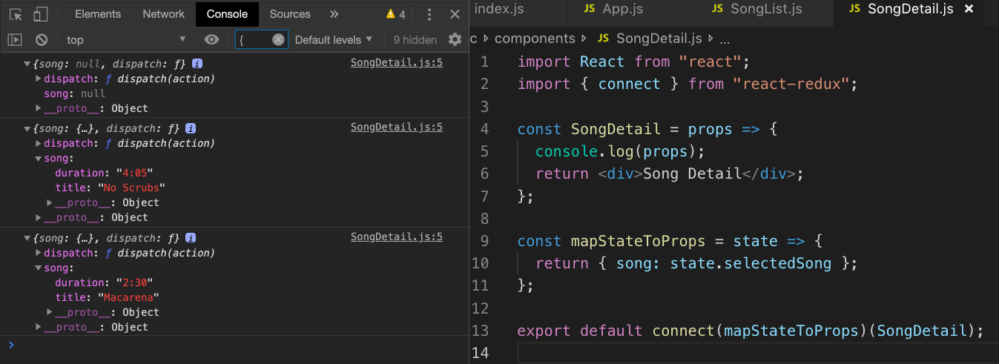

# 20200618 React-Redux

We are choosing to import the action creator and then pass it off to our connect function as opposed to just directly calling the action creator inside of our component.


```js
// Action creator
export const selectSong = song => {
  // Return an action
  return {
    type: "SONG_SELECTED",
    payload: song
  };
};
```

Our actions index.js file contains our action creator. Now we are referring to this function as an action creator, but there's nothing about this function right here that somehow automatically wires itself into redux. There's nothing inside this function that somehow registers the function with redux.

There's nothing to say that anytime that I call this function and return that action that redux is going to somehow magically detect that and take the action and threw it off to all those reducers and update our state. That does not happen at any step.

So when we are inside of our SongList component, and we import the selectSong action creator, we're not so much importing action creator as we are importing a regular plain old javascript function.

So we can call selectSong inside of SongList component as many times as you want, but this is going to be treated as a normal javascript function call. We're going to call the function, it's going to return an object, the object that gets returned from this function call never gets forwarded over to redux, redux doesn't detect that we called a function that you and I are arbitrarily calling a action creator.

If we ever want to make sure that an action eventually makes its way over to our reducers, we have to call that dispatch function, we have to take the action that gets returned and we have to pass it into the dispatch function.

In CodePen example, notice how every single time that we dispatched an action, we called our action creator that returned an action object. And then that was directly passed into the store.dispatch function

If we had not passed the result of calling those action creators, if we had instead simply called createPolicy('Alex', 20), none of these function calls are going to update our Redux store. They return actions, but those actions never got sent into redux and they never ended up inside of our reducers. (console.log(store.getState()); you'll notice that I have no policy)

So if we ever want to make sure that an action creator actually updates our states, we have to take the action that gets returned and send it into that dispatch function.

```js
export default connect(
  mapStateToProps,
  { selectSong }
)(SongList);
```

Now you do not actually see any reference to dispatch inside of our component. When we pass our action creators into the connect function, the connect function does a special operation on the functions inside of this object. It looks at all the functions include inside of this object, and it essentially wraps them up in another javascript function.

When we call the new javascript function, the connect function is going to automatically call our action creator, it's going to automatically take the action that gets returned and it's going to automatically call the dispatch function for us.

So by passing our action creator into that connect function whenever we call the props.action creator or the action creator that gets added to our prop's object, the connect function is going to automatically take the action that gets returned and throw it into the dispatch function for us.

So any time that you ever want to call a action creator from a component you are always going to pass it into this connect function.

---



the SongDetail component needs to know information that is stored inside of our redux store, so we wrap SongDetail with the connect component.

We define a mapStateToProps function that's going to tell the provider to tell it anytime the selected song changes. In response, the provider tell the connect function every single time that the user clicks on a select button and the selected song changes.

The connect function take the currently selected song and pass it as a prop down into the SongDetail component.

Now the SongDetail component has absolutely no functionality (allow user to click on something... which would cause a change to a redux state) tied to it, so we do not need to wire up any action creator to SongDetail component.

(You do not need to make a class based component to work with the connect function, you can work with the connect function with a functional component as well.)

```js
const mapStateToProps = state => {
  return { song: state.selectedSong };
};

export default connect(mapStateToProps)(SongDetail);
```

This function is going to be called with our entire state object, so we're going to reach into that state object and pull out the property that we care about, and return it as an object from this function.

```js
// in reducers index.js file
export default combineReducers({
  songs: songsReducer,
  selectedSong: selectedSongReducer
});
```

The keys on this object are going to be the keys inside of our state object. So our selectedSong is going to be available on state.selectedSong.

```js
const SongDetail = props => {
  console.log(props);
  return <div>Song Detail</div>;
};
```

Inside of SongDetail component, it should be getting a prop's object that contains the currently selected song ({ song: state.selectedSong }).

---

<font color = "gray">So this is another good example of where our app component is no longer going to be really in charge of customizing any of the child component that it renders. That's absolutely what happened in the past before we had the app component in charge of everything and it passed a lot of config into our different components. But now we are relying upon redux to provide all the configuration that we really care about and all that changing data and the ability to change data is being passed directly into the components themselves.</font>

---



So this is the props object inside of our SongDetail component (We see that it gets the dispatch function directly). We usually do not make use of that dispatch function directly, instead we wire up our action creators to the connect function

When our application first starts up, we do not yet have a selected song, so we see a value of null.

If I clicked on the select button, we called an action creator which updated a reducer that updated our state inside of a redux store.

Anytime we update the data inside our redux store by dispatching an action or essentially calling an action creator, it causes all of our components that are hooked up to the connect function to automatically re-render.

And so this second called of console.log right here is from our SongDetail component automatically being re-rendered, and inside there we can see that we have a song property with the song that I had selected.
