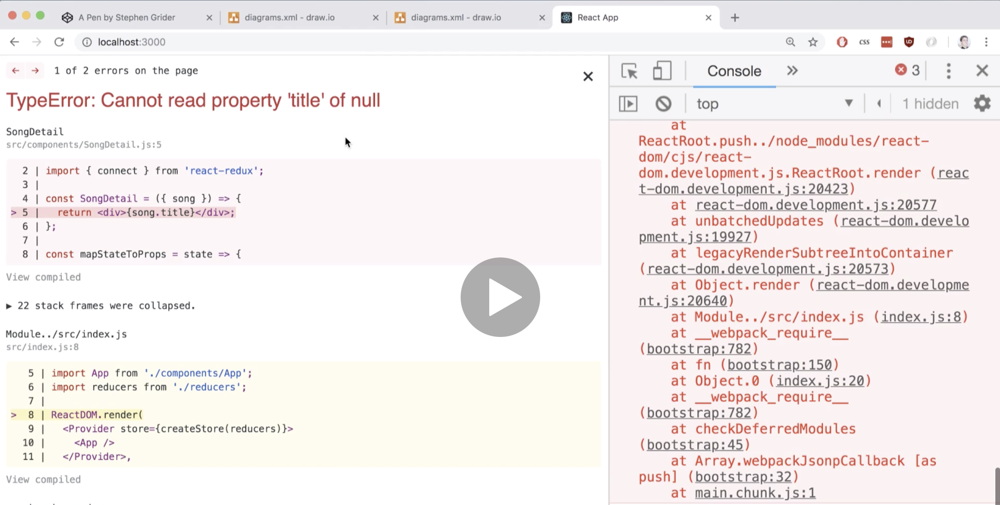
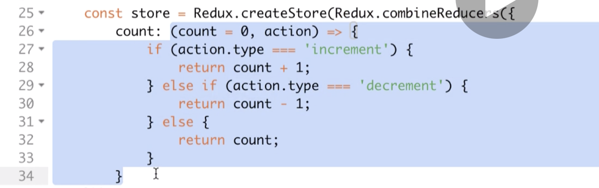

# 20200619 React-Redux

We can print out the currently selected song from our SongDetail component by hooking up the connect function to it.

Our props object has a key of song, and it is what we had returned from our mapStateToProps function.

```js
const mapStateToProps = state => {
  return { song: state.selectedSong };
};
```

This entire object (mapStateToProps function return) is what is going to eventually show up as our props object inside the component.

So if you ever want to customize the key that shows up inside your props object, you do it inside of mapStateToProps.

---

```js
const SongDetail = props => {
  console.log(props.song.title);
  console.log(props.song.duration);
  return <div>Song Detail</div>;
};

const SongDetail = ({ song }) => {
  console.log(song.title);
  console.log(song.duration);
  return <div>Song Detail</div>;
};
```

Instead of receiving the entire props object I'm going to destructure out just the property we care about just the song property.



When we first render out our component on the screen, we do not yet have a selected song, and in fact the selected song piece of state inside of our redux store starts off as null. So we're trying to read the property title on a value of null.

```js
const SongDetail = ({ song }) => {
  if (!song) {
    return <div>Select a song</div>;
  }
  return <div>{song.title}</div>;
};
```

to fix this, all we have to do is add in a little check inside of our component. (If song does not yet exist or if it's a null value.)

how we integrate react and redux together: we're still going to create our components as we usually do. We're going to then select some very specific components inside of our application that need to receive some information or need to make changes to our state. if we need to make changes to our state or receive information, we're going to import that connect helper. And then at the bottom of the file we can define a mapStateToProps function. We'll then pass that function as the first argument off to connect, and I'll put on the actual component that we care about as a second function call next to the connect call.

```js
// Action Creators - You don't need to change these
const increment = () => ({ type: "increment" });
const decrement = () => ({ type: "decrement" });

const Counter = props => {
  return (
    <div>
      <button className="increment" onClick={props.increment}>
        Increment
      </button>
      <button className="decrement" onClick={props.decrement}>
        Decrement
      </button>
      Current Count: <span>{props.count}</span>
    </div>
  );
};
const mapStateToProps = state => {
  return { count: state.count };
};
const WrappedCounter = ReactRedux.connect(mapStateToProps, {
  increment,
  decrement
})(Counter);

// Only change code *before* me!
// -----------

const store = Redux.createStore(
  Redux.combineReducers({
    count: (count = 0, action) => {
      if (action.type === "increment") {
        return count + 1;
      } else if (action.type === "decrement") {
        return count - 1;
      } else {
        return count;
      }
    }
  })
);

ReactDOM.render(
  <ReactRedux.Provider store={store}>
    <WrappedCounter />
  </ReactRedux.Provider>,
  document.querySelector("#root")
);
```

The first we need to do is get some state out of our redux store, and show some state or show some property inside of our counter component.

If you look at the store that we defined down here, inside of the store definition is the combineReducers call.



So I've got a reducer right there, that reducer is assigned to the count property. So that means that whenever our redux store comes to life, it's going to have a property on its state object called count.

So now inside of mapStateToProps we're going to pull off that state property from the state object, and we put together this object which we want to show up as props inside of our component. So we take the mapStateToProps function and pass it as the first argument to the connect function.

I'm going to receive the props object inside this component, it's going to have a count property (because that is what we are returning from mapStateToProps). A easy way that we could test to make sure that we actually have stuff wired up correctly would be to change the default value that gets returned from the reducer. We at least can confirm that we are pulling data out of our redux store and showing it inside the react component.

Anytime someone clicks on these buttons, we call an appropriate action create and attempt to change our state. So we need to take these two action creators and pass them inside of an object to the second argument of the connect function. Then our props object is now going to have two additional properties (It's going to have an increment function and a decrement function).

To make sure that we call those two functions whenever a user clicks on either the button, I'm going to add in an on click event handler, and put in props.increment.

Notice that I did not put a set of parentheses. I don't need any parentheses because I don't want to call this action creator or this callback when the button is first rendered. (If you put on the parentheses (props.increment()), the function will be called right away when the counter component actually gets rendered to the screen) We only want to pass a reference to this callback function (to onClick) so that it can be called at some point in time in the future.
