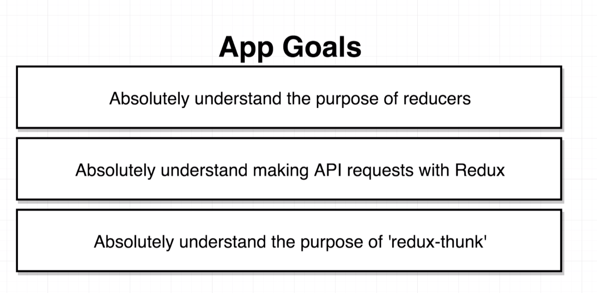
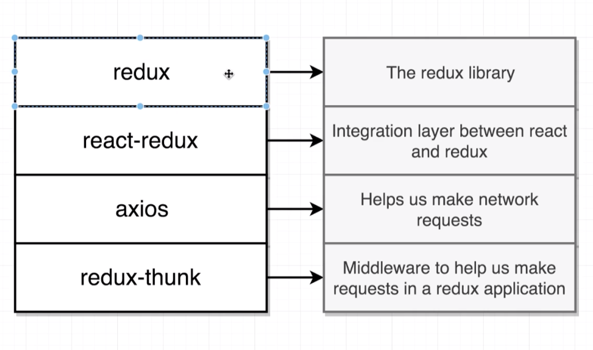

# 20200620 Async Actions with Redux Thunk



npm install --save redux react-redux axios redux-thunk



Ｔ his new dependency called redux thunk, this is a dependency that we refer to as a middleware. The term middleware applies to the redux library. middleware are essentially functions that are going to slightly change the behavior of our redux store, so they will add in new capabilities or new features to the redux side of your application.

In the case of redux thunk, this is a middleware that is going to help us make network requests from the redux side of our app.

---

```js
export default combineReducers({
  replaceMe: () => "hi there"
});
```

Inside the combinedReducers call I can put in some dummy key, and then we can assign this dummy key an arrow function that is always going to return some fixed value. There's no purpose to this thing, it's just tricking redux into thinking that it has a valid reducer. And the only reason we're doing this is to get that error message to go away.
