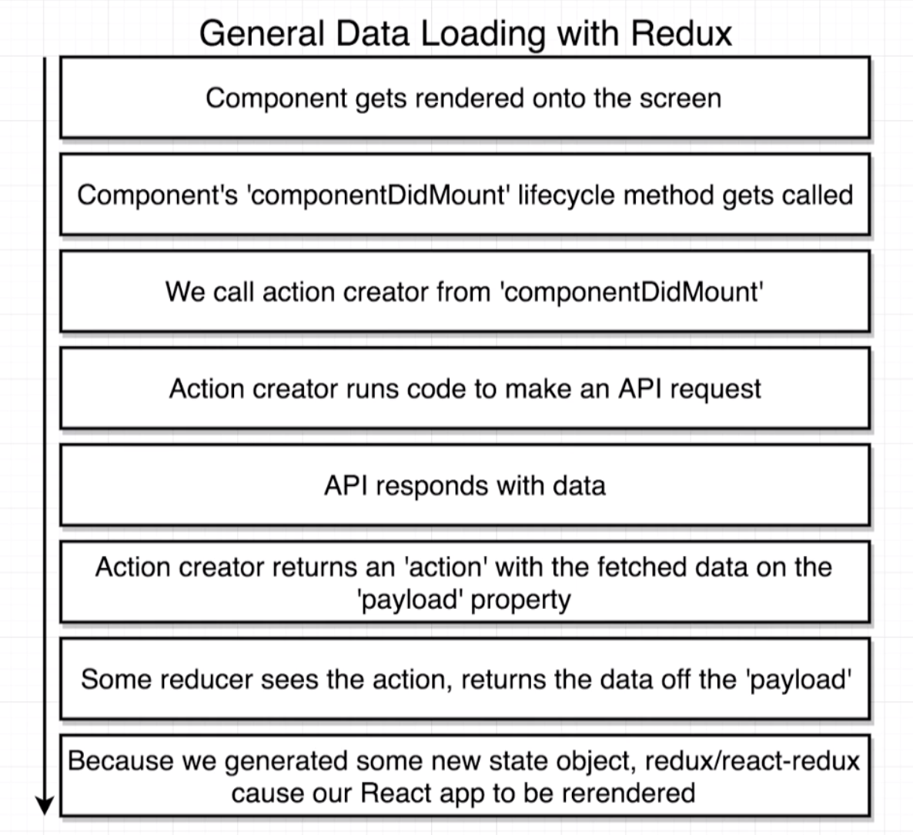
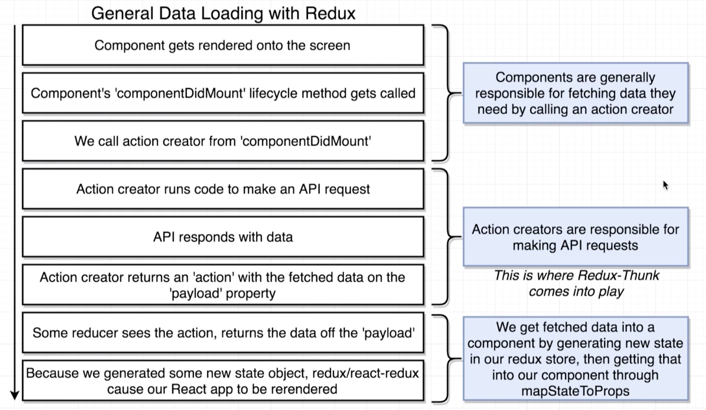

# 20200622 Async Actions with Redux Thunk



Once you load up some data into a redux application from some outside API, almost always it's going to be the exact same flow.

our PostList component needs to get a list of posts from that JSON API in order to show itself correctly. Because of that, we are going to define a componentDidMount life cycle method on our component class (That is why we created a class based component).

Inside of the componentDidMount lifecycle method, we're going to place an action creator.

Anytime that our PostList component initially shows up on the screen, that action creator is going to be automatically called. The action creator is going to use axios to make an API request over to the JSON API.

After we make that request the API is going to eventually respond with some amount of data (In this case its going to be the list of blog posts).

Once we get back that data, our action creator is then going to return an action, and the action object is going to have our fetched data on the payload property.

the dispatch method is going to dispatch that action and send it off to all the different reducers inside of our app. So then we're going to have some very specially configured reducer that is going to be watching for an action of the type, and it's going to pull off just the data from that payload property.

Remember anytime that our reducers run, they're going to return some values, those values are going to form up a new state object inside of our redux store.

Anytime our reducers run and produce a new state object, we're going to take that state and it's going to be sent off to the react side of our application, and so redux and react-redux essentially are going to cause the react side of our app to be re-rendered.

But now this time inside of our state object, we're going to have that list of posts, so we're going to use the mapStateToProps function to get the list of posts out of the global state object and into our PostList component.



We're going to make sure that components themselves are responsible for fetching data that they need to get by calling some action creator (usually from a lifecycle method like componentDidMount). By far the most common place you're going to be initiating a data fetch requests from will be the componentDidMount life cycle method now.

In some cases we might put together some external class or some type of external service that is going to do the actual API request for us, but in general it's going to be up to the action creator to initiate the data fetching process.

Whenever we fetch some data and we want to get it into a component, we're always going to make use of that mapStateToProps function to get some data out of our redux store and get it down into our component.

```js
import React from "react";
import { connect } from "react-redux";
import { fetchPosts } from "../actions";

class PostList extends React.Component {
  render() {
    return <div>Post List</div>;
  }
}

export default connect(
  null,
  { fetchPosts: fetchPosts }
)(PostList);
```

Because we do not have a mapStateToProps function right now. Nonetheless we still have to pass in a first argument to the connect function. The first argument is always going to be mapStateToProps, but in this case because we do not have a mapStateToProps function, I'm going to just pass in null to indicate that we don't have any state that we want to get into this component.
