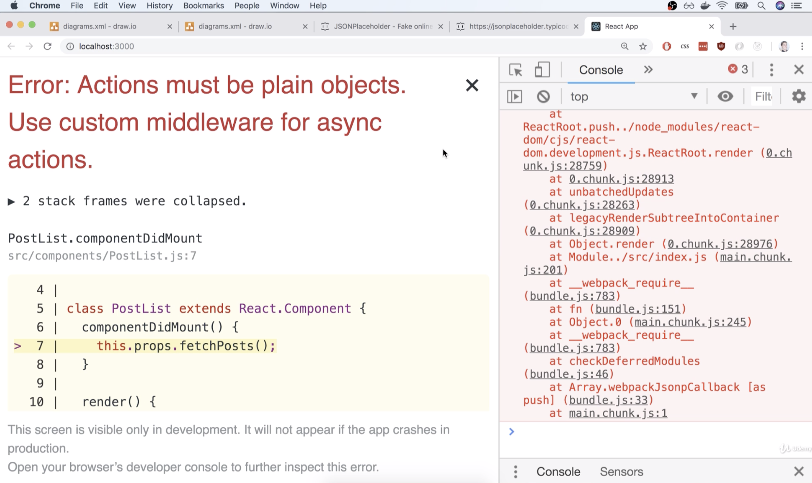
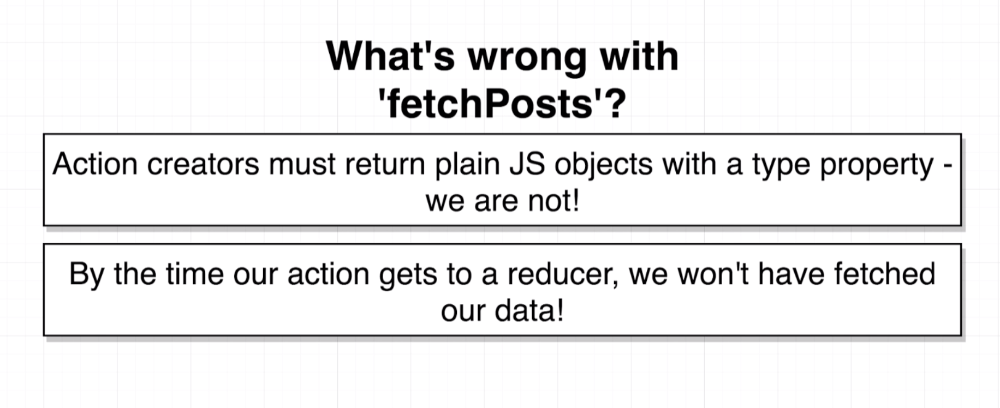
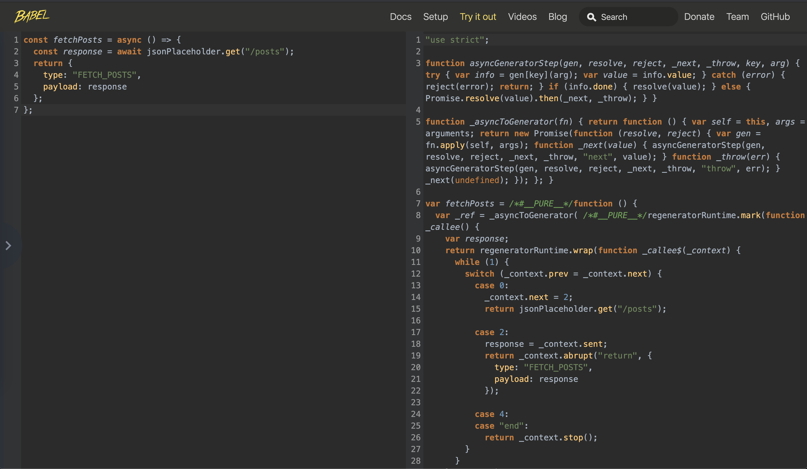
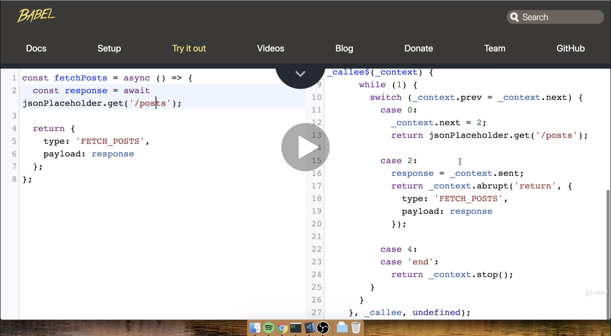
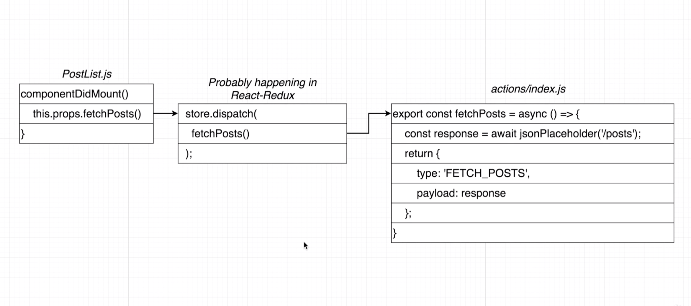
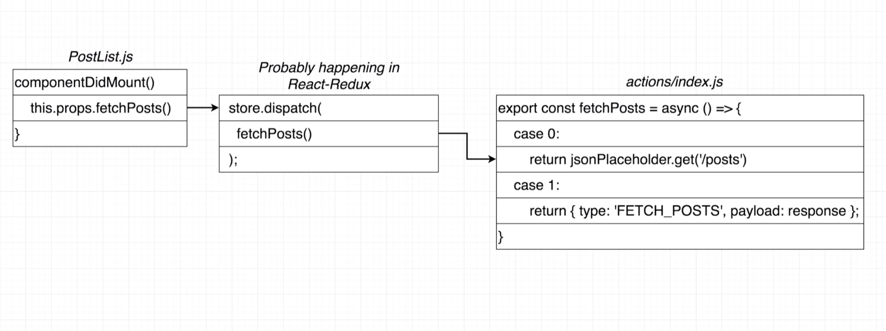

# 20200623 Async Actions with Redux Thunk

```js
import axios from "axios";

export default axios.create({
  baseURL: "http://jsonplaceholder.typicode.com"
});
```

We can use pre-configured axios instance to make a request inside of our action creator itself.

```js
export const fetchPosts = async () => {
  const response = await jsonPlaceholder.get("/posts");
  return {
    type: "FETCH_POSTS",
    payload: response
  };
};
```

Inside of action creator, we're going to use that async await syntax, we mark this function as async, then inside of here I will say await, and then list out the actual request that we want to make.

I want to make a request to jsonPlaceholder, and make a get type request, and I want to access the posts endpoint. Then I'm going to assign the result of all that to response. Then finally I'm going to take that response object and assign it to the payload property.





action creators inside of our redux are supposed to return plain javascript objects that had a type property and optionally a payload as well. But at present we are not returning an action from our action creator.

All of the code that we'd write inside of our code editor is ES 2015 2016 2017 2018 and so on code, the code that you and I write gets transpiled down to ES5 syntax, and that ES5 syntax is what actually gets executed inside the browser.

So even though this function looks like it is returning an object with a type property, in fact after we transpiled this to ES2015 code we are not.



Because we have specifically the async away syntax here, the entire function gets expanded to what you see on the right hand side.

So our action creator is not returning a plain javascript object it is because we have that async await syntax. That is why our action creator is not working as expected.



case 0: We return the results of calling jsonPlaceholder.get

case 2: we're going to eventually kind of return objects that we actually care about the action that we want to eventually send off to all of our different reducers.



Behind the scenes, this step in the middle is probably happening in the react redux library.
Anytime that we call an action creator, it returns an action and we must take that action and send it to the dispatch function on our redux store.

In the last application we introduced react redux, and react redux is going to take our action creators when we pass them off to the connect function and kind of wrap them up. So any time that they get called, they're going to essentially return the action and immediately for that automatically into the dispatch function.

So we call our action creator fetchPosts, and then whatever that thing returns we immediately dispatch it.

That is the ideal flow. But in fact it's not what's happening.



So this is what is really occurring behind the scenes. componentDidMount gets called, we call fetchPost, that calls this imaginary code chunk in the middle inside of the react-redux library, our action creator gets called, so this action creator is invoked, and then inside of that nasty code chunk (right) at some point in time we come across that line of code that says return jsonPlaceholder.get.

When our action creator gets called the very first time, we do not return the action object. Instead, we have some code inside there (case 0) that's going to return our request object.

So we return the request from our action creator and that goes into the store.dispatch method. Then the redux store looks at what we returned and it says: Is this a plain javascript object with only a type property?

Well in this case no, because we just returned that request object we did not return our action and that's why we ended up seeing this nasty error message, we did not return a plane object we returned a request object. And again this is all because of the async away syntax that we are using.

Issue number one is that because we're using the async await syntax and that gets transpiled down to ES5 code, what actually runs inside of our browser is not what you think actually runs.

---

```js
export const fetchPosts = () => {
  const promise = jsonPlaceholder.get("/posts");
  return {
    type: "FETCH_POSTS",
    payload: promise
  };
};
```

If we remove async await syntax, we are in fact going to be returning a plain javascript object. we would not really refer to this variable as a response anymore, it is technically a promise.

The reason we refer to this as a promise is that when we call "jsonPlaceholder.get("/posts")" we are making requests over to our API, that is going to take some amount of time to complete that request.

So we make this request right here ("jsonPlaceholder.get("/posts")"), and then what gets returned to us and assigned to this variable (promise) is something that we call a promise, and that promise object essentially is going to give us a little notification when the request is completed at some point in the future.

So without the async await syntax, we do not get some data back right here (response). Instead we get a promise object that is going to give us access to our data when we eventually get it at some point in the future.

Now the code you see here still works with no error message. It's because we no longer have the nasty async await syntax, we are returning a normal javascript object.

even though the error message went away, this code that you see right here is still probably not going to work.
