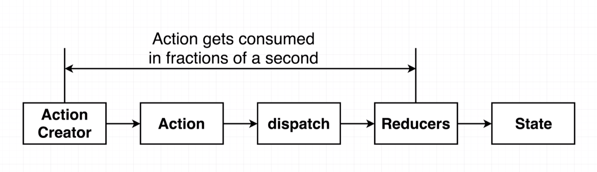
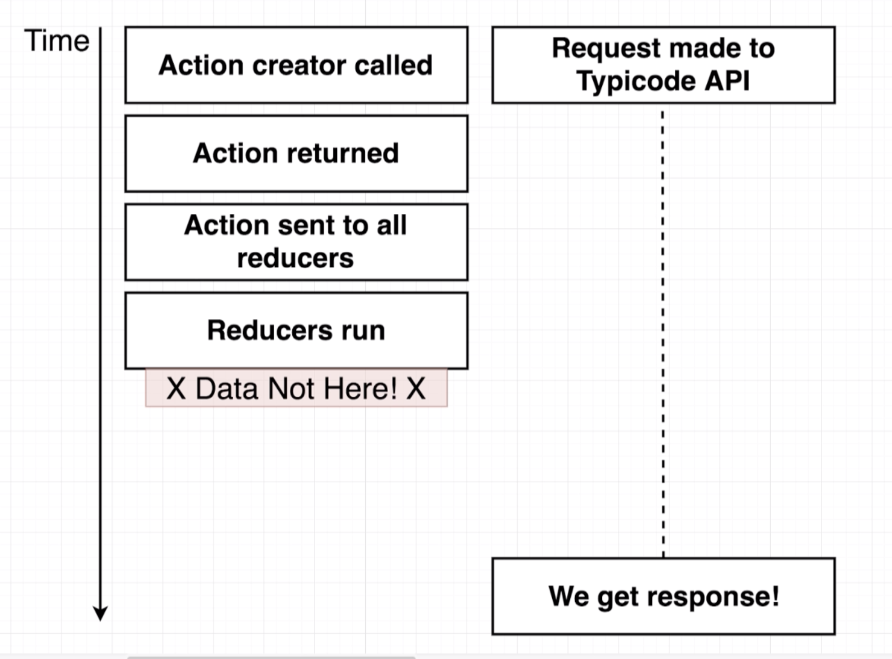
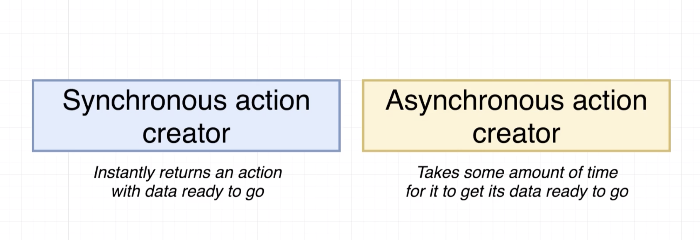
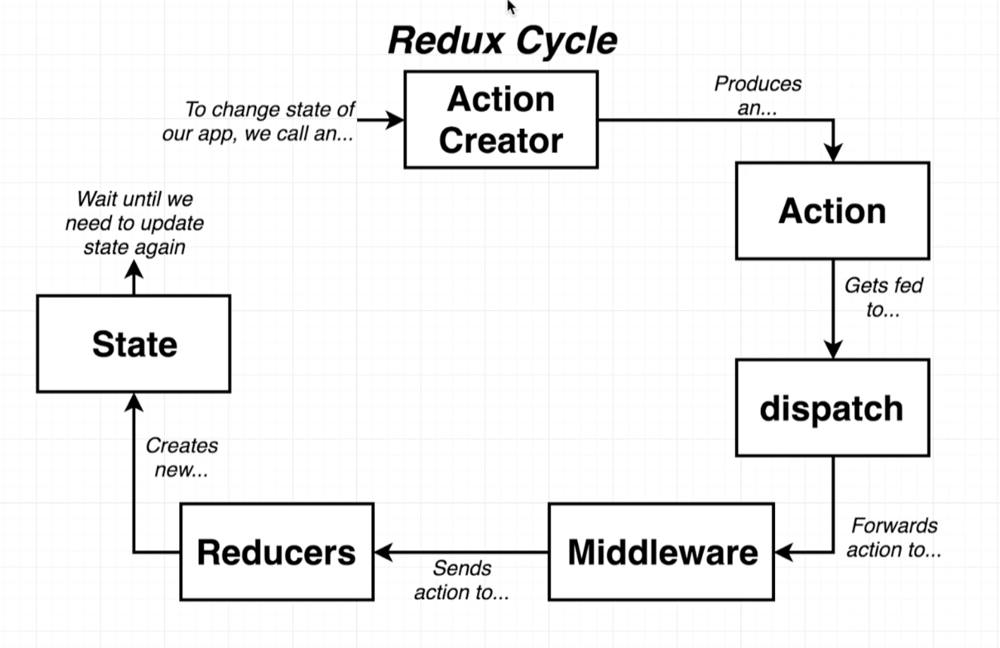
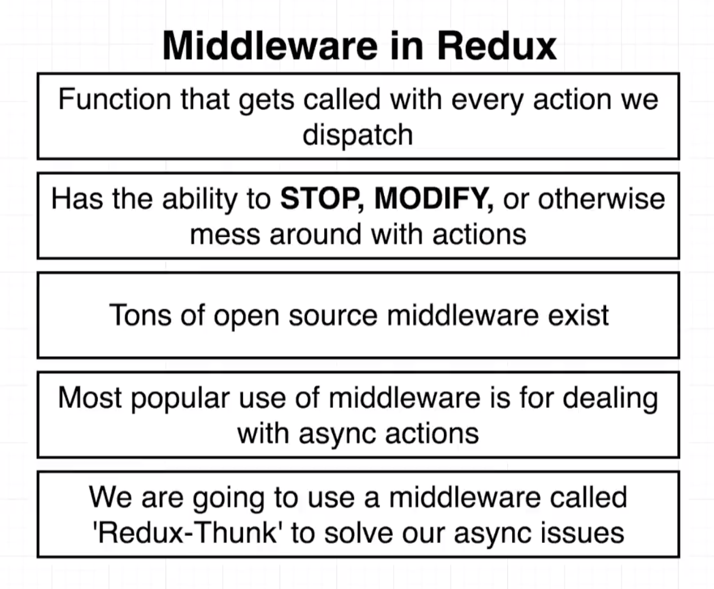

# 20200624 Async Actions with Redux Thunk


We've got our action creator, We call the action creator it returns an action. That action is going to get dispatched automatically by the react-redux library, sent off to all of our different reducers, the reducers are going to rerun, and we get some new state object back.



when we call an action creator, and it returns the action, and we dispatch it, and it goes through our reducers. All of those steps are going to be executed in a fractions of a millisecond (Instantaneous).

That causes an issue with the fact that we are making an asynchronous requests here.



Here's what is really going on behind the scenes. On the left hand side is what is happening inside of redux, on the right hand side is what is happening with our request.

```js
export const fetchPosts = () => {
  const promise = jsonPlaceholder.get("/posts");
  return {
    type: "FETCH_POSTS",
    payload: promise
  };
};
```

We call action creator, We return that action object, we dispatched that action, so the action gets sent to all of our reducers, reducers run (reach into the response and pull out the list of posts that we fetch). But in this case we do not yet have any data return from that API. These series of steps instantaneous as fast as you can imagine.

At the same time that we call the action creator, we are going to make the request over to the typicode API, that request is going to take some unknown amount of time to eventually get a response back from that API.

So by the time we finally get a response from the API, our action has long since been processed by our reducers, our reducers have already ran. And they have looked inside that promise object and said oh the request isn't complete, and there is nothing that we can do inside of our reducers to somehow delay them from running.

So with this alternate syntax, when we return an object it gets sent off to the reducers, but that all happened so quickly that it happens and completes itself way before we ever get any data back from our API.

So in other words even if we use this alternate syntax right here without the async await, we would still run into an issue where we could not get access to our data.

That is the two reasons that are fetch post action creator was not working as intended.

---



a synchronous or sync action creator is one that when we call it it immediately returns an action object with all the relevant data attached to that object and it's ready to be processed by our reducers.

a asynchronous or async action creator is one that is going to require a little bit of time before it is ready to eventually dispatch an action.

By definition anytime that you have an action creator that makes a network request it is always going to qualify as an async action creator. If you want to have asynchronous action creators inside of a redux application you have to install middleware, that is going to allow you to deal with these asynchronous action creators.

We installed a dependency called redux thunk. This is a middleware that's going to help us deal with this asynchronous action creator.

---



Now when we dispatched an action rather than sending it directly off to all of our reducers we're going to say that action is going to be sent through all of the different middlewares inside of our application.

Inside a single redux app, we can have as many or as few middleware as we want hooked up to our redux store.



A middleware is a plain javascript function that is going to be called with every single action that you dispatch.

Inside of that function a middleware has the opportunity to stop an action from being dispatch (prevent it from going to any of your reducers).

A middleware can modify an action or it can otherwise just mess around in with an action in any way shape of form you can imagine. A simple example would be to create a middleware that simply console log every action that you dispatch. So any time you dispatch an action, you might have a middleware that is going to simply console log it, so you can see that an action just got dispatched.

There are a tremendous number of open source middleware that you can install as dependencies into your project. Now you are not limited to only making use of open source middleware or installing them as dependencies, we can easily write our own custom middleware and use them inside of our own redux store.

One of the most popular uses of middleware is for dealing with these asynchronous action creators. In fact probably the most popular middleware out of all of the ones that exist in the world is redux thunk.

There are many other types of middleware, but again many of them are going to be focused around helping you deal with these async action creators.
