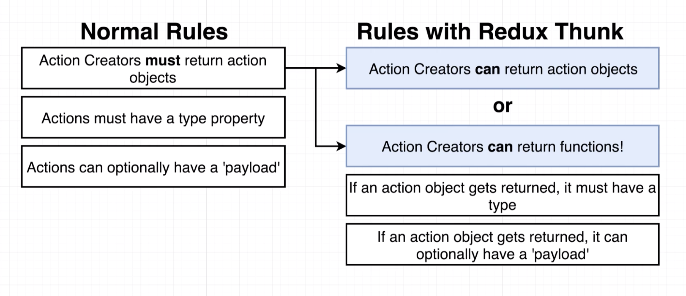
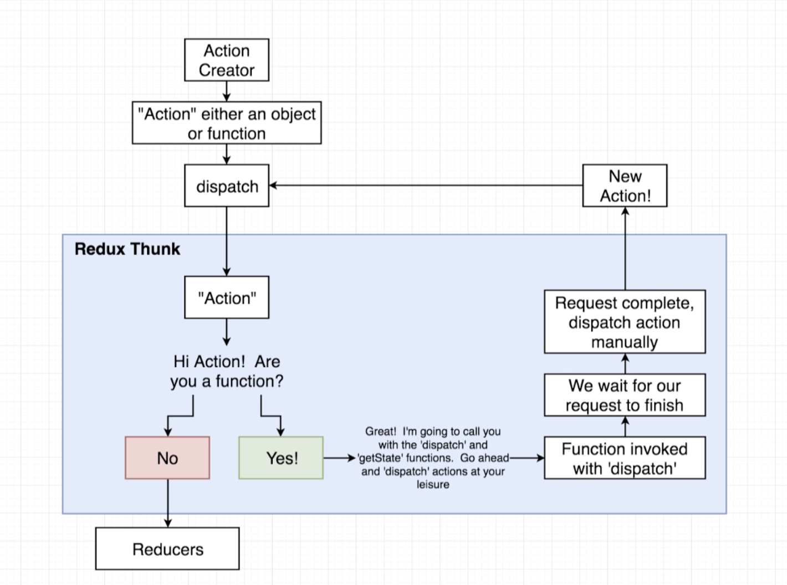

# 20200625 Async Actions with Redux Thunk



In this diagram (left) is some normal rules around action creators.

So inside of a normal redux application, an action creator must return an action object, that action object must be a plain javascript object that has a type property and optionally can also have a payload as well.

Redux thunk essentially is going to relax these normal rules around an action creator.

Redux thunk is an all purpose middleware that allows us to deal with asynchronous action creators, but it also allows us to do many other things as well.

So one thing that redux thunk does is allow us to handle action creators, but that is not its primary purpose

So right-hand side are the rules around an action creator once we have installed redux thunk. This is the only change that redux thunk makes to your application.

With redux thunk installed, your action creator can return an action object. if you return an action object, it still must have a type property, and if it is an action object that gets returned it again optionally can have the payload as well.

The other thing that redux thunk does, it allows you to return either an action object or a function. And if you return a function, redux thunk is going to automatically call that function for you.

This is the only thing that redux thunk does. It allows you to return a function from an actual creator. And if you do, redux thunk is going to invoke or call that function automatically.

```js
export const fetchPosts = () => {
  return function() {
    const promise = jsonPlaceholder.get("/posts");
    return {
      type: "FETCH_POSTS",
      payload: promise
    };
  };
};
```

So essentially if we put this into code form, or we get an understanding or an idea of what redux thunk allows us to do, basically we can return a function that is going to have some logic inside of it like so.



This is a flow diagram of what redux thunk is doing internally.

when we call an action creator so our action creator is going to return like an action (something).

We're still going to take that something and pass it into the dispatch function. Now remember whenever we dispatch something, the dispatch function is going to send that thing on to the middleware. So after we return something or dispatch it it's going to eventually end up inside of Redux thunk.

And then inside of redux thunk, redux thunk is going to take a look at that something and it's going to say: Are you a function or are you an object ? If this is an object right here, then redux thunk is going to say: I don't really care to deal with you at all. So redux thunk is going to take any object that shows up and pass it along to all the different reducers inside of your application.

So with Redux thunk, we still can return action objects as usual. Redux thunk only starts to get interesting if we return a function instead.

So if we return a function right here we're going to start to go into this alternate flow, redux thunk invokes our function, and it passes it into the dispatch and the get state functions as arguments.

```js
export const fetchPosts = () => {
  return function(dispatch, getState) {
    const promise = jsonPlaceholder.get("/posts");
    return {
      type: "FETCH_POSTS",
      payload: promise
    };
  };
};
```

So in other words, with this function right here that we returned, we are going to receive dispatch and get States as arguments.

We can pass actions into the dispatch function. Those actions will be sent through all of our different middlewares and eventually forwarding it off to our reducers. So the dispatch function is essentially unlimited power to initiate changes to the data on the redux side of our app.

getState function can be called on our redux store and that will return all of the data or all the state inside of our redux store.

So these two arguments that our function receives are essentially unlimited power over everything that goes on inside of our redux application. Through dispatch, we can change any data we want, and through getState, we can read or access any data that we want.

We're trying to make a request inside this function, so we will imagine that redux thunk invokes our function with those two arguments.

Then inside of our function we are going to wait for our requests to finish so we're going to wait to return or dispatch any action until we eventually get a response from our Typicode API. Once we eventually get that response, we're then going to use the dispatch function to manually dispatch an action.

With redux thunk we can manually dispatch an action at some point in time in the future.

Now when we dispatch an action, so we get this new action created right here, this can be a plain javascript object or a function. But when we're dispatching it manually from redux thunk or inside of that function, it's basically always going to be a plain object. So we're going to dispatch this action, it's going to flow back into dispatch, dispatch is going to send it right back into redux thunk redux thunk is going to say OK are you a function or an object. In this case it's going to be an object. So we're going to have redux thunk automatically for that thing onto all of our different reducers.

So the real takeaway here is that with redux thunk we can return a function, if we do, that function will be invoked with the dispatch and get state arguments, and with those two functions, we have unlimited power over our redux store. We can change any data, and we can read any data, and so at any point in time in the future for example after our request completes, we can then manually dispatch an action and update the data inside of our store.
