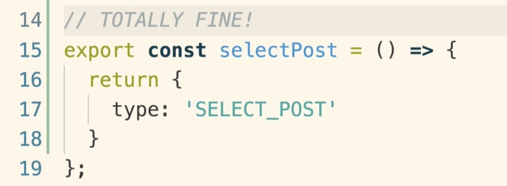
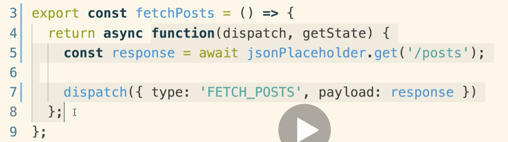
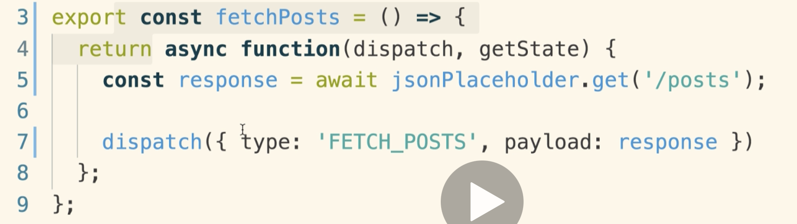

# 20200627 Async Actions with Redux Thunk

That's now installed redux thunk into our project. To be precise we already installed it as a dependency, but before we can make use of it, we have to wire it up to our redux store. If you ever expect anything to be done chances are you have to do it yourself, and that includes wiring up middlewares. So to wire up redux thunk as a middleware, we're going to go to our root index.js file, inside of here I'm going to import thunk, and then I'm also going to import a second function from the redux library as well.

```js
import { createStore, applyMiddleware } from "redux";
import thunk from "redux-thunk";
```

The applyMiddleware function is how we connect a middleware like thunk to our redux store itself.

So now to hook up redux thunk, as a second argument inside of createStore, I'm going to call applyMiddleware and pass in thunk.

```js
const store = createStore(reducers, applyMiddleware(thunk));

ReactDOM.render(
  <Provider store={store}>
    <App />
  </Provider>,
  document.querySelector("#root")
);
```

That's how we hook up a middleware to a redux store.

---

```js
export const fetchPosts = () => {
  return function(dispatch, getState) {
    const promise = jsonPlaceholder.get("/posts");
    return {
      type: "FETCH_POSTS",
      payload: promise
    };
  };
};
```

When we are making use of redux thunk, we are not going to return any actions from the inner function(第二行) anymore.



We can still have normal action creators so we could still have export const, and inside of here we can still return a normal object with a type property.

With redux thunk we just get the ability to return a function as well. That's the only change. You can still make normal action creators that return action objects.

```js
export const fetchPosts = () => {
  return async function(dispatch, getState) {
    const response = await jsonPlaceholder.get("/posts");
    dispatch({
      type: "FETCH_POSTS",
      payload: response
    });
  };
};
```

So inside of this inner function, we do not need to return an action. If we are returning a function, if we ever want to dispatch an action, we will instead call the dispatch function manually with the action that we are trying to dispatch.

In order to make sure that we still get our data inside of here we're going to revert back to that same async await syntax.

why are we using the async await syntax again here: with redux thunk we can use async await no problem. Remember the entire problem with async await is that with a synchronous action creator it causes us to return a request object instead of a action.



But once we have redux thunk, the async await syntax right here is only going to modify the return values of this inner function(如上圖), and we don't care about what we return from this function. Nothing from this function return or invocation ever gets used. You just looked at the source code of redux thunk and you saw that redux thunk did not somehow get a reference to whatever gets returned from right and make use of it for some nefarious purpose, so we can return or not return anything we want from the inner function.



It is only what we return from our outer function the actual creator itself that we are concerned about.
