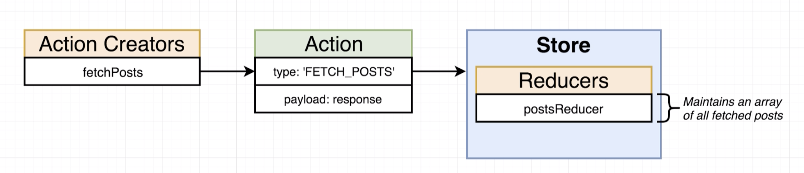
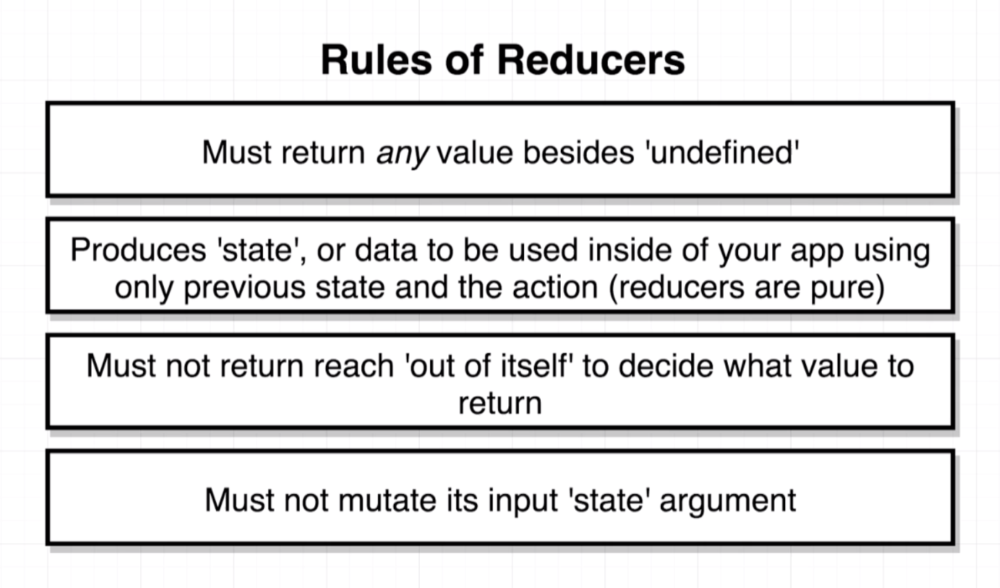

# 20200629 Redux Store Design

We're going to create a separate file for each reducer that we end up with. The idea here is that as we start to work on larger projects with many reducers, putting them all inside of one file is probably not going to scale too well.

So we're going to create a separate file for each reducer in our reducers directory, we'll then import them into this index.js file and wire them up to the combineReducers call.



We are going to create a post reducer, and this thing is going to be responsible for watching for actions with type fetch posts and any time it sees that it's going to pull off that response right there and all the data inside of it and add it into some array. So we're going to eventually have a list of sorts with all of our different posts that have been fetched from our API.



when we put together that dummy reducer or the replace me one inside that index.js file, we had return some fixed number or fixed string. The reason for that was that if we ever return undefined from the reducer, we're going to very quickly see an error message.

```js
export default () => {};
```

So now any time that this function gets called, it's going to return a value of undefined (That is how javascript functions work). If you do not have an actual return statement with some value to the right of that, then the function is going to return the value undefined by default when it gets called.

every single time that your reducer gets called, it should always have a return statement at some point in time, and that return statement should always return some type of value (number, string, array, object, null).

It's when I failed to place a return statement or I specifically return a value of undefined that we're going to run into that error message.

when redux first boots up, it's going to run each of your reducers one time (essentially when redux first boots up it's going to call your reducers one time).

The rule around not returning undefined is not only about initialization, your reducer can never ever return undefined whether it is an initialization or at some point in time in the future when an action has been dispatched.
