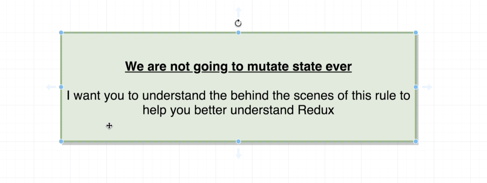
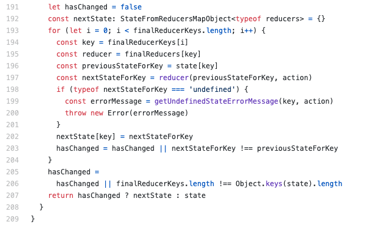

# 20200701 Redux Store Design


Rule 4:

By convention we always refer to the first argument that a reducer called with as state, because that's what it really is, it is the piece of state that this reducer is managing from the last time that the reducer ran.

what does mutate mean in the context of javascript:

```js
const colors = ["red", "green"];
colors.push("purple");
console.log(colors); // ['red', 'green', 'purple']
colors.pop();
colors[0] = "pink";
```

We change the contents of the colors array. Anytime that we change the contents of an array it is referred to as a mutation.

So I can take the form of adding an element or removing an element or by changing an element inside there.

```js
const profile = { name: "Alex" };
profile.name = "Sam";
profile.age = 30; //add key value pair
```

I can also mutate an object as well. A mutation on an object is anytime that we update the value of a property anytime that we add a key value pair or anytime that we remove a key value pair.

Inside of javascript strings and numbers are immutable values, we can not change them in the same way that we can easily change a array or an object. And so if you have a reducer that is always returning a number or a string you don't need to worry about this mutation rule.

You only have to worry about these mutation things when you're working with an array or an object.

Inside of javascript we can very easily compare equality between two values using the triple equals operator. This comparison operator can be used on arrays and objects as well.

In the case of primitive values such as numbers and strings we can kind of imagine that this is a value comparison. But how comparison is done around arrays and objects is a little bit more subtle.

```js
const numbers = [1, 2, 3];
numbers === numbers; // true
numbers === [1, 2, 3]; // false
```

When you use this triplet equals operator on an array, javascript is checking to see if it is a reference to the exact same array in memory, not the contents of the array.

Because the comparison here is not between the contents of the array. The comparison is between whether or not numbers is referencing the exact same array in memory as the one on the right hand side. In this case it is not. We declared this array (numbers) that is in some location in memory or RAM on your computer, and then you defined a completely new array down here([1,2,3]). So you now have two separate arrays inside of RAM or memory on your computer. And so in this case these two separate arrays are clearly not the same array, so when we do this comparison it's going to return a value false


Redux is never going to give you any error message when you mutate state.





this chunk of code is the code that is going to take an action anytime that it gets dispatched and send the action around to all the different reducers inside of your application. So in other words every time you dispatch an action this code right here is going to be executed.

This for loop(line 193) is going to iterate over all of the different reducers inside of your application. Then inside the body of the for loop(line 196), this variable right here is going to be assigned the last state value that our reducer returned.

Every single time that a reducer gets called, the first argument is going to be the state that it returned the last time it had ran. So essentially this previousStateForKey is a reference to the previous state value that this particular reducer that we are iterating over returned.

Then on the next line (line 197) This is where we actually invoke your reducer, so that reducer variable right there(紫色) that is your reducer that you pass to the combinedReducers function. The first argument is the state that you reduce or return the last time that it ran, and then the second argument is the action object. So your reducer is going to run, and then it's going to eventually return some new value some new state value and that's going to be assigned to nextStateForKey.

We have previousStateForKey which is our last state value and nextStateForKey which is our new state value.

Immediately after your reducer runs and assigns that new state value to nextStateForKey, redux is going to check to see if you're reducer just returned a value of undefined. (we had said that a reducer can never return a value of undefined)

Now assuming that you get past that check go down to line 203. hasChanged is going to take the value of a direct comparison between nextStateForKey and your previousStateForKey. This is that rule (do not mutate state) this is what it all comes down to right here. This checks to see if nextStateForKey and previousStateForKey are the exact same array or object in memory. So if you just returned some array and it is the exact same array in memory that you returned the last time that this reducer ran, then hasChanged is going to be a value of false, otherwise otherwise if you reduce or just ran and it just returned a brand new array
