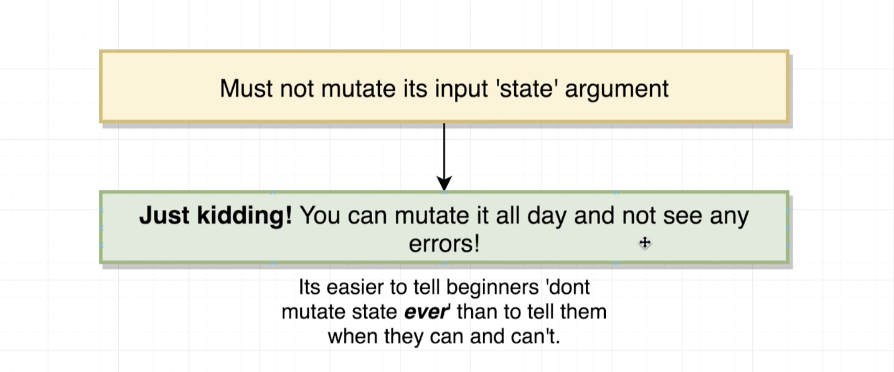

# 20200701 Redux Store Design


Rule 4:

By convention we always refer to the first argument that a reducer called with as state, because that's what it really is, it is the piece of state that this reducer is managing from the last time that the reducer ran.

what does mutate mean in the context of javascript:

```js
const colors = ["red", "green"];
colors.push("purple");
console.log(colors); // ['red', 'green', 'purple']
colors.pop();
colors[0] = "pink";
```

We change the contents of the colors array. Anytime that we change the contents of an array it is referred to as a mutation.

So I can take the form of adding an element or removing an element or by changing an element inside there.

```js
const profile = { name: "Alex" };
profile.name = "Sam";
profile.age = 30; //add key value pair
```

I can also mutate an object as well. A mutation on an object is anytime that we update the value of a property anytime that we add a key value pair or anytime that we remove a key value pair.

Inside of javascript strings and numbers are immutable values, we can not change them in the same way that we can easily change a array or an object. And so if you have a reducer that is always returning a number or a string you don't need to worry about this mutation rule.

You only have to worry about these mutation things when you're working with an array or an object.

Inside of javascript we can very easily compare equality between two values using the triple equals operator. This comparison operator can be used on arrays and objects as well.

In the case of primitive values such as numbers and strings we can kind of imagine that this is a value comparison. But how comparison is done around arrays and objects is a little bit more subtle.

```js
const numbers = [1, 2, 3];
numbers === numbers; // true
numbers === [1, 2, 3]; // false
```

When you use this triplet equals operator on an array, javascript is checking to see if it is a reference to the exact same array in memory, not the contents of the array.

Because the comparison here is not between the contents of the array. The comparison is between whether or not numbers is referencing the exact same array in memory as the one on the right hand side. In this case it is not. We declared this array (numbers) that is in some location in memory or RAM on your computer, and then you defined a completely new array down here([1,2,3]). So you now have two separate arrays inside of RAM or memory on your computer. And so in this case these two separate arrays are clearly not the same array, so when we do this comparison it's going to return a value false



Redux is never going to give you any error message when you mutate state.


this chunk of code is the code that is going to take an action anytime that it gets dispatched and send the action around to all the different reducers inside of your application. So in other words every time you dispatch an action this code right here is going to be executed.

This for loop(line 193) is going to iterate over all of the different reducers inside of your application. Then inside the body of the for loop(line 196), this variable right here is going to be assigned the last state value that our reducer returned.

Every single time that a reducer gets called, the first argument is going to be the state that it returned the last time it had ran. So essentially this previousStateForKey is a reference to the previous state value that this particular reducer that we are iterating over returned.

Then on the next line (line 197) This is where we actually invoke your reducer, so that reducer variable right there(紫色) that is your reducer that you pass to the combinedReducers function. The first argument is the state that you reduce or return the last time that it ran, and then the second argument is the action object. So your reducer is going to run, and then it's going to eventually return some new value some new state value and that's going to be assigned to nextStateForKey.

We have previousStateForKey which is our last state value and nextStateForKey which is our new state value.

Immediately after your reducer runs and assigns that new state value to nextStateForKey, redux is going to check to see if you're reducer just returned a value of undefined. (we had said that a reducer can never return a value of undefined)

```js
hasChanged = hasChanged || nextStateForKey !== previousStateForKey;
```

expr1 || expr2

(邏輯 OR) 如果 expr1 可以轉換為 true，就返回 expr1。否則返回 expr2。所以，當使用於布林值時，如果其中一個運算元為 true，|| 返回 true，如果兩個運算元都為 false，就返回 false。

Now assuming that you get past that check go down to line 203. hasChanged is going to take the value of a direct comparison between nextStateForKey and your previousStateForKey. This is that rule (do not mutate state) this is what it all comes down to right here. This checks to see if nextStateForKey and previousStateForKey are the exact same array or object in memory.

So if you just returned some array and it is the exact same array in memory that you returned the last time that this reducer ran, then hasChanged is going to be a value of false, otherwise if your reducer just ran and it just returned a brand new array (completely brand new just created inside of your reducer), and this is a totally different array than the one that your reducer returned the last time it ran, then hasChanged is going to be set equal to true. So this hasChange variable essentially saying has any of the state returned by our reducer changed. (That is what the name hasChanged is referring to. it is saying we have just dispatch an action, has any of the state produced by reducers changed in any way).

So the for loop is going to iterate over all of your reducers and then has changed is going to be either true or false considering all of those different reducers. There is only one hasChanged variable right here, there is not a separate hasChanged variable for each reducer. If any different reducer has changed a value or returned a new value a new array or a new object or a different value for an integer or a number or a string, hasChanged is going to be set equal to true. So it's kind of a all or nothing deal.

```js
return hasChanged ? nextState : state;
```

And then after the for loop (at line 207), we then look at the value of hasChanged, if hasChanged is equal to true, the result of this entire function is to return the new state object like the entire new state object that has been assembled by all of your different reducers, otherwise if hasChanged is equal to false, we instead return state, and state right here is a reference to all the state that you're reducers returned the last time that they ran.

So to sum up this code block right here in very simple terms, essentially what this does is check to see after running each of your reducers. If any reducer returned a brand new Array object or value for a number or string, if they do, then redux is going to return the brand new result from all of your reducers. Otherwise if you're reducers returned no new value, it's going to return the old states or the old result from each of your reducers.

The reason this is relevant is that if redux returns the old state value right here then redux is not going to notify the rest of your application that any of your data has changed. If you do have a new state, if you have changed something from one of your reducers and you instead return next state right here, redux is going to look at that object, it's going to say: we just got some new states, some new state just came out of all of our different reducers, and it's then going to notify the rest of your application including your react application that you have a new state available, and that is going to cause your react application to re-render.

So in summary the reason we care so much about saying that you must not mutate its state argument is not because you can't mutate the state argument. The reason we say this is that if you accidentally return the same value that is pumped into your reducer, and it's still the same object or the same array be it modified or not, Redux is going to say: oh no difference here is the same object or array in memory, and so we have done absolutely no updates to any data inside of our application, and the react app does not need to re-rendered itself, and so you will never see any updated content appear on the screen.


This rule is really trying to tell you if you return the state argument right here, making changes to it or not making changes to it it doesn't matter, if you return the same value at the very bottom, then no update will be made to your application.
