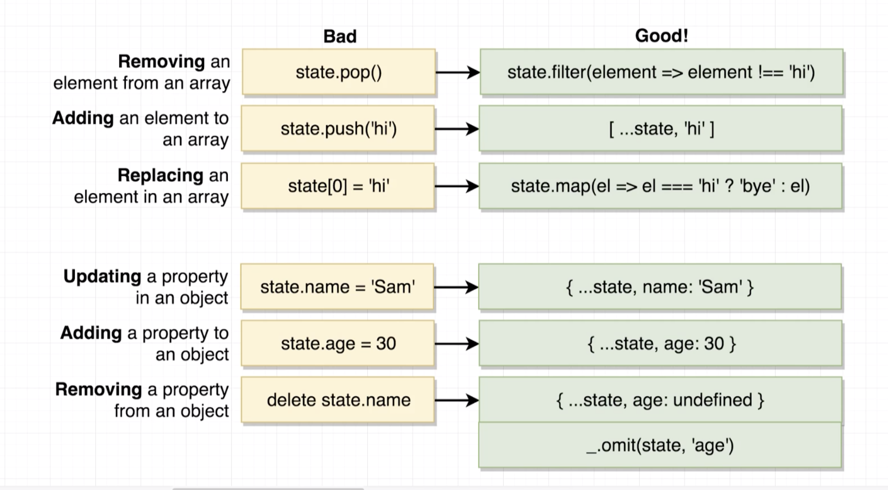

# 20200702 Redux Store Design



```js
const colors = ['red', 'green']
[...colors, 'blue', 'pink'] //['red', 'green', 'blue', 'pink']
['blue', 'pink', ...colors] //['blue', 'pink', 'red', 'green']
[...colors, 'blue'] === colors //false
```

We can create a new array by putting down a square bracket
... This is going to take all the elements out of the colors array and add them into this new array. When we put down the square brackets, that is creating a new array in memory, and so we are not going to be modifying or making any change to the original array, and we are creating a brand new one, so redux is going to notice that we have now returned some entirely new value from our reducer.

```js
const colors = ["red", "green"];
colors.filter(color => color !== "green"); //['red']
colors.filter(color => color !== "green") === colors; //false
```

Anytime that we return false from the inner function, a return value of false means that this element is not going to be included inside of some new output array, this is returning a brand new array, we still have the unmutated colors array in memory.

```js
const profile = { name: 'Sam' }
{ ...profile, name: 'Alex' } //{name: 'Alex'}
{ ...profile, age: 30 } //{name: 'Sam', age: 30}
{ name: 'Alex', ...profile } //
```

...profile : that's going to take all of the key value pairs out of the profile object and add it into this new one.

(第二行)Any additional key value pairs that I add in will overwrite or replace the key value pairs that have been added from the profile object.

(第三行)I can do the same thing to add in new properties as well.

(第四行)The name property inside of profile is now going to overwrite the name I added right here. So the name of Sam inside of profile is going to overwrite the name of Alex.

So all these additions into this object are going to be evaluated from left to right. (because I added in name of Alex first and then I overwrote that with the original name of Sam)

---

```js
const profile = { name: "Sam" };
_.omit(profile, "name"); //{}
```

A much easier way to remove property from object would be to use the load ash library. So the underscore right there is a reference to the load ash library. load ash is a very popular javascript library for working with objects and arrays
