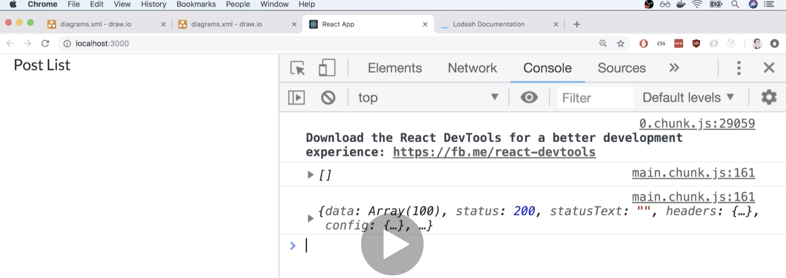
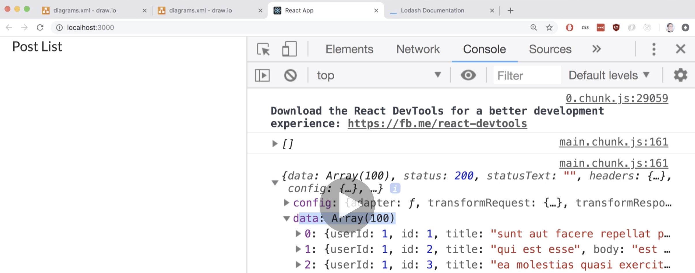

# 20200703 Redux Store Design

```js
export default (state = [], action) => {
  if (action.type === "FETCH_POSTS") {
    return action.payload;
  }
  return state;
};
```

```js
export default (state = [], action) => {
  switch (action.type) {
    case "FETCH_POSTS":
      return action.payload;
    default:
      return state;
  }
};
```

In order to make sure that we always handle every action that comes into our reducer without error, we very frequently use a switch statement as opposed to an if statement inside of reducer.

So now any time that we make a request over to that API we should be getting back an action with our payload property showing up inside the reducer that reducer should be returning the list of posts, so our redux state object is now going to contain that list of blog posts from the API. As soon as that happens, our entire react application should be re-rendered.

Remember anytime we want to get some data from the redux side of our application into the React side, we're always going to define the mapStateToProps function and pass it off to connect.

```js
const mapStateToProps = state => {
  return { posts: state.posts };
};
```

mapStateToProps function is going to be called with our entire state object out at the redux store. If you open up your reducers index.js file you'll recall that we assigned our reducer to this posts key inside of our combineReducers call.

So that means that our state object is going to have a property called posts, and that property is going to hold all of the data that our reducer has returned.

So now every single time that our reducers run, mapStateToProps is going to be called again. We're going to return a new object with property posts and that object is going to show up as the prop's object inside of our component.



The reason we have two console.log is that when our application is first loaded up inside the browser, all of our reducers run one initial time, it's going to run with an action of some initialization type, it's going to have some random type inside of that action object, whatever type it is, it's probably not going to match the case of fetch posts. So we're going to return our default state value of an empty array.

So when our application first boots up, we're going to have a state object that has a posts property, and that posts property is going to contain this empty array.

```js
class PostList extends React.Component {
  componentDidMount() {
    this.props.fetchPosts();
  }
  render() {
    console.log(this.props.posts);
    return <div>Post List</div>;
  }
}
```

After all of our reducers run, the React side of our application is going to be rendered one time on the screen. So the PostList component is going to be displayed on the screen one time. During that initial one time, we're going to have our render method called, and that's going to invoke the console log right here, and so we see a single console log with this.props.posts, that is this empty array that you see on the console.log. So that is the initial first time our application is rendered onto the screen.

Now immediately after the PostList component shows up on the screen, our componentDidMount lifecycle method will be called, and then we go through that entire process of running off to that API and fetching some data. After we get back some data and we dispatch an action to our reducer, our reducer sees that the action has a type of fetch post, it returns whatever value is inside of that action at payload property. redux sees that we have not returned the same array in memory, the second time our reducer ran instead we return this brand new value(action.payload). Because that is a totally new value, redux assumes that it has some new data inside of our application, and redux essentially tells react to re-render itself with this new data, and so our PostList component is going to be rendered to the screen a second time, mapStateToProps is going to be called a second time. We're now going to get the new value of state.posts, and that new property(props.post) is going to show up inside of our component, the render method gets called again, and we see that console log a second time appear.

So you'll notice that the console log for this.props.post is the entire response object that we got back from the API or through axios essentially.



And so the little error that we have inside of our code right now is essentially just the fact that we are dispatching the entire response object from our action creator when in fact we should probably only be dispatching this data array instead.

```js
export const fetchPosts = () => async dispatch => {
  const response = await jsonPlaceholder.get("/posts");
  dispatch({
    type: "FETCH_POSTS",
    payload: response.data
  });
};
```

So essentially back inside of my actions file here's where we dispatch our action, and on our payload property we have that entire response, So we don't care about the entire response, we only care about the data property, So I get to make sure I put response.data like so, when we get that second console log we should see the array of posts that are now showing up as props inside the post list component.
