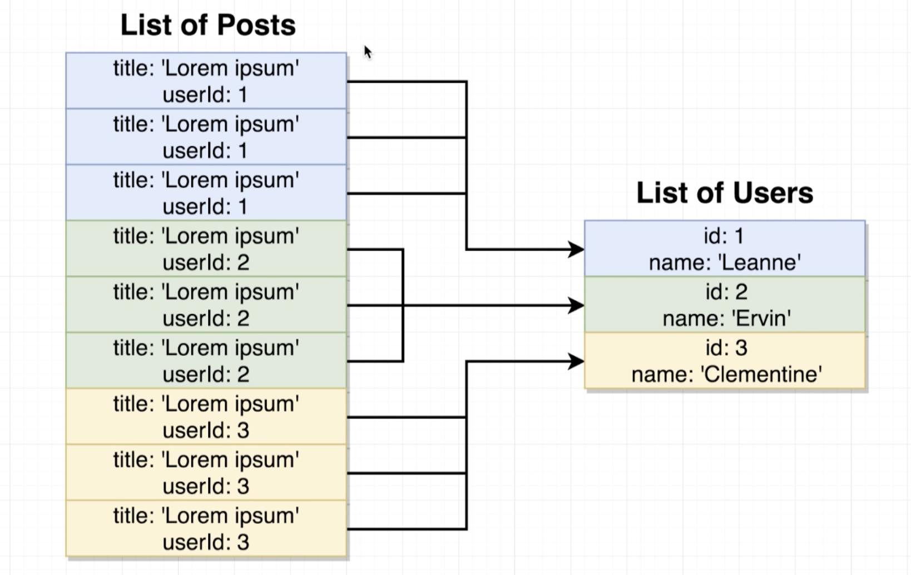
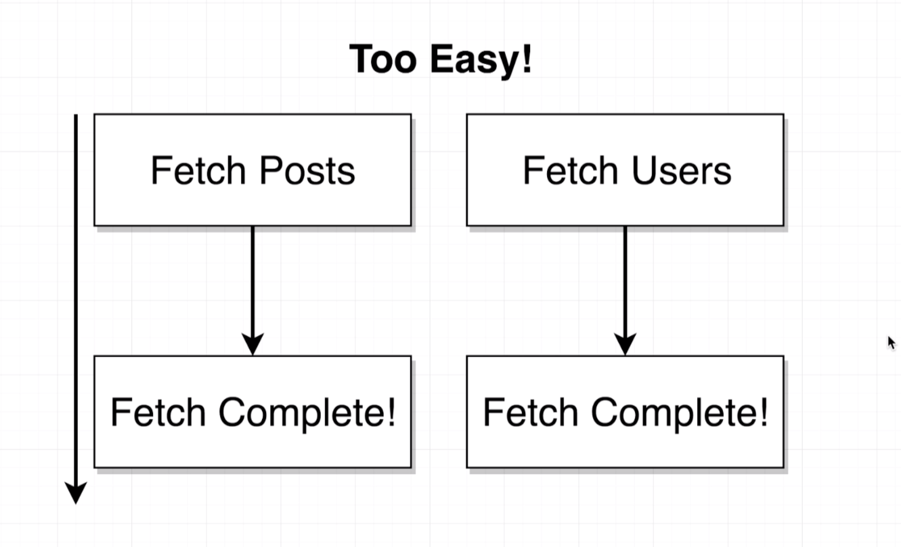
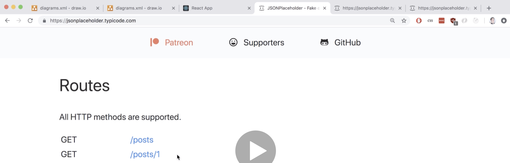
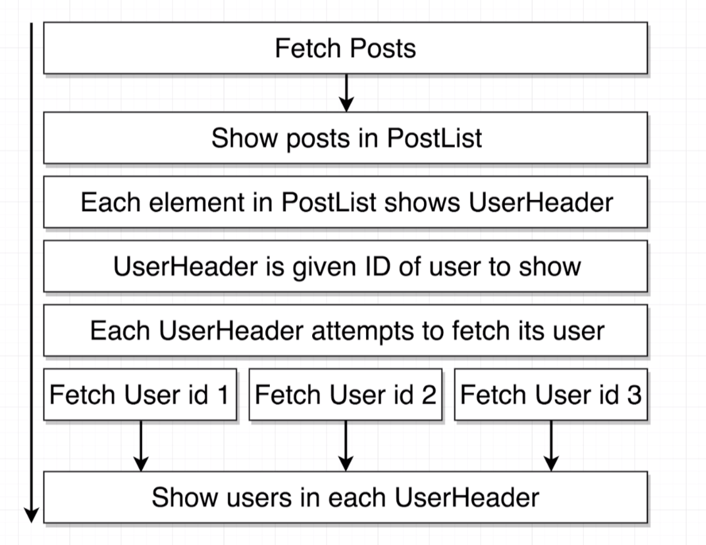
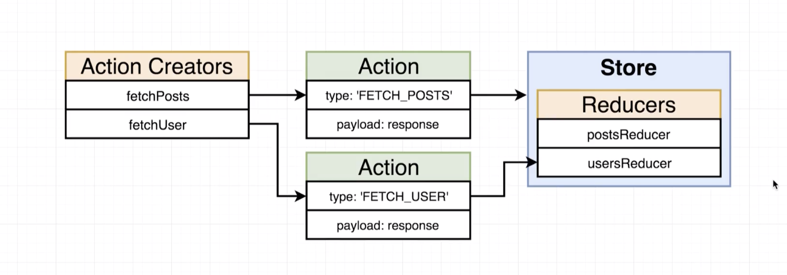

# 20200707 Redux Store Design

Putting all this logic into this helper method of renderList() just to keep the render method itself nice and easy to read, and make sure that I call renderList from my render method.





A real blogging application like say medium, if they want to show a list of blog posts along with their authors to a user as we are doing right now, the medium are not going to send your browser a list of like a million blog posts and a million users. Instead they're going to send you like 10 blog posts to show on the screen, and then you'll have to make a follow request for each of those individual users. So if we just made the request for all the users that we would ever need it's just too easy and it's not realistic.



What this is essentially telling us is that we can make requests to get one individual record at a time as opposed to these big gigantic lists of records.



So inside of application everything is going to start off with us fetching that list of posts. So we're going to make an API request. And then after some period of time indicated by this little arrow right here we're going to get a response, we're going to return that data from our reducer, and then eventually we're going to show our list of posts to the user inside that post list component.

Now inside of that render list method that we have inside there we're going to create a separate instance of the user header component for every individual post.

```js
renderList() {
    return this.props.posts.map(post => {
      return (
        <div className="item" key={post.id}>
          <i className="large middle aligned icon user" />
          <div className="content">
            <div className="description">
              <h2>{post.title}</h2>
              <p>{post.body}</p>
            </div>
          </div>
          <UserHeader userId={10} />
        </div>
      );
    });
  }
```

In other words if we go back over to the render list method right here, this map function(inner function) is going to be executed a hundred times because we have a hundred different posts.

So somewhere inside of here we're going to place our UserHeader component, and give it a prop of userId, and inside of here we'll put whatever this particular user's id is for this particular blog post. And so we're going to create a bunch of instances of the UserHeader component and each one is going to know exactly what userId it needs to show on the screen.

So then inside of the UserHeader component, we're going to add a call to a new action creator that's going to attempt to fetch just the individual user that instance of the user header needs. So we're going to end up with a bunch of separate requests for each individual user. And so we're going to make 10 separate requests in theory, one for each user, we'll get each user return it back to our application, somehow process that through a reducer, and somehow get each relevant user into each instance of the UserHeader component.

It's way more common to do some initial request to get like a list of records and then you have to make a bunch of individual follow up requests to get more information about each of the original records. We want to get the big list and then make some smaller requests to follow up on it and get just the information we need.



This new action creators called fetch user singular and so the idea here is that we're going to use the action creator to fetch one individual user at a time. Now the action creater itself it's going to make a request over to that API. It's going to get our chosen user like some user with some particular ID and then it will dispatch an action with the type of fetch user, and will have our data on the payload property. So then we're going to also create a usersReducer which is going to hold a list of all of the users we have fetched into our application.

So notice how the action creator is fetching one record. But we're going to essentially tabulate or collect all the different records that we get inside of that reducer.

```js
export const fetchUser = id => async dispatch => {
  const response = await jsonPlaceholder.get("/users/" + id);
};

export const fetchUser = id => async dispatch => {
  const response = await jsonPlaceholder.get(`/users/${id}`);

  dispatch({ type: "FETCH_USER", payload: response.data });
};
```

when we call this action creator, we're going to pass in the id of the user that we want to fetch as an argument.

We're going to rewrite that using ES2015 syntax with a template string instead.

After we make that request and get back a response I'll then dispatch an action with type (No s here because we are fetching one user at a time) and payload.

in fetch posts when we fetch a list of posts the response that we got was an array of records (objects), but when we fetch one user at a time we don't get an array, we get just an object that has details about that given user.
