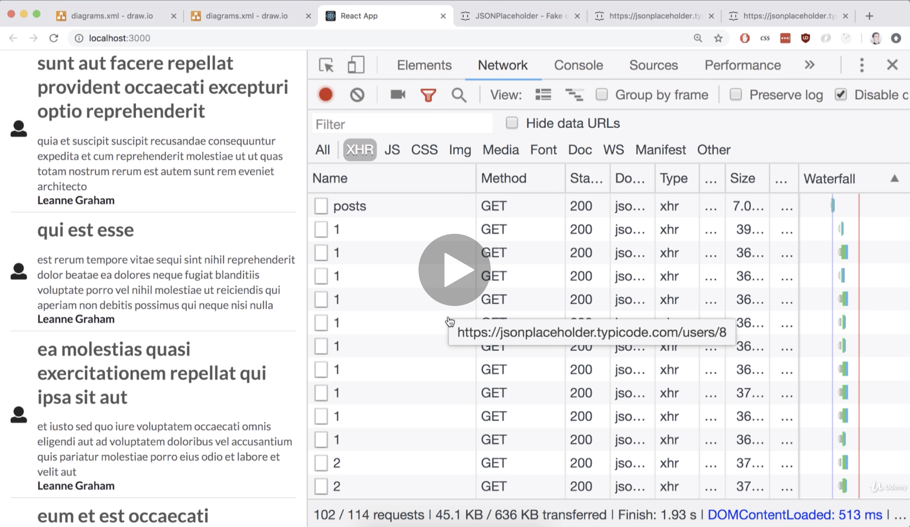
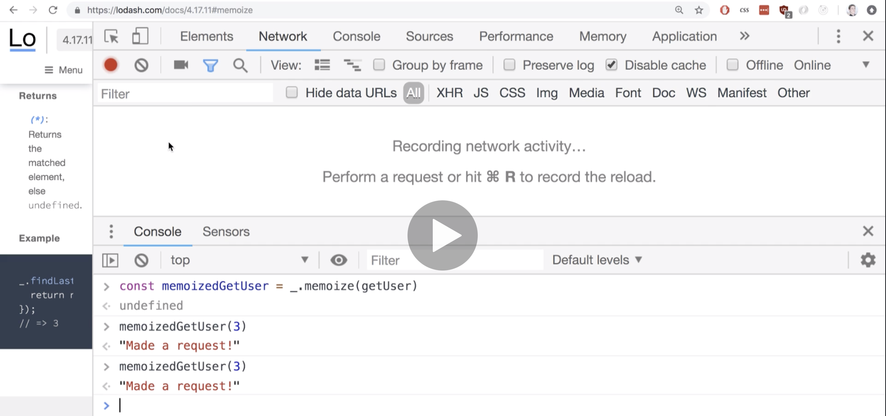
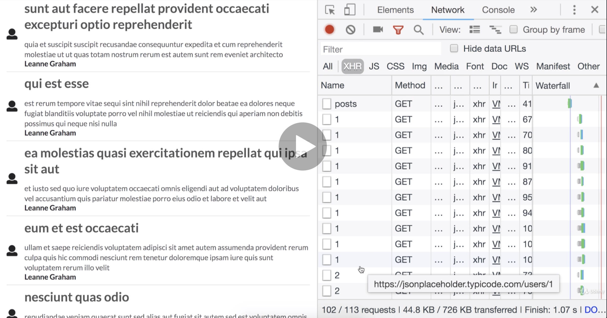
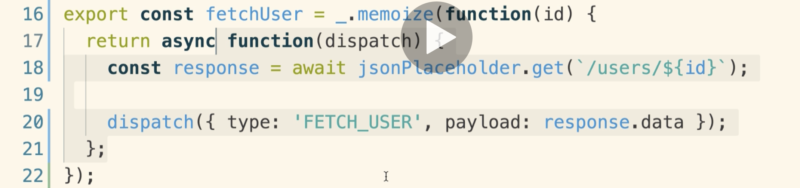
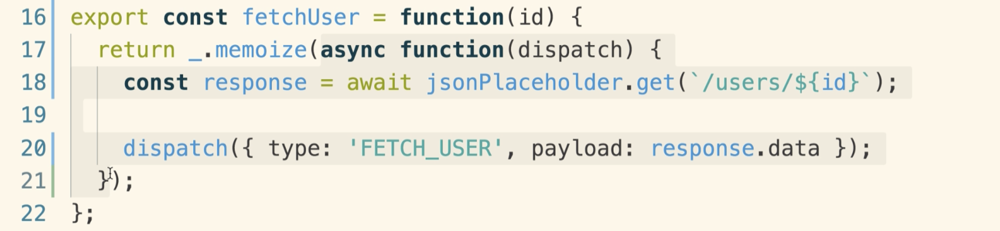

# 20200710 Redux Store Design



we are making request for user with ID number one 10 times in a row and then we are doing the same thing with user ID number 2 and 3 and 4 and so on. In total we are making a hundred separate requests to fetch just 10 individual users.

```js
class UserHeader extends React.Component {
  componentDidMount() {
    this.props.fetchUser(this.props.userId);
  }
```

we are showing one instance of the UserHeader component for every single blog post that we fetch, every time that a UserHeader is rendered on the screen componentDidMount is called and so we call this action creator fetchUser with this particular user ID.

So essentially because we are rendering out a hundred instances of UserHeader, our action creator gets called a hundred different times, even though we are fetching some very repetitive data. Ideally we would only fetch each one of these users exactly one time.

---

lodash is a utility javascript library. It has a ton of functions built into it that make writing javascript just a little bit easier. The reason that I want you to open up your console on lodash.com/docs is because the lodash library is automatically injected onto Windows scope. So we can write out a simple underscore and that is a reference to the lodash library. If you go to some other Web site you're not going to have lodash available on Windows scope.

```js
function getUser(id) {
  fetch(id);
  return "Made a request!";
}
```

inside of function getUser I'm going to make a network request with that give an ID. Remember the fetch function is built into your browser, it will make a network request. Now we do not have any API or anything like that hooked up on lodash.com, so if we just call fetch right now with some random ID, we're probably going to see a 404 not found error message which is totally fine.


When we call the function, it says made a request and you can see my network request log that I made a request to /2. Now in this case it just happens by chance that /2 is a valid route on this Web site, so we did not actually get a 404 in this case. So we called the getUser and we made a request.

```js
const memoizedGetUser = _.memoize(getUser);
```

Notice how there are no parentheses on here after getUser, we just call memoize and we pass in the getUser function itself.

Now when we do that, memoize is going to take our function, it's going to wrap it up with a bunch of additional code, and it's going to return a new copy of our getUser function and this new copy is what we refer to as the memoized version of the function.

So memoizedGetUser is a new function that has the same behavior as our old function that we were just wrote. The only difference is that we can only call memoizedGetUser 1 time with any unique set of arguments. After we call it one time we can still call it, but the original function is not going to be actually invoked. Instead memoizedGetUser is just going to return whatever we had returned previously the last time we ran it with the identical set of arguments.



I'm now going to call memoizedGetUser and I'm going to pass in 3 as the argument. Now the first time that I call this with three the request is going to made it is going to run our original function.

Clear the requests log and I'm going to run that same exact call a second time. The second time I do it, the request is not made. So when we memoized a function, the original function only runs one time, and then anytime we call it again in the future the function itself is not going to run, instead we are just going to return whatever was returned the previous time.

So we still see the return value of made a request right here, but we did not run the original function and actually make the request.

But that's only on a basis of the unique arguments that we pass in. So if I pass in a new unique argument here like two instead of three, now the first time I run this function with two the original function getUser is going to be ran again.

We only want to build a call our action creator with a unique ID one time, because we only want to fetch each user one time, and then if we call our action creator with that same ID again in the future we don't really want to make the request at all.

we're now going to install the lodash library into our project:

npm install --save lodash

```js
import _ from "lodash";
```

Usually by convention we import the lodash library as the underscore character.

```js
export const fetchUser = function(id) {
  return async function(dispatch) {
    const response = await jsonPlaceholder.get(`/users/${id}`);

    dispatch({ type: "FETCH_USER", payload: response.data });
  };
};
```

To apply memoize to action creator, I'm going to first rewrite it using the function keywords as opposed to arrow functions just to make this more clear.

We'll then attempt to memorize one of these two functions. So notice how there really are two functions here(There's the outer function and the inner one).

```js
export const fetchUser = _.memoize(function(id) {
  return async function(dispatch) {
    const response = await jsonPlaceholder.get(`/users/${id}`);

    dispatch({ type: "FETCH_USER", payload: response.data });
  };
});
```

let's just take a guess here and try to memoize the outer function first. Remember in theory now we are going to assign a memoized version of this function to the fetchUser, and export it from this file. And so in theory we should only ever be allowed to call this function with a unique argument one time, and after that one time we'll then just return whatever the previous return value was.



you're going to very quickly see that we're still making a ton of different requests here.

Every single time that we call outer function right here, it's going to return whatever was returned the first time it was called. In this case it is a inner function. We're not running the outer function again with the given ID, but we are returning the same (inner) function that was returned the first time.



Because we returned that function, redux thunk is still going to invoke that function with dispatch, and inside of there we're still going to make our network request.

---

```js
export const fetchUser = function(id) {
  return _.memoize(async function(dispatch) {
    const response = await jsonPlaceholder.get(`/users/${id}`);

    dispatch({ type: "FETCH_USER", payload: response.data });
  });
};
```

so now we are trying to memoize the interior or inner function. This is the one that actually gets invoked with redux thunk.




remember every single time that we call this action creator, we are going to declare a new function(inner function). We recreate this function right here in memory every single time that we call fetchUser. So we recreate this function and then we memoize it and return it.

Now we definitely memoize the interior function right here. So in theory it's not going to be called multiple times by redux thunk, but every time we call fetchUser, we're going to create a new version of the interior function and memoize it every single time. So even though we are memoizing this thing, we are memoizing a new version of the function every time we call the action creator.

So every time we call the action creator, new memoized version comes out and we can successfully call that memoized version and the original interior function right here will be invoked because we are recreating it every single time.

---

We need to define a function outside of our action creator, that's going to actually make the request and then dispatch our action, and we're going to memoize it outside of the action creator. So that it only gets memoized exactly one time, and it's not going to be rememoized everytime that we call our action creator fetchUser.

So I'm going to declear a new variable called \_fetchUser. I'm putting in the underscore right here to indicate that this is a private function so to speak and that other engineers should not attempt to call this function unless they really know what they are doing.

And then we're going to set up an arrow function, and this arrow function is going to be what actually makes a request and then dispatches an action.

And then I'm going to make sure that I memoize this thing by wrapping it with a memoize call.
