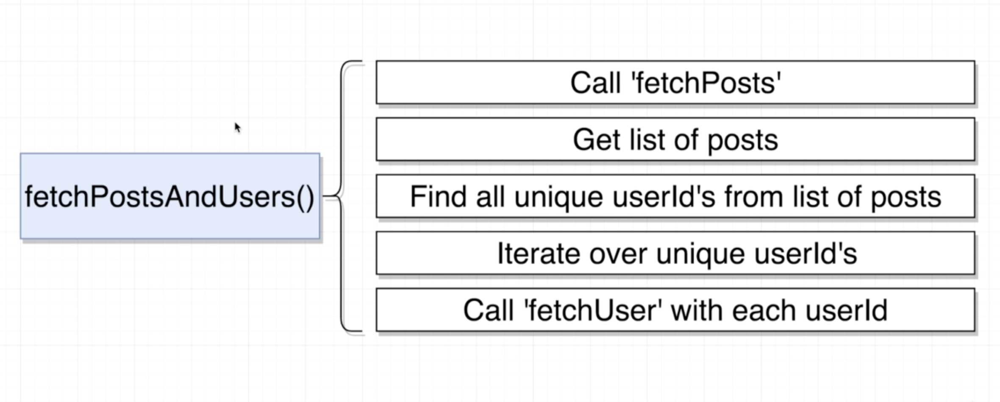
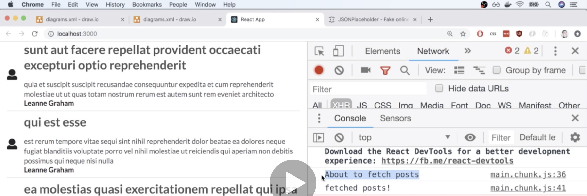

# 20200711 Redux Store Design

memoizing definitely worked pretty well, but the downside is that we can now call this action creator only one time with each unique user ID, and that effectively means that we can only fetch each user one time inside of our application.



We're going to create a new action creator called fetch posts and users, the twist is that we are not going to replace the fetchPosts action creator and the fetchUser action creator. So in other words fetchPostsAndUsers is not going to have some logic inside of it to make a network request over to our API. Instead we're going to keep all that network request logic inside of our two existing action creators fetchPosts and fetchUser.

The idea here is that when you start working on your own projects, you want to create action creators that are as small and compact as possible. So when you start putting together these kind of big combo action creators that do multiple things, a very good approach is to first create some action creators that do very small things and essentially kind of wired them altogether into the more mega action creator.

---

We're going to wire fetchPostsAndUsers up with redux thunk just as we have with all the other action creators as well. we're going to have one arrow function that returns an arrow function, it's going to have async await syntax in it, and we're going to again received that argument of dispatch, so that we can dispatch our own actions inside of here.

Inside of fetchPostsAndUsers, we're going to call fetchPosts and fetchUser multiple times. Our application like all of our react code all of our components are going to call fetchPostsAndUsers action creator alone. They are no longer going to call the other two action creators we have.

```js
export const fetchPosts = () => async dispatch => {
  const response = await jsonPlaceholder.get("/posts");
  dispatch({
    type: "FETCH_POSTS",
    payload: response.data
  });
};
```

when we call fetchPostsAndUsers that is the only action creator that you and I are going to call. So we need to make sure that when we eventually delegate to fetchPosts to actually go and fetch the posts, we handle that action creator(fetchPosts) appropriately. We need to make sure that action creator still has some action that is going to get dispatched at the end of the day.(如上)

```js
export const fetchPostsAndUsers = () => async dispatch => {
  fetchPosts(); //wrong
  dispatch(fetchPosts()); //right
};
```

So in other words you and I cannot just call fetchPosts() in fetchPostsAndUsers and get our posts. Instead we need to make sure that when we call this action creator(fetchPosts) whatever action or whatever function it returns gets dispatched as well. So it goes into that entire pipeline of being dispatch goes through the middleware and eventually goes into the reducers.

So when we call fetchPosts, we have to pass the result of calling that thing into our dispatch function. So we are now kind of manually dispatching the result of calling the action creator.

So we're going to call fetchPosts() in fetchPostsAndUsers, that's going to invoke fetchPosts outer function(first arrow function), that's going to return this inner function(async dispatch => {...}), so we are going to dispatch a function.

Remember whenever we dispatch a function, redux thunk is going to pick it up and automatically invoke it. So redux thunk is going to see this inner function, and invoke it and pass in dispatch as the first argument. So then this inner function is going to make a request over to our API, get the list of posts, and then it's going to dispatch its own action internally, and start that entire process of updating our reducers.

So again whenever we call an action creator from inside of an action creator, we need to make sure that we dispatch the result of calling the action creator. So we're going to call fetchPosts, fetch the list of posts and then eventually update our reducer.

---

So now we go on to the next step which is to get the list of posts.

```js
export const fetchPostsAndUsers = () => async dispatch => {
  dispatch(fetchPosts());
};

export const fetchPosts = () => async dispatch => {
  const response = await jsonPlaceholder.get("/posts");
  dispatch({
    type: "FETCH_POSTS",
    payload: response.data
  });
};
```

Remember whenever we call fetchPosts(in fetchPostsAndUsers), that is going to initiate a asynchronous request over to our API and get our list of posts. So we need to somehow make sure that we do not attempt to get at our list of posts that have been fetched until this action creator(第二行 fetchPosts()) has completed and has fetched all the appropriate data.
(因此，我們需要以某種方式確保在此 action creator 完成並獲取所有數據之前，不要嘗試獲取已獲取的 list of posts)

```js
export const fetchPostsAndUsers = () => async dispatch => {
  await dispatch(fetchPosts());
};
```

To do so, we're going to put the await keyword in front of it. So the reason that we put the await keyword, it's going to make sure that when we dispatch that action creator, and this inner function(inside fetchPosts()) eventually gets called, the await keyword right here is going to essentially make sure that we wait for this API request(inside fetchPosts()) to be completed before we move on and do anything else inside of our new action creator(fetchPostsAndUsers).

quick review:

we call our action creator(fetchPosts). That's going to return the inner function. We're going to make sure we dispatch that things, so this inner function is going to show up inside of redux thunk, and get invoked with dispatch. Then to make sure that we don't try to do any other logic inside of our action creator(fetchPostsAndUsers) until we have successfully fetch that list of posts, we're going to make sure that we put the await keyword right here in front of that entire call(dispatch(fetchPosts());) and that's going to make sure that we're not going to progress down to the next line of code until we have successfully fetched the list of posts and dispatched the action for it.

```js
export const fetchPostsAndUsers = () => async dispatch => {
  console.log("About to fetch posts");
  await dispatch(fetchPosts());
  console.log("fetched posts!");
};
```



So we see about to fetch posts, when we saw that console log appear, there was the slightest little delay where we were waiting for that list of posts to be fetched and then processed by our reducers and then we saw the second console log.

So that means that this await syntax right here is definitely making sure that we do not progress down to the next line of code until we have successfully fetch the list of posts dispatched an action and updated our reducer with all those different fetch posts.
