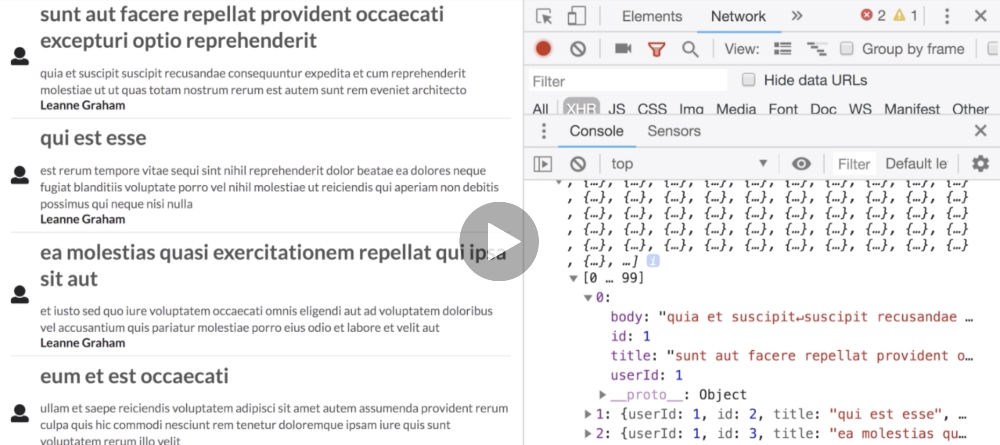

# 20200712 Redux Store Design

```js
export const fetchPostsAndUsers = () => async (dispatch, getState) => {
  await dispatch(fetchPosts());
  console.log(getState().posts);
};
```

The second argument that redux thunk calls our inner functions with for all this action creator. The second argument in addition to dispatch is the getState argument. That getState function is the function that exists on the redux store that gives us access to all the data inside of redux.

So now inside of this action creator, after we wait for all these posts to be fetched and processed by the reducer, we can then call getState and reference the posts property, and that should have all of the posts that we just loaded up and caught inside of our reducer.



We should load up our application see a brief little pause as we are fetching our list of posts, and then we should see a console.log of all the posts we have fetched.

```js
_.map(getState().posts, "userId");
```

So now the next thing we need to do is iterate through this list of posts find all the unique user IDs, and then fetch a user for each one. To do that we're going to make use of that lodash library to do that memoization step.

First off we're going to call getState, we're going to reference the posts property(an array). We're then going to use lodash's version of the map function(map is a function on all javascript array), I'll pass in those posts as the first argument.

Now we want to pull off just the user id property from all those posts, and find just the unique user ids. I'm going to put a second argument inside of here a string of user id. That's going to go through all of our different posts and pull off just that user id property. So we'll then have as a result of this entire expression an array of all of the different user IDs. It's going to be 100 long because we have 100 posts, so we now need to go through it and find just that unique user ids.

```js
export const fetchPostsAndUsers = () => async (dispatch, getState) => {
  await dispatch(fetchPosts());
  const userIds = _.uniq(_.map(getState().posts, "userId"));
  console.log(userIds);
};
```

unique is going to return an array with just the unique user IDs. So we'll assign that to a variable called userIds.

```js
export const fetchPostsAndUsers = () => async (dispatch, getState) => {
  await dispatch(fetchPosts());
  const userIds = _.uniq(_.map(getState().posts, "userId"));
  userIds.forEach(id => dispatch(fetchUser(id)));
};
```

Now the last thing we have to do is iterate over that list of IDs and for every id we need to call our fetchUser action creator, we're going to pass in that id, and then we're going to dispatch the results of it.

The reason that we don't have to put await in front of dispatch this time around is that we do not care at all about waiting for each user to be fetched inside of fetchPostsAndUsers. We just wanted to wait and make sure that we loaded up the list of posts, and then once we got the posts, all we wanted to do was initiate a request to go and fetch the individual users, but we don't have any other logic inside of here that we need to run after we fetch those users, so we don't have to put any other await keyword and await for each user to be fetched.

```js
export const fetchPostsAndUsers = () => async (dispatch, getState) => {
  await dispatch(fetchPosts());
  const userIds = _.uniq(_.map(getState().posts, "userId"));
  userIds.map(id => dispatch(fetchUser(id))); //return an array of promises

  Promise.all(userIds.map(id => dispatch(fetchUser(id))));
    .then

  await Promise.all(userIds.map(id => dispatch(fetchUser(id))));
};
```

If we had some other resource we wanted to fetch inside of here then we could use the await keyword. Async await syntax does not work with a forEach statement. So if you did want to await for each user to be fetched, we'd have to adjust this code(如上).

So we're now going to loop over all the different user IDs, we will call the appropriate action creator, when we call that thing we'll then dispatch it, that should make sure that our inner function inside this action creator right here gets called by redux thunk, its going to make sure that we fetch that user ID and then dispatch the appropriate action, we're only doing that one time for each unique user ID.

We don't want the UserHeader component to fetch its own data anymore, so we can remove that componentDidMount

---

```js
export const fetchPostsAndUsers = () => async (dispatch, getState) => {
  await dispatch(fetchPosts());
  const userIds = _.uniq(_.map(getState().posts, "userId"));
  userIds.forEach(id => dispatch(fetchUser(id)));

  _.chain(getState().posts)
    .map("userId")
    .uniq()
    .forEach(id => dispatch(fetchUser(id)));
};
```

chain is a function inside of lodash, that allows us to chain on essentially a bunch of additional functions that are going to manipulate some collection of data. When we call the chain method and then chain on some additional method(ex: map), The first argument to this map function right here behind the scenes will be whatever object we are changing over(getState().posts), so this list of posts right here will be provided as the first argument to the map function. So then we only have to provide the second or third arguments that we want to pass in here.

So in this case we had originally called the map function with our list of posts and a second argument of userId. So now that list of posts is going to be passed behind the scenes as the first argument to map. So we only have to pass in the second argument that we cared about of userid.

We can then take the result of that map step we can chain on another method right here, and whatever result we got from the map step will be passed into this next method. So originally we had called map, and then we passed the results of that into uniq, so the results of the mapping step will be automatically passed as the first argument into uniq. So the result of uniq will be passed into forEach. And so now we could put a function inside of forEach that will be called for every unique ID.

the last thing we do here this is a little bit of record keeping with lodash. With lodash, it's not going to actually execute all these steps on a chain function like so until we put on a value step. If you just list out all these chain methods like so it's not going to actually execute all those steps until you finally put on a value.

```js
export const fetchPostsAndUsers = () => async (dispatch, getState) => {
  await dispatch(fetchPosts());

  _.chain(getState().posts)
    .map("userId")
    .uniq()
    .forEach(id => dispatch(fetchUser(id)))
    .value();
};
```

---

quick overview:

```js
const store = createStore(reducers, applyMiddleware(thunk));
```

Inside of root index.js file we had imported redux thunk, and then we wired it up to our redux store through the use of applyMiddleware. We called applyMiddleware which is a function from the redux library itself. We passed the result of that into the second argument of the createStore call. When we apply that middleware of redux thunk, anytime that we dispatch an action, the action will be first sent to redux thunk as the middleware, and then after redux thunk the action will be sent off to all of our different reducers.

When we wired up redux thunk, it changed the rules of our action creators. So inside of our action creators file, we no longer had to create action creators that always returned an action object. Instead with redux thunk, we could also optionally return a function. If we return a function, it would be automatically called with the dispatch and getState arguments, and that essentially gave us total control over changing or getting information out of our redux store.

Anytime that we expect to make an API request from an action creator, we are always going to make use of something like redux thunk.

```js
export const fetchPosts = () => async dispatch => {
  const response = await jsonPlaceholder.get("/posts");
  dispatch({
    type: "FETCH_POSTS",
    payload: response.data
  });
};

function() {
    return function() {
    }
}
```

When we return a function from our action creators, we use this really interesting syntax right here, and all that's going on right there is we have a function that returns a function like so. So we had the outer function and then whenever we called it, it automatically returned this inner function.

```js
export const fetchPostsAndUsers = () => async (dispatch, getState) => {
  await dispatch(fetchPosts());
```

Now for the alternate solution to solving over fetching stuff we saw how we could create an action creator that somehow called other action creators, and made sure that we still dispatch the result of calling those action creators.

```js
export default (state = [], action) => {
  switch (action.type) {
    case "FETCH_USER":
      return [...state, action.payload];
    default:
      return state;
  }
};
```

We learned a ton about our reducers. We learned that the first argument is state, and it is whatever was returned from this reducer the last time that it ran, so we run these reducers over and over again and whatever we return shows up as that first argument.

We learned that we usually make use of this switch statement syntax inside of our reducers. Remember anytime that we return some data from a reducer, we always have to return a new array or a new object or a different valued string or a different value number if we expect redux to realize that we made a change to the data inside of our application. If we ever just return the exact same object or array, redux has that very simple comparison where it just checks to see if that is the same object or array in memory. And if it is, redux says: no data has changed, and it does not update the rest of your application and tell the react side of your app to actually re-render itself and pull down new state and show some new content on the screen.
