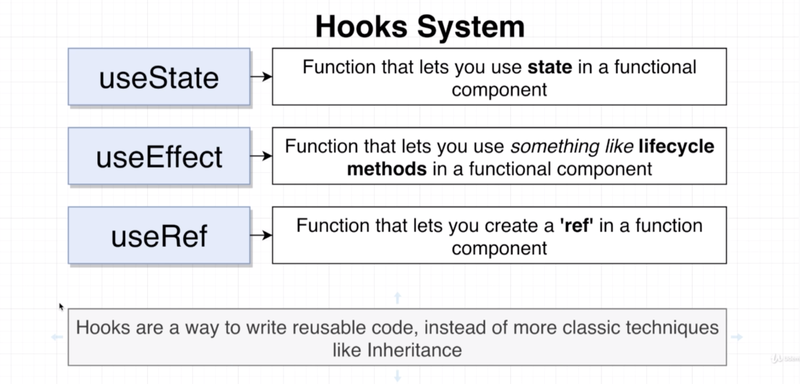
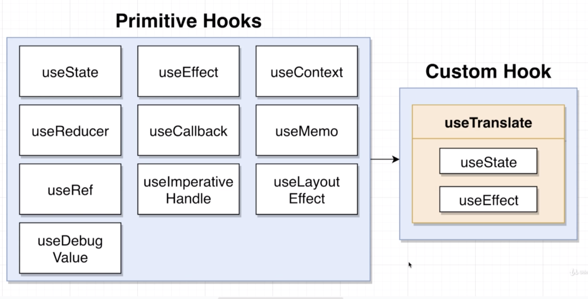
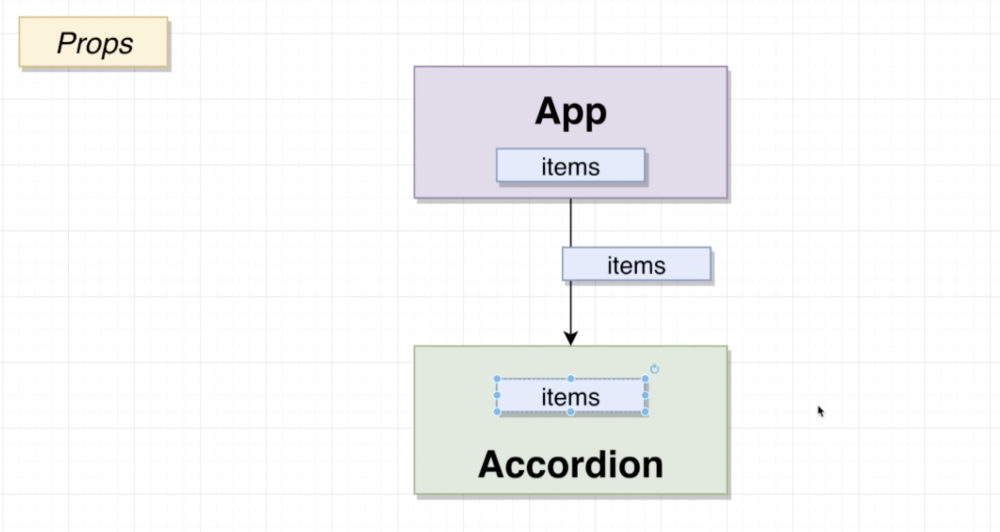
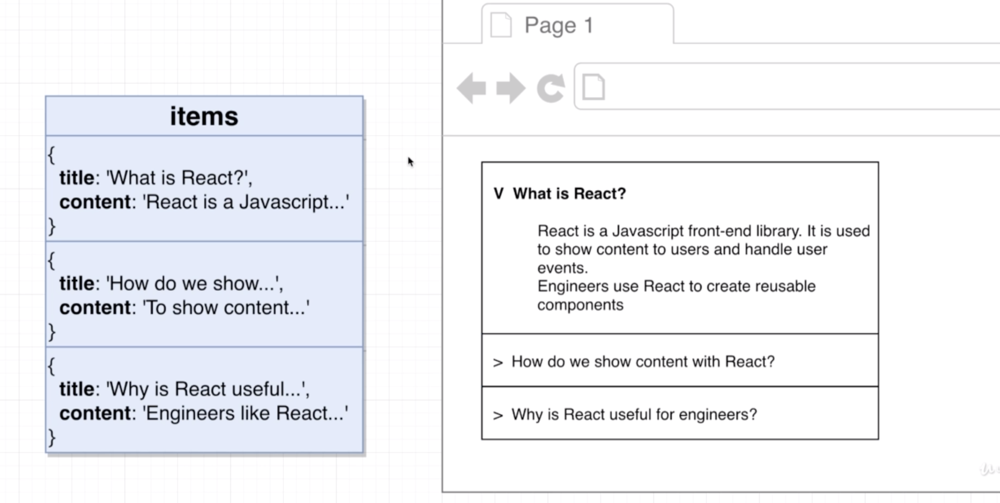
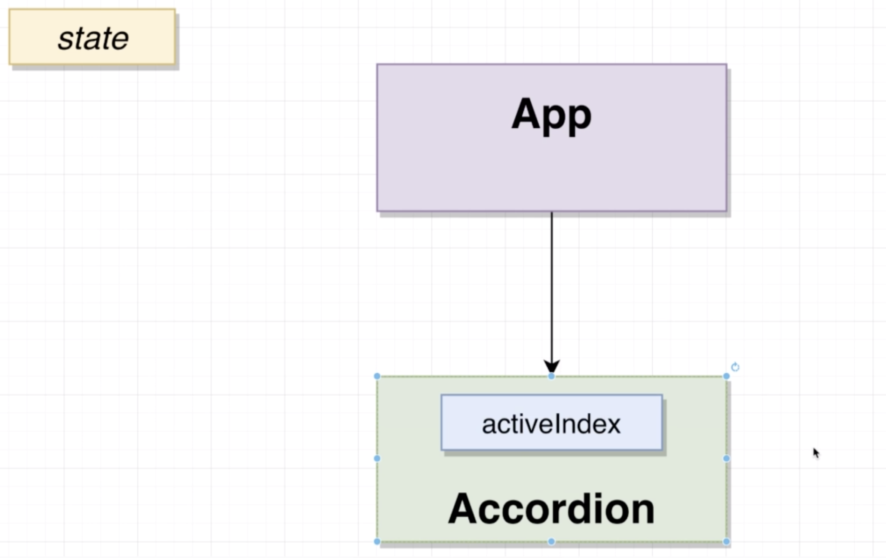

# 20200713 Understanding Hooks in React

In the world of react, the hook system is all about giving function components a lot of additional functionality. As we have discussed, function components so far throughout this course, we have said that they could not make use of state or life-cycle methods and so on. The hook system is all about changing that, with the hook system, React gives us functions called things like useState useEffect, useRef. These are all functions, and each of them give additional functionality to a function component. For example, the useState function allows us to make use of state(similar functions to setState function) in a functional component. useRef allows us to create a ref or a reference to a particular element that is created by react. Everything in the hook system, all functions. hooks are all about giving you tools to write reusable code.

With a hook system, we get a collection of different functions that we might refer to as primitive hooks. These are 10 functions that are included with react to give more functionality to function components.

Eventually we're going to make use of these primitive hooks to write our own custom hooks. A custom hook is a piece of code that does one very repeatable or task, little chunk of code that we want to make as reusable as possible. Inside of a custom hook, we're going to reuse some of the different primitive hooks that are given to us from react.

---

We'll have an app component that kind of governs or coordinates information across our entire application. We'll then also create an accordion component, this accordion component is going to be in charge of showing this entire piece of content. Because we probably want to make the accordion reusable in nature, and be able to show different sets of questions and answers, we should probably have some kind of items prop that is created inside of our app component, and then pass down as a prop into the accordion. The accordion will then decide what set of questions and answers to show on the screen based upon this items prop. No difference here whatsoever on the prop side of things, just because we're using the hook system.

The actual items prop will probably make it an array of objects. For each object inside of there, maybe we will give it a title and a content property. Because there can only ever be one active question at a time, we could probably get away with just one piece of state, maybe an index, or in a number. the index of the active question that should be expanded on the screen. So maybe if a user clicks on this first question right here, we should set some kind of active index piece of state to zero to say that we should expand the element at index zero. That means we really just would need one very simple piece of state, just a number, and the number is going to change based upon whatever the user clicks upon.

We could definitely have this active index piece of state to find inside the app. However, our app component is unlikely to ever really care about what question is expanded at any given time. Whenever a user sees the accordion and they start to expand or look on different questions, chances are there are no other parts of application that really cares about what tab is expanded. Rather than defining this active index piece of state inside the app and then passing it down as a prop inside of the accordion, we're going to instead just define this piece of state inside the accordion itself. So only the accordion is going to know which question is currently expanded.

Now, of course, we could design this completely differently, but as we've taken a look at the mockup, it is very clear that there is no other part of our application that cares about that piece of state at all. That's why we're going to define that piece of state inside of the accordion.
