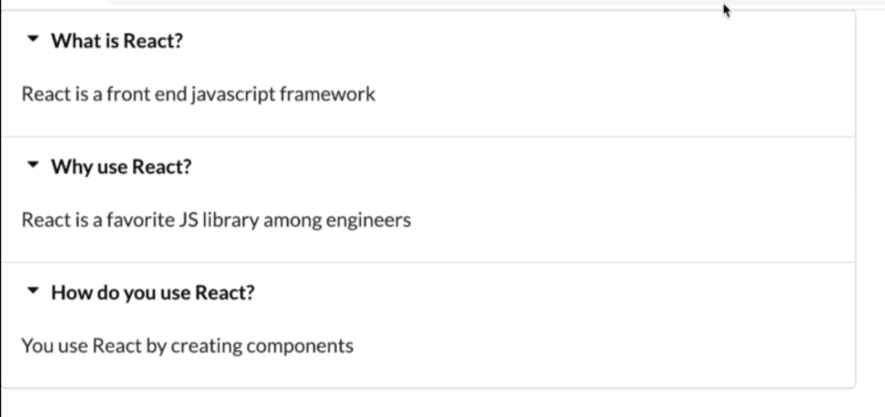
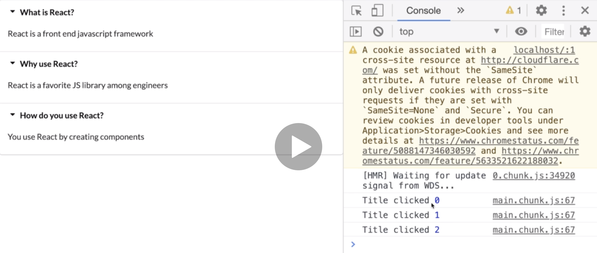
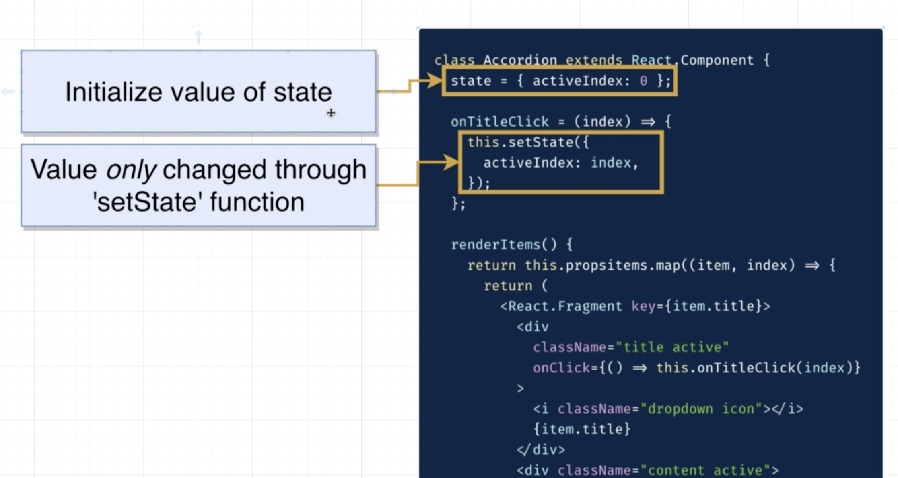
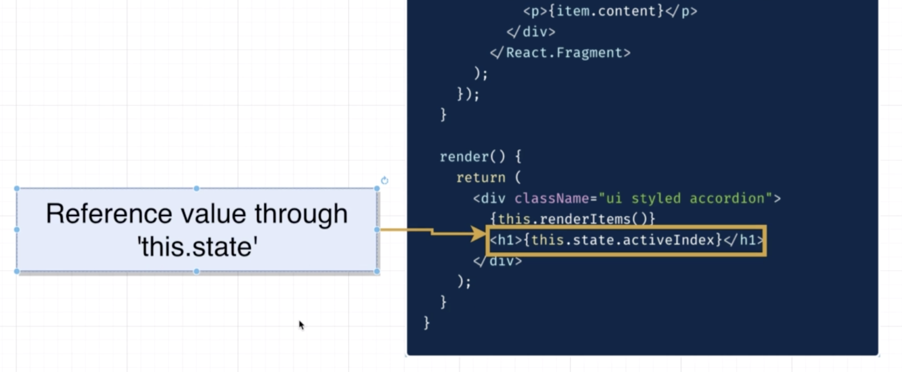

# 20200714 Understanding Hooks in React

```js
const Accordion = ({ items }) => {
  const renderedItems = items.map(item => {
    return (
      <div key={item.title}>
        <div className="title active">
          <i className="dropdown icon"></i>
          {item.title}
        </div>
        <div className="content active">
          <p>{item.content}</p>
        </div>
      </div>
    );
  });

  return <div className="ui styled accordion">{renderedItems}</div>;
};
```

We've to add in a key to this top level element that they're returning. Every element inside of a list of JSX elements needs to have a key property. In this case, we will just use the title of each item as our key because it is unique, inconsistent across renders.

---

basically there's actually two borders(gray line) being displayed up here at the very top. that turns out that semantic UI expects a very strict, very specific structure of each of these items right here (`<div key={item.title}>`).



In particular, semantic UI is assuming that we are not adding in this extra div right here, it doesn't want to see that div at all. If we put in that extra div, then Semantic is going to accidently apply a CSS rule that displays a second border up here at the very top.

To get that to go away, we essentially need to not return an HTML element right here. To do that, we can return a react fragment. We still have to return everything, because we want to eventually have two divs, we just don't want to have any extra element right there(`<div key={item.title}>`).

```js
const Accordion = ({ items }) => {
  const renderedItems = items.map(item => {
    return (
      <React.Fragment key={item.title}>
        <div className="title active">
          <i className="dropdown icon"></i>
          {item.title}
        </div>
        <div className="content active">
          <p>{item.content}</p>
        </div>
      </React.Fragment>
    );
  });
```

To supply a react fragment, we can delete the element name altogether. But in this case, we also want to supply the key property. In this case, we have to write out the full name of react fragment.

This is just a containing JSX element that react understands we've got to divs inside of it.

---

```js
      <React.Fragment key={item.title}>
        <div
          className="title active"
          onClick={() => console.log("Title clicked")}
        >
```

The next thing we need to do is figure out how to detect whenever user clicks on one of these titles. We're just going to wire up an event handler. We need to add in any onClickEventHandler to detect anytime a user clicks on one of these titles.

I'm going to add in an onClick prop, so anytime someone clicks on this thing, I'm going to run a little arrow function and inside there I'll do a console log of title clicked, and then I would display the index of the item that was clicked on.

```js
  const renderedItems = items.map((item, index) => {
    return (
      <React.Fragment key={item.title}>
        <div
          className="title active"
          onClick={() => console.log("Title clicked", index)}
        >
```

So to make sure that we also console log the index of the title that was just clicked, we can receive the index argument, that is the second argument to the map function. We can take that index variable and add it in to the very end of that console log.

It's entirely possible that this onClick callback right here is going to eventually have a good amount of code inside of it. It might be a little bit messy to add in all the code right here directly in line. So it would be really nice to put together some helper function and then write out that helper function somewhere else inside this file.

---

```js
class Accordion extends Component {
  onTitleClick() {
    console.log("title was clicked");
  }
  render() {}
}
```

a quick example of what we might do if we had a class based component. And then maybe inside this thing would have a render method that produced our JSX. And then if we wanted to add in that helper method, we could add in something like onTitleClick.

one of the nice things about a Class-Based component is it's really easy to organize your code. If you ever need to add in some kind of helper method, well, you just added in. It's really easy to give it a very appropriate name, that makes it clear to other engineers what that method is doing for you.

---

```js
const Accordion = ({ items }) => {
  const onTitleClick = index => {
    console.log("title clicked", index);
  };

  const renderedItems = items.map((item, index) => {
    return (
      <React.Fragment key={item.title}>
        <div
          className="title active"
          onClick={() => onTitleClick(index)}
        >
```

Inside of a function component, how we would approach adding in some kind of helper function or helper method to a function component?

I'm going to expect that this helper function is going to receive the index of the item that was just clicked on. So I now want to call this function right here(onTitleClick) anytime a user clicks on that div.

Why do we still have the arrow function inside div?

```js
const Accordion = ({ items }) => {
  const onTitleClick = index => {
    console.log("title clicked", index);
  };

  const renderedItems = items.map((item, index) => {
    return (
      <React.Fragment key={item.title}>
        <div
          className="title active"
          onClick={onTitleClick(index)}
        >
```

If we just write out something like this, then onTitleClick is going to be invoked the instant that our list of items is rendered.



the instant we refresh the page, we see title clicked zero one & two. We do not want to run that callback function the instant our component is rendered. Instead, we want to call it at some point in time the future. And to do that, we have to wrap it with an arrow function. Now, whenever that arrow function is executed, we run onTitleClick.

And the reason I'm making such a big deal about this entire helper method right here is that it's gonna be a little bit nasty, and your components are gonna end up being a little cluttered. When you write out all these helper functions inside the body of a function component, you don't get that kind of nice separation of code that we used to have back inside of a class based component.

```js
class Accordion extends React.Component {
  state = { activeIndex: 0 };

  onTitleClick = index => {
    this.setState({
      activeIndex: index
    });
  };

  renderItems() {
    return this.propsitems.map((item, index) => {
      return (
        <React.Fragment key={item.title}>
          <div
            className="title active"
            onClick={() => this.onTitleClick(index)}
          >
            <i className="dropdown icon"></i>
            {item.title}
          </div>
          <div className="content active">
            <p>{item.content}</p>
          </div>
        </React.Fragment>
      );
    });
  }

  render() {
    return (
      <div className="ui styled accordion">
        {this.renderItems()}
        <h1>{this.state.activeIndex}</h1>
      </div>
    );
  }
}
```

a little bit of code of an alternate implementation of the accordion component using a class.

So if we wanted to show the index of the currently selected panel at the very bottom, there are three key things we would do inside of here.

First, we would initialize our state object at the top and maybe we would have a property inside there called something like activeIndex.

Second, we would have a helper method that was called whenever a user clicked on a title, and inside there, we would update our state by calling this.setState.

And then finally, we would reference our piece of state down here inside the render method with this.state.activeIndex.

We can reference that value at any point in time inside of our entire class with this.state.activeIndex.





---

First off, at the very top, I'm going to get the useState function(This is a hook, it gives us access to state inside of a function component.) from the react Library.

```js
const [activeIndex, setActiveIndex] = useState(null);
```

Next up at the top of my component, I'm going to initialize a new piece of state.

```js
const onTitleClick = index => {
  setActiveIndex(index);
};
```

Next up, inside of onTitleClick, we're going to make sure that we update our value of our piece of state anytime a user clicks on the title.

```js
return (
  <div className="ui styled accordion">
    {renderedItems}
    <h1>{activeIndex}</h1>
  </div>
);
```

Down at the very bottom, we are going to expand this div.
