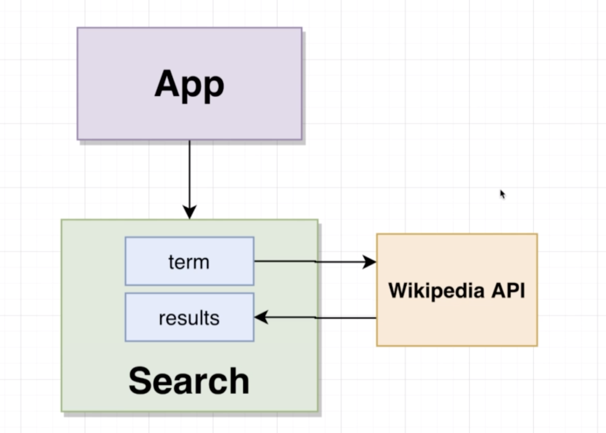

# 20200715 Understanding Hooks in React

```js
const [activeIndex, setActiveIndex] = useState(null);
```

```js
const onTitleClick = index => {
  setActiveIndex(index);
};
```

Anytime we call useState, we get back that array and the second argument inside of it is always going to be our setter. We saw an example of how to call it inside this onTitleClick. So we simply called the setter and provide the new value.

As soon as we call any setter function coming from a useState hook, our entire component is going to re-render. So we essentially go back up to the very top and execute everything inside of our function once again.

When you re-render your component, the default value to the useState function(That's the null value over here) is then going to fall away. It will not be used anymore. This is only an initialization value. And as soon as we call our setter, even one time, we will not be using that default value anymore.

So the second time we render this accordion component, the value of activeIndex will be equal to whatever we provided to our setter function. We would then execute the rest of our function with a new activeIndex value.

We've got this activeIndex variable that is going to be changing over time. Whenever a user clicks on a title, activeIndex will be updated and we will re-render this entire component.

---

```js
const renderedItems = items.map((item, index) => {
  return (
    <React.Fragment key={item.title}>
      <div className="title active" onClick={() => onTitleClick(index)}>
        <i className="dropdown icon"></i>
        {item.title}
      </div>
      <div className="content active">
        <p>{item.content}</p>
      </div>
    </React.Fragment>
  );
});
```

So how are you going to actually expand one of these items or shrink it? It all comes down to the existence of the active class name on this div right here inside of our list. The active class names control whether or not an individual item will be expanded.

So we need to make sure that whenever we are iterating over our list of items right here, we need to take a look at the index that we are currently iterating over and then compare it to the activeIndex piece of state. If they are equal to each other, then we will want to add the className of active to this div.

```js
const active = index === activeIndex ? "active" : "";
```

Now we can simply take this active variable and interpolate it or essentially join it together into this className. We're going to wrap this with some curly braces because we need to write out a little JavaScript expression inside of here.

```js
<div className={'title ' + active} onClick={() => onTitleClick(index)}>

<div className={`title ${active}`} onClick={() => onTitleClick(index)}>
```

```js
export default function App() {
  const [count, setCount] = useState(0);
  const onButtonClick = () => {
    setCount(count + 1);
  };

  return (
    <div>
      <button onClick={onButtonClick}>Click Me!</button>
      <h1>Current Count: {count}</h1>
    </div>
  );
}
```

As soon as setCount is called, that will also cause my entire component to automatically re-render. When it does so, count will be equal to the new value that I just passed in to setCount.

---

overall structure


in this very simple search or listing application we are gonna put together, we're going to build everything inside of one single search component. That's going to be displayed by the App. It's not going to take any props from the App, so it's self-contained. The search component itself will have two pieces of state. First off, we'll have a term which is whatever user is typing into that text input, whenever a user types into that text input, we're then going to send that off to the Wikipedia API and do a search. That's going to give us back some results. We're going to store those results on some piece of state as well. So as soon as we change that results piece of state, our component will re-render and we should render that list of results onto the screen and show to the user.
