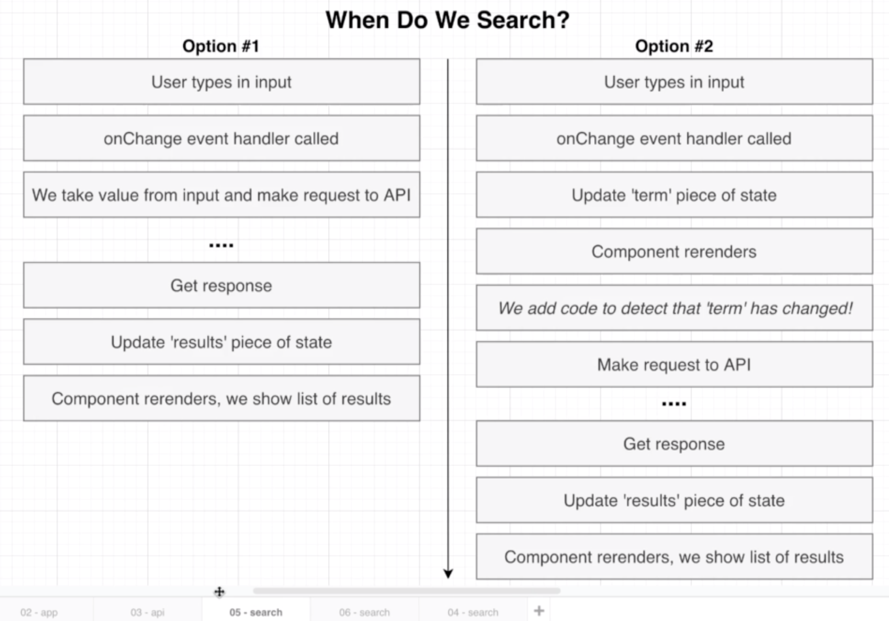
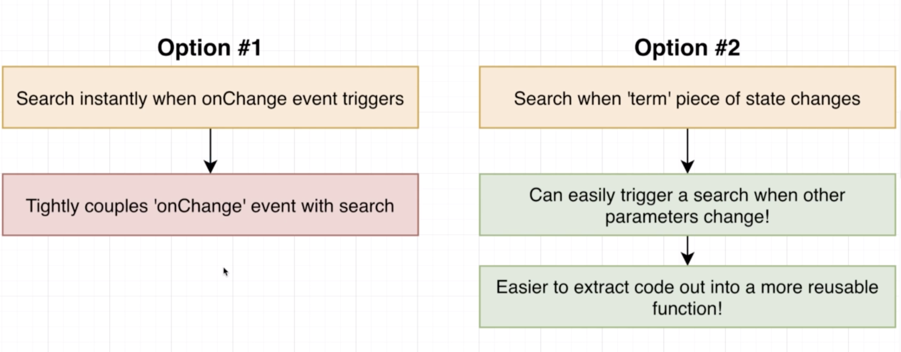
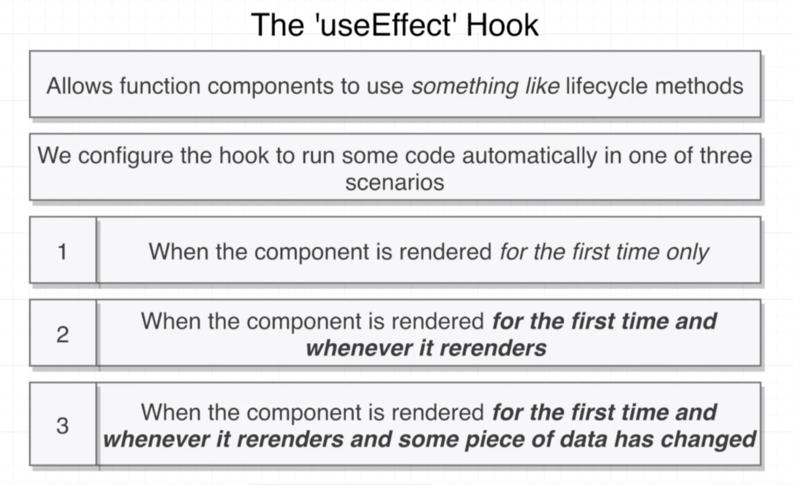
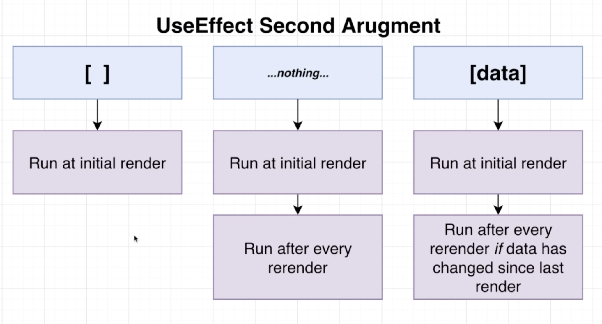

# 20200716 Understanding Hooks in React

We still use the exact same approach for managing typing into an input as we did with class based components. We are still going to assign a value prop to this input. We are still going to assign an onChange event handler any time the value inside that input has changed, we are going to update our piece of state. That's going to keep track of the value(that input) that is going to cause our component to re-render, and we will see the new value inside the input up here on the screen.

```js
const Search = () => {
  const [term, setTerm] = useState("");
  return (
    <div>
      <div className="ui form">
        <div className="field">
          <label>Enter Search Term</label>
          <input
            value={term}
            onChange={e => setTerm(e.target.value)}
            className="input"
          />
        </div>
      </div>
    </div>
  );
};
```

So we need to create a piece of state, that's going to keep track of the value type inside there, we will make use of the useState hook.

---



The big difference here between these two approaches is whether we want to make the request immediately inside the onChange handler, or whether we want to only update some piece of state and then make the request only after our component begins to re-render and we detect that term has changed.



With option number two, however, we can very easily kind of decouple or extract that searching code from anything related to an onChange event. With option number one, we are only doing a search when onChange event handler fires. With option number two, if there is some other piece of information that a user is going to enter, we could very easily trigger a search. If we had some additional search criteria, we would probably want to trigger a search whenever the user edits a search term or changes the category that they are trying to search from. So in that scenario, we would then have two pieces of information that would need to trigger a search.

The useEffect hook is what allows us to write out some code that detects that our component is re-rendering and some piece of information has changed, and that's going to allow us to run some additional code.



function components do not naturally have access to lifecycle methods like class components do. Class components have lifecycle methods that get automatically called at certain points in time.

The useEffect hook allows functions to use something very similar to Life-cycle methods. When we make use of useEffect, we provide some configuration to it. And this configuration is going to configure when we run some code automatically.

Their are the three different ways that we can configure useEffect to run code at a very specific time.

```js
useEffect(() => {
  console.log("123");
});
```

Inside of our component, we call useEffect, and we will provide a function as the first argument

To tell useEffect which of these scenarios we want to have this arrow function be executed in, we are going to provide a second argument to useEffect. So it's the second argument that controls when our code gets executed. The second argument we're going to put inside there is going to be an empty array, an array with some value inside of it, such as term or no array at all. Those are the three options we have.



if we put in an array with some value inside of it or some variable, that means we want to run at the initial render, and we also want to run the arrow function after every re-render if some element inside this array has changed since the last render. So in other words, this data variable right here has to change between renders or the arrow function to be executed again.

```js
const Search = () => {
  const [term, setTerm] = useState("");
  const [termTwo, setTerm] = useState("");

  useEffect(() => {
    console.log("123");
  }, [term, termTwo]);
```

This array can have multiple elements inside of it. If we had some other piece of state inside of here, and now useEffect is going to run if either of those elements change between renders, so only one has to change and the arrow function will be executed again.

```js
npm install axios
```

```js
useEffect(() => {}, [term]);
```

this means whenever we re-render our components and the term has changed, run that arrow function. It also means that we're going to immediately run the arrow function when our components first rendered as well.

```js
useEffect(() => {
  const search = async () => {
    await axios.get("URL");
  };
  search();
}, [term]);
```

We are not allowed to mark the function that we are passing into useEffect, we can not mark that as async and use any await keywords directly inside that function.

The first solution: Inside of useEffect, we can make a little temporary helper function. We can define a function inside of useEffect and mark that one as being async. We can then use the await keyword inside of here. So we could call axios.get make a request. After we define that function, we can call it.

```js
useEffect(() => {
  (async () => {
    await axios.get("URL");
  })();
}, [term]);
```

Method number two is going to very similar, we can remove that temporary variable altogether. And to invoke the function, we could wrap this with a set of parentheses, and then after the closing parentheses, we'll put in another set of parentheses. This defines a function, and then immediately invokes it.

```js
useEffect(() => {
  axios.get("URL").then(response => {
    console.log(response.data);
  });
}, [term]);
```

The third possible approach is to just revert back to using normal promises. Whenever you make a request through axios, it gives us back a promise, we could chain on a .then statement. And this arrow function inside of .then will be invoked with the response that we get back from that API.

So those are the three possible alternatives. Either declare the helper function, declare a helper function and immediately invoke it, or just make use of promises.

the three ways that we can make a request inside of useEffect while still using some async await syntax or a promise.

---


The vast majority of this is actually a query string. So we do not encode the query string into the actual URL argument of our request. Instead, we're just going to put in the domain and the path and then we will provide a separate object to encode all these query parameters.

```js
useEffect(() => {
  const search = async () => {
    await axios.get("https://en.wikipedia.org/w/api.php", {
      params: {
        action: "query",
        list: "search",
        origin: "*",
        format: "json",
        srsearch: term
      }
    });
  };
  search();
});
```

Then as the second argument, we're gonna put in an options object. We're going to provide a params property and assign it an object. Remember whatever key value pairs we put inside of this object, Axios will take all those and code them into a query string and depended on to the end of the URL automatically. srsearch is going to be our actual search term.

An initial request has already been issued. The reason for that is that when we first render our component to the screen, our useEffect function is going to be invoked.
