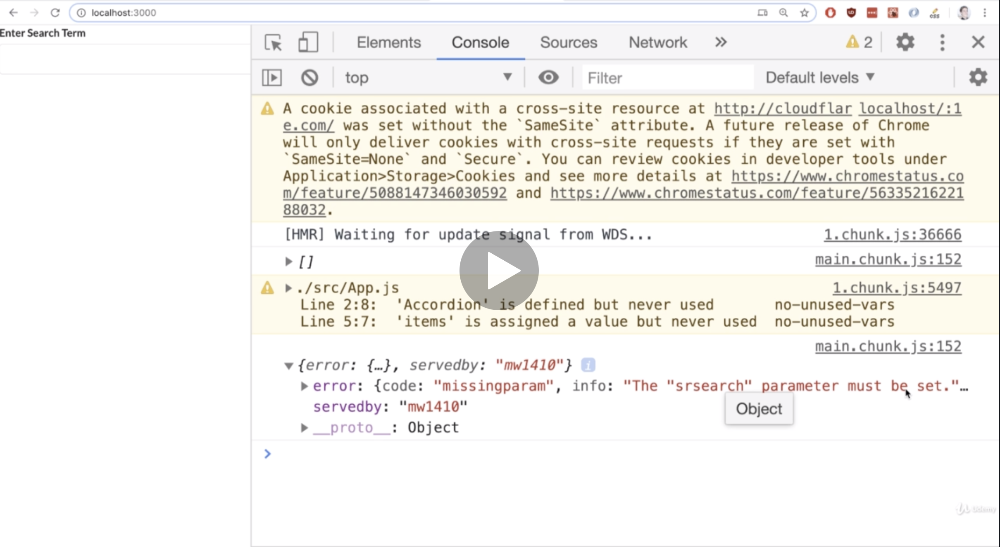
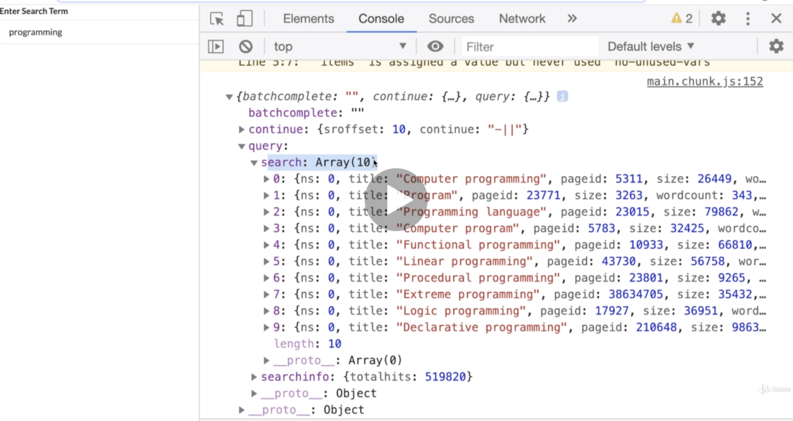
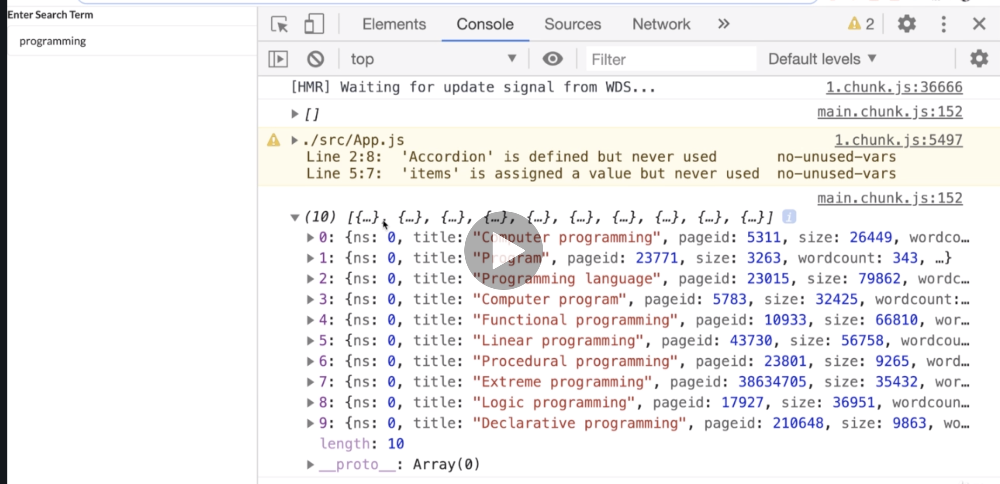
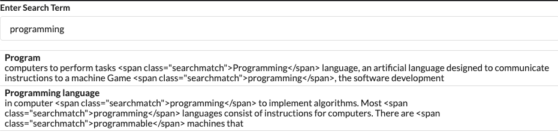
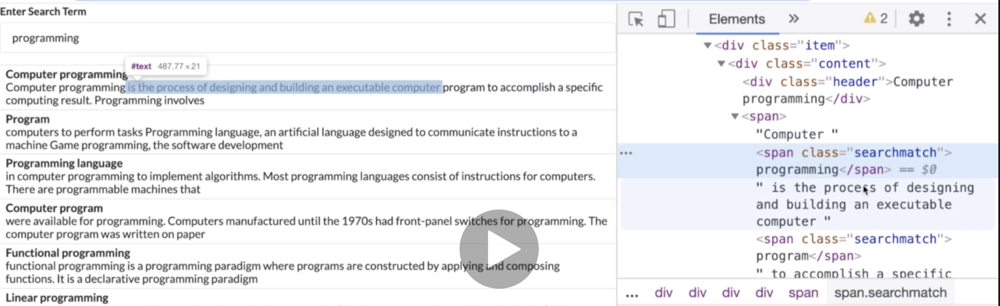
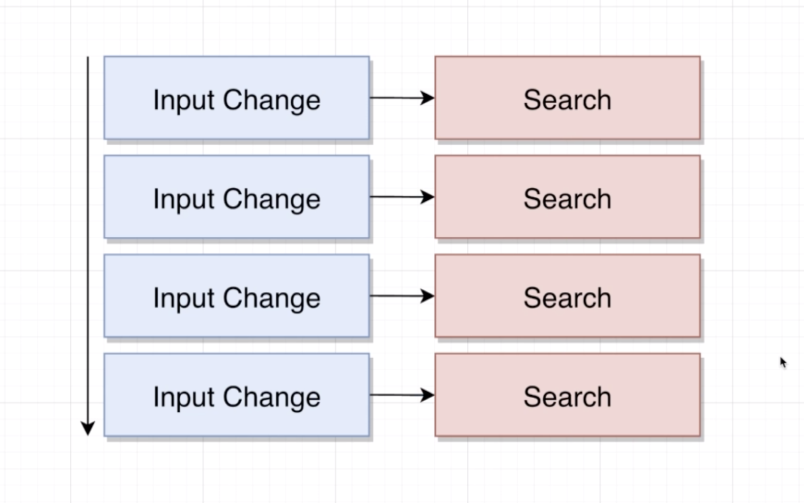
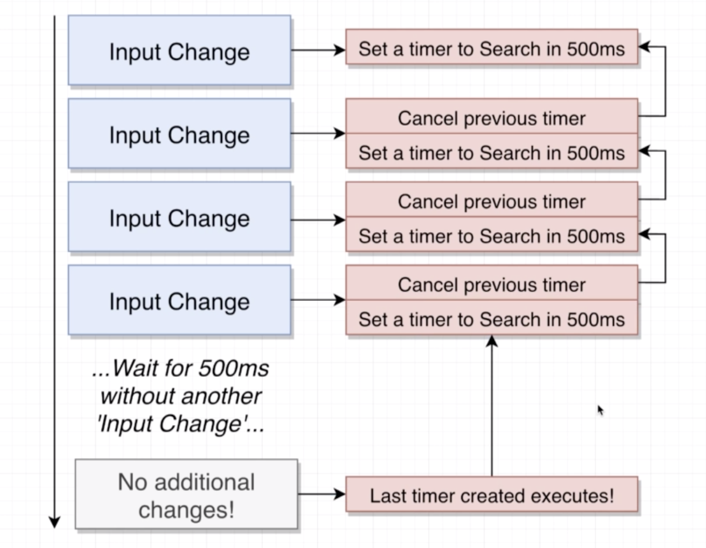

# 20200717 Understanding Hooks in React

```js
const [results, setResults] = useState([]);
```

The results state is eventually going to be an array of objects. When we first render our component to the screen, it would make sense to use a default value here of an empty array. Just to say we do not have any search results right now.

Then inside this search function, we're going to take the data out of the response we get. We have const data is request. And then right after we make the request, we're going to use data to update our results piece of state. That will cause our component to automatically re-render. So we can then access the results array down inside of our JSX block and render out our list.



When our component is rendered for the very first time, term is an empty string. If we provide an empty string to the Wikipedia API, they are saying, hey, you have to provide us an srsearch, you can't search for empty string.

```js
const Search = () => {
  const [term, setTerm] = useState("programming");
  const [results, setResults] = useState([]);

  useEffect(() => {
    const search = async () => {
      const { data } = await axios.get("https://en.wikipedia.org/w/api.php", {
        params: {
          action: "query",
          list: "search",
          origin: "*",
          format: "json",
          srsearch: term
        }
      });
      setResults(data);
    };
    search();
  }, [term]);
```

We have two options available to us. We can either put in a default search term that will be displayed to the user. If we do that, then when our components first rendered, we will initiate a search, and we will search for the term programming.

```js
const Search = () => {
  const [term, setTerm] = useState("");
  const [results, setResults] = useState([]);

  useEffect(() => {
    const search = async () => {
      const { data } = await axios.get("https://en.wikipedia.org/w/api.php", {
        params: {
          action: "query",
          list: "search",
          origin: "*",
          format: "json",
          srsearch: term
        }
      });
      setResults(data);
    };
    if (term) {
      search();
    }
  }, [term]);
```

If we do not want to provide an initial value for our user, but we don't want the request to error out, we could revert useState and give it an empty string as the default value. And then inside of useEffect, rather than immediately calling search, we can make sure that term is defined. If term is an empty string, it will not search, if term has some characters inside of it, we will do a search. If we take this approach, we will not have a default search term and we will not make an initial request until the user starts to type something in.



```js
setResults(data.query.search);
```

You'll notice that results right now. I really just took all the data out of that response. But the only thing we really care about is the search array. Rather than taking the entire data property out of that response and using that to update our results piece of state, we should just get this search array of results, and set that on our state instead. The data is this entire object({batchcomplete: "", continue: {…}, query: {…}})



During our initial render, we have no results, so there is an [ ]. The request is then completed. We update our states. We do a console log of the results piece of state, and we can see that we've got the array of objects.

```js
const renderedResults = results.map(result => {
  return (
    <div key={result.pageid} className="item">
      <div className="content">
        <div className="header">{result.title}</div>
        {result.snippet}
      </div>
    </div>
  );
});
```

And then finally, we need to map over that results array, and build out our actual list of elements to display inside this JSX block.



In the response we get back from the API, wikipedia is automatically giving us a response that has some HTML written inside of it.

There are two ways that we can somehow get rid of these span elements that are wrapping our search term.

The first way would be really simple and straightforward before we render out the actual snippet, we could do a find and replace. We could find every instance of this span and the closing span and replace them with an empty string. So essentially, just remove the span.

---

The other way we can approach this is by taking this HTML that has been provided to us by Wikipedia, and rendering it out as HTML inside of our app. So actually create a span element to wrap that programming. The benefit to this is that we could then apply some CSS to style search match.

whenever we show text with react, as we are doing right now, it is displayed as plain text. The only way to create a HTML element normally with react is by writing out some JSX, as we do many times whenever we write a component.

But in this case, we have a string that we want to turn into JSX, to do so, we have to use a little hidden feature in react.

```js
const renderedResults = results.map(result => {
  return (
    <div key={result.pageid} className="item">
      <div className="content">
        <div className="header">{result.title}</div>
        <span dangerouslySetInnerHTML={{ __html: result.snippet }}></span>
      </div>
    </div>
  );
});
```



So now we don't see those span elements anymore. But if we do an inspection on that, we'll see that we've got a span, and inside of it is some spans that have been created out of the HTML string that we had previously. This is now an actual HTML element.

anytime do you take a string, which we are doing from a third party, such as the Wikipedia API, you could be introducing a security hole into your application, specifically a type of security hole called XSS attack(cross site scripting attack). That is where we accidentally pick up and render some HTML from an untrusted source, that can allow some hacker or otherwise malicious person to execute some JavaScript inside of our application.

when I make my request to get a list of all these search results, I'm making a request to the server, which is running malicious code that's going to send back a fake set of articles, embedded in there is malicious HTML. There's some HTML that has some embedded JavaScript code. Whenever that JavaScript code runs, it replaces the entire react app. What this really represents is that some untrusted party would run some JavaScript code inside of your app. we really open ourselves up to it as soon as we use dangerously set in our HTML.

So anytime that you make use of dangerously set in your HTML to take a string and rendered as HTML, you are opening yourself up for risk unless you are 100 percent confident that the person who is sending you that HTML is someone who can be trusted.

```js
<div className="right floated content">
  <a
    className="ui button"
    href={`https://en.wikipedia.org?curid=${result.pageid}`}
  >
    Go
  </a>
</div>
```

Now, we just need to make sure that this anchor element has a link assigned to it or an href property.

To get a URL that the user can visit, we're going to go to a specially crafted URL. We're going to do some string templating, which will require us to put in a set of curly braces.

Right now, if we delete everything inside that input, we get a nasty error. This is because we are doing a search with an empty string. We made use of a default search term just to make sure that we wouldn't do a search without any content inside of it or no search term.

```js
useEffect(() => {
  const search = async () => {
    const { data } = await axios.get("https://en.wikipedia.org/w/api.php", {
      params: {
        action: "query",
        list: "search",
        origin: "*",
        format: "json",
        srsearch: term
      }
    });
    setResults(data.query.search);
  };
  if (term) {
    search();
  }
}, [term]);
```

So we'll say that we only want to run a search if there is a term. So if term is empty string, don't do a search at all. Otherwise, if we've got some term defined, go ahead and run the search.

---

The next problem that we're going to solve is making sure that we do not do an API request every single time the user changes that text input.



The user keeps on changing that text input. And every single time they initiate a change to it, we are immediately doing a search.



We want to allow a user to type inside that input as much as they please. whenever they type inside there, we are not going to immediately do any kind of search. Instead, we're going to somehow wait for about five hundred milliseconds for the user to not do any additional input changes.

So in other words, if they type a whole bunch and then stop for about five hundred milliseconds, then we will go ahead and do the actual search.
