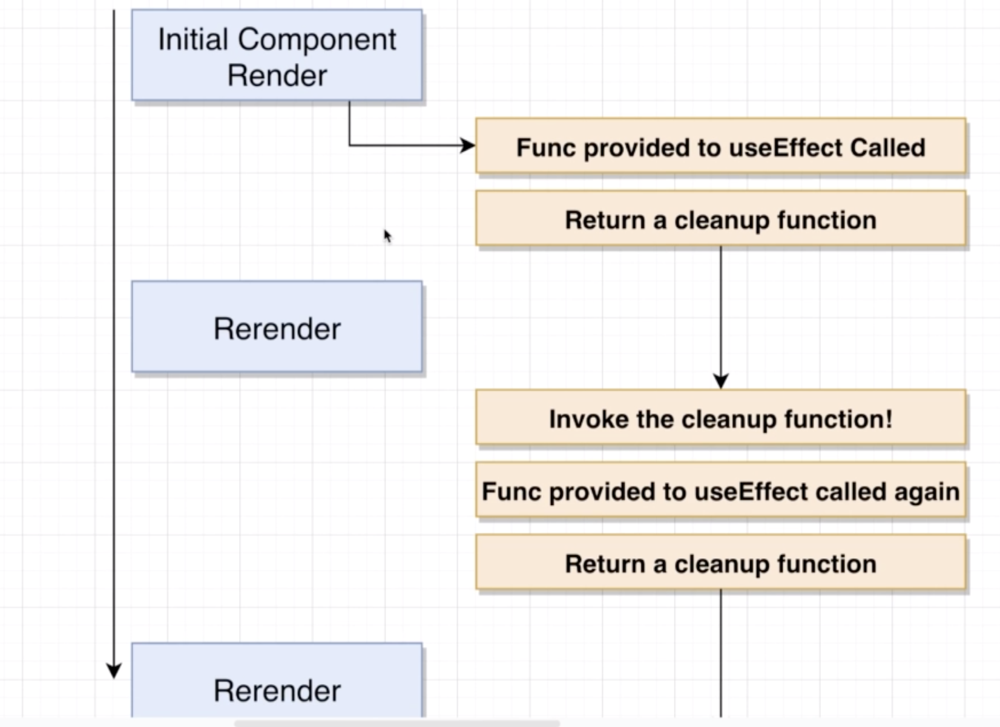
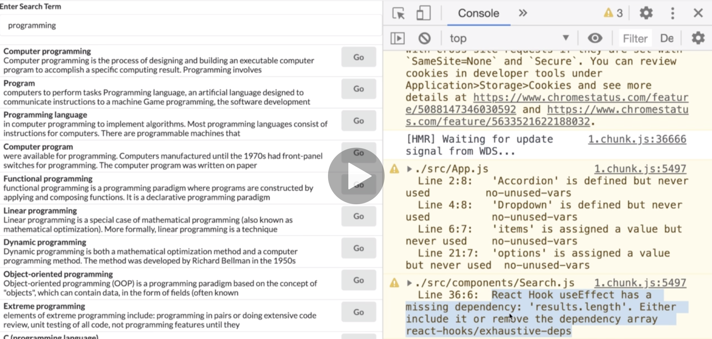
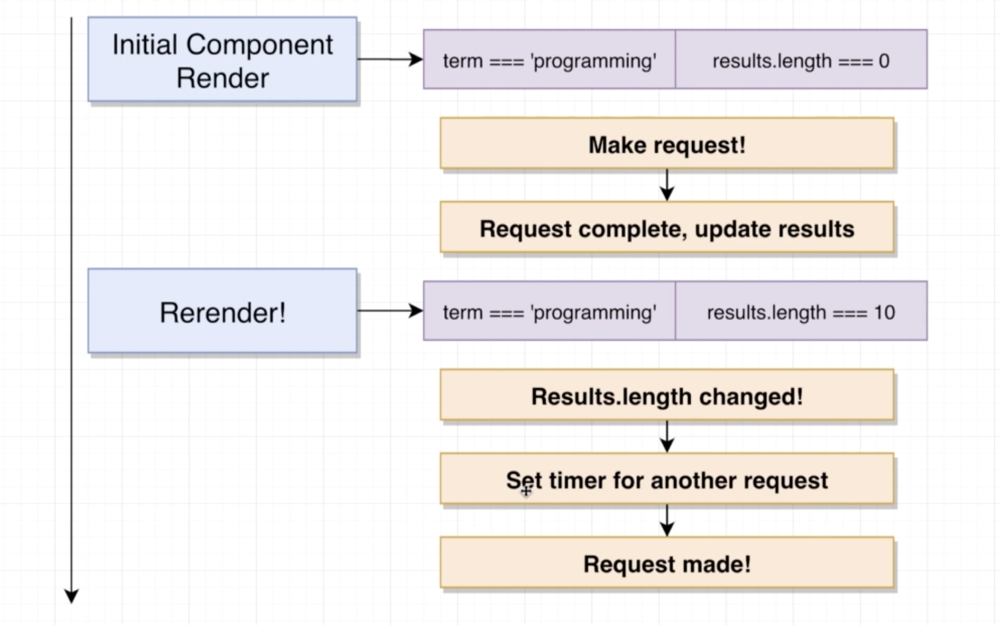
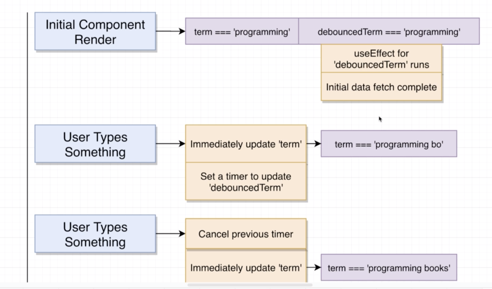
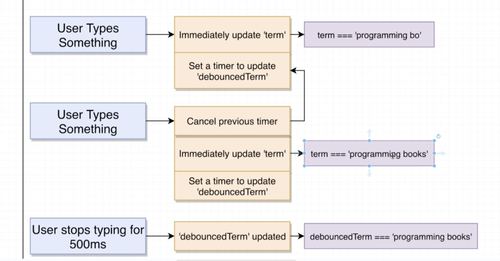
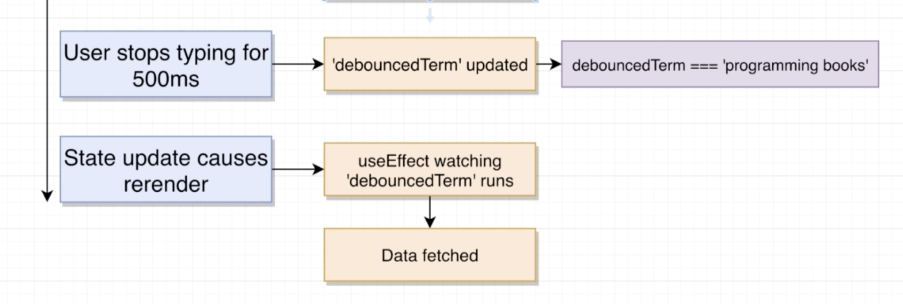

# 20200719 Understanding Hooks in React

To set up this cascading timer of sorts, we're going to first write in some code that is going to just set up a timer to do the search in 500 milliseconds. So we're still going on the same behavior as before where every single key press results in a search. They will just all be lagged by 500 milliseconds. Once we get this code together, we'll then start to discuss how to add in that cancel step.

```js
setTimeout(() => {
  if (term) {
    search();
  }
}, 500);
```

Now if I put in 'programming', everything is lagged by 500 milliseconds.

```js
setTimeout(() => console.log("Hi"), 10000); //116
clearTimeout(116);
```

whenever you create a time out using set time out, you get back a number or an integer like 116. This is an identifier that identifies the timer that was just created. Before that timer times out or completes, we have the opportunity to cancel this timer by making use of a function that is built into JavaScript. I'm going to very quickly call clearTimeout and pass in that 116. By calling clearTimeout, we are cancelling this timeout right here, and even after ten seconds, that arrow function is not going to be invoked.

Whenever we call setTimeout, we get back an identifier, we can use that id right there to stop the timer from executing.

So we can take this set time out statement and assigned the result of it to a variable timeoutId. And then at some point in time in the future, we can attempt to clear our time out making use of the clear timeout function. All we have to do is pass in that Id.

---

```js
useEffect(() => {
  console.log("Initial render or term was changed");

  return () => {
    console.log("CLEANUP");
  };
}, [term]);
```

With this current setup, we're going to invoke that arrow function the very first time our component is rendered to the screen. We will then also invoke this function any time the term piece of state changes.

Whenever we define useEffect or call it, and we provide an function as the first argument. There's only one type of value we are allowed to return from this arrow function. The only thing that we are allowed to return is another function. The goal of the returned arrow function is to do essentially some cleanup.

whenever our component first renders the overall arrow function is invoked and we return that inner arrow function. Then any time that is time to run outer arrow function again, first, react is going to call the cleanup function that it got from the last time useEffect ran. And then it's going to call the overall arrow function again.

As soon as that is time our useEffect to be invoked again, first, the cleanup function we had returned from the last time around gets invoked, and then the overall function gets invoked again.



```js
useEffect(() => {
  const search = async () => {
    const { data } = await axios.get("https://en.wikipedia.org/w/api.php", {
      params: {
        action: "query",
        list: "search",
        origin: "*",
        format: "json",
        srsearch: term
      }
    });
    setResults(data.query.search);
  };

  const timeoutId = setTimeout(() => {
    if (term) {
      search();
    }
  }, 500);

  return () => {
    clearTimeout(timeoutId);
  };
}, [term]);
```

Now, whenever a user first clicks or types inside of that input, we are going to immediately set a timer to search in five hundred milliseconds. And we return that cleanup function. cleanup function does not get invoked right away. Instead, the next time a user type something, we're gonna cancel the previous timer and set up another one. If the user types something again, cancel a previous timer, set up another one, we're gonna repeat this process over and over again until five hundred milliseconds goes by without useEffect being invoked. So those five milliseconds go by, we're going to execute that timer automatically (We do our search the API. We update our results piece of state and we should see our results appear on the screen.).

The one downside at present is that we do not do any initial search until after 500 ms the lapses when our application first starts up.

So to fix this up, we're just going to add in a couple of little checks into our hook. So we really have to do inside of useEffect is detect whether or not this is the first time our component is being rendered. If it is the very first time, we're going to skip doing any kind of time out, we're just going to do a search immediately. Then for every additional type that this useEffect function is called, if we know for certain that this is not the first time that the component is rendered, then we will go ahead and set the time out and return that cleanup function.

```js
useEffect(() => {
  const search = async () => {
    const { data } = await axios.get("https://en.wikipedia.org/w/api.php", {
      params: {
        action: "query",
        list: "search",
        origin: "*",
        format: "json",
        srsearch: term
      }
    });
    setResults(data.query.search);
  };

  if (term && !results.length) {
    search();
  } else {
    const timeoutId = setTimeout(() => {
      if (term) {
        search();
      }
    }, 500);

    return () => {
      clearTimeout(timeoutId);
    };
  }
}, [term]);
```

if there is a term present and we have no results yet, that probably means that this is the first time that we are rendering our component, and we probably want to do a search right away.

if we do have a term or do not have a term, whatever it is, and if we do already have some results, then we probably want to set up our time out and return the cleanup function.

---



But we have a new warning right here around react hook use effect has a missing dependency.

Anytime that you refer to a prop or a piece of state inside of useEffect, react or specifically a rule built in to create react app or something called ESLint is going to want you to reference any different prop or piece of state inside of the useEffect dependency array([term]), it is the array that controls when useEffect gets executed.

So if you ever make reference to a piece of state or props, that rule wants you to see it listed inside of this array, and that array is all about deciding when to rerun our useEffect function.

```js
useEffect(() => {
  const search = async () => {
    const { data } = await axios.get("https://en.wikipedia.org/w/api.php", {
      params: {
        action: "query",
        list: "search",
        origin: "*",
        format: "json",
        srsearch: term
      }
    });
    setResults(data.query.search);
  };

  if (term && !results.length) {
    search();
  } else {
    const timeoutId = setTimeout(() => {
      if (term) {
        search();
      }
    }, 500);

    return () => {
      clearTimeout(timeoutId);
    };
  }
}, [term, results.length]);
```

Now the warning get away, but there is another issue. When I refresh the page, we immediately see one request issued over to the Wikipedia API, however, you'll notice that now there is a second request being issued as well after 500ms. If we take out that results.length.

Why does adding in results.length result in the second request?



So right now, we've got our initial component render when we first render our component to the screen, we've got these two pieces of state and we are referencing these things inside of that dependancy array(the second argument to useEffect).

Then we immediately run that useEffect function or really the function that we provide to use effect. Inside of there, we've got a term of programming, we have no results, so we do a search right away, we make that request and then after a very brief period of time, we get the response back and we update our results piece of state.

when we update that piece of state, that causes a re-render of our whole component, when we do that, we render we build up our list re-display that component on the screen. However, immediately after updating that component, we now have some new state. Now results.length has a value of ten.

This array(the second argument to useEffect) controls when the overall of this first argument function we provide gets executed. Whatever elements we put in this array are going to cause that function to be executed again whenever at least one of these elements change.

So after we fetch our data and results.length is now updated to 10, react see result.length changed, that is one of the elements inside this array. A element in that array has changed, that means we have to rerun that useEffect function. So react is going to automatically rerun this function(the first argument to useEffect) again.

Now this time, we have a term and we have some results. So we're going to go into this else case. We're going to set up a time out. And then after one second goes by without us typing anything in, we do another search. And that is why we see that second request appear in our network request log. That's why we are seeing two requests.

we are making use of useEffect, one of those dependencies, we have lists inside there results.length is changing, and so we're going to run that function a second time.



we are going to solve this whole problem by introducing a second piece of state, and the second piece of state is going to keep track of the debouncedTerm. the debouncedTerm is essentially going to be our kind of time blagged search term.

At our initial component render, we're going to set term & debouncedTerm equal to programming. We are then going to set up two separate useEffect functions. One is going to watch debouncedTerm. The other is going to watch term. And when I say watch, I mean that we are going to list term as the dependency to one useEffect and debouncedTerm as a dependency to the other useEffect.

Inside the useEffect for debouncedTerm, that is where we are going to place our request logic. So inside of this useEffect, we are going to put some request data fetching stuff inside their.

Whenever a user type something, we're going to run some code to immediately update our term piece of state. However, rather than having a timer setup to make our request, we are going to instead set up a timer to update the debouncedTerm piece of state instead. That's the big difference here. We are introducing a new piece of state that is only going to be updated after user stops typing for one second.



If a user then type something again, just in the next instant, we're going to cancel that previous timer to update debouncedTerm. We're going to update our term piece of state and then set up another timer to update debouncedTerm.



if a user then stops typing for 500 ms, we will execute the timer that we had set up to update that debouncedTerm piece of state. So we will update debouncedTerm, and then because we updated the debouncedTerm piece of states, we're going to cause re-render, and we're going to have that useEffect (we set up to watch the debouncedTerm piece of states) run, and we're going to fetch some data.

We're now going to set up two separate useEffect. One useEffect is going to watch debouncedTerm, and whenever we have a change to debouncedTerm, we're going to make a request. We're going to have another useEffect that is going to watch updates to term, and whenever we have an update to term, we're going to create that timer to update debouncedTerm.

```js
useEffect(() => {
  const timerId = setTimeout(() => {
    setDebouncedTerm(term);
  }, 1000);

  return () => {
    clearTimeout(timerId);
  };
}, [term]);
```

So now, anytime that we update term, we're going to setup a timer to update debouncedTerm. And if the user then immediately type something else, we're going to cancel the previous timer. We're going to make our update to term, and we're going to set up a new timer to update debouncedTerm.

We are watching term, we set up the timer to update debouncedTerm. And if a user updates term again very quickly, we will cancel that time out that we just set and create a new timer.

```js
useEffect(() => {
  const search = async () => {
    const { data } = await axios.get("https://en.wikipedia.org/w/api.php", {
      params: {
        action: "query",
        list: "search",
        origin: "*",
        format: "json",
        srsearch: debouncedTerm
      }
    });
    setResults(data.query.search);
  };
  search();
}, [debouncedTerm]);
```

As a second argument, we only want to run first argument whenever the component is first rendered or debouncedTerm changes.

The only reason we defined search as a separate function is because we cannot use async await syntax directly inside of a useEffect functions.

We've got one use effect that is going to run anytime term changes, and term is going to change anytime user types into that input. Anytime this useEffect changes, we're going to queue up a change to debouncedTerm, that is going to execute in one second. If a user changes term again too quickly, we will clear the previous time out and set up another timer. Whenever a change to setDebouncedTerm actually goes through and is processed, we're going to run the second useEffect we had put together.

Whenever the second useEffect runs, we are going to call search, that's going to make a request, we'll then take some results and update our results piece of state. The second useEffect is going to run whenever our component first shows up on the screen.

useEffect always runs whenever we first render our component, so whenever we first render our component on screen, we're going to immediately execute a search.

if we only type out these same word once again, React is going to see you've got the same word for debouncedTerm, so it's not going to rerun the useEffect function.
