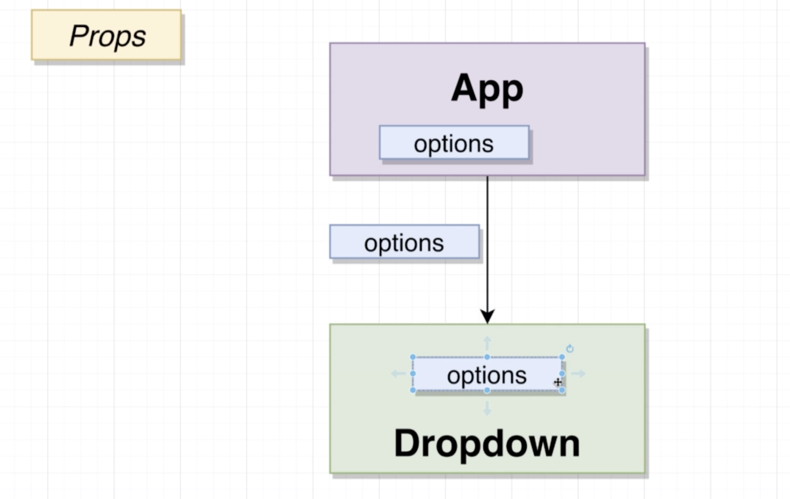
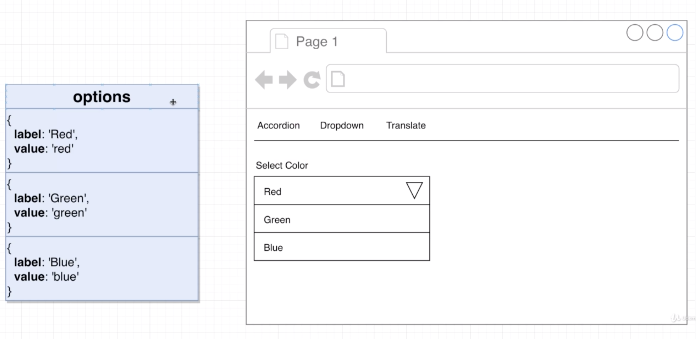

# 20200720 Understanding Hooks in React





We have both a label and a value property. The label is what actually gets displayed to the user. The value is how we interpret whatever the user selects.

We're going to define options inside of our app component and then pass it down to the dropdown as props.

Inside of our drop down component, we can now receive that list of options, we're going to destructure options out of our props object. We will then map over that list of options and build up a list that we want to display to the user.

```js
const Dropdown = ({ options, selected, onSelectedChange }) => {
```

we will receive both those props from App.js file, those selected and onSelectedChange. And we're going to wire them up to the component.

```js
const renderedOptions = options.map(option => {
  return (
    <div
      key={option.value}
      className="item"
      onClick={() => onSelectedChange(option)}
    >
      {option.label}
    </div>
  );
});
```

whenever someone clicks on this div, I want to call the onSelectedChange with the option that we are rendering.

Whenever we click on one of those dives, we are calling onSelectedChange. onSelectedChange from our App.js file is the setSelected function that is going to update our selected piece of state. It will cause the app component to re-render, and then pass down the newly selected option, the dropdown component then in turn takes that newly selected option, it renders itself and it shows that newly selected options label property inside of that div right there.(\<div className="text">{selected.label}\</div>)

```js
const Dropdown = ({ options, selected, onSelectedChange }) => {
  const renderedOptions = options.map(option => {
    if (option.value === selected.value) {
      return null;
    }

    return (
      <div
        key={option.value}
        className="item"
        onClick={() => onSelectedChange(option)}
      >
        {option.label}
      </div>
    );
  });
```

So inside of this array entry representing this option inside of renderedOptions, we will end up with null, and null in react means don't render anything.

---

Two ways to close the dropdown.

The first way we could possibly do this would be to conditionally hide or show the renderedOptions. So if we want to close the dropdown, we could say maybe don't return any options at all or even return an empty ray. And if we want the thing open, just go ahead and do the same thing that we've got right here(\<div className="menu visible transition">{renderedOptions}\</div>). However, if we did that, we would end up with a kind of strange looking dropdown.

```js
<div className="ui selection dropdown (visible active)">
  <i className="dropdown icon"></i>
  <div className="text">{selected.label}</div>
  <div className="menu (visible transition)">{renderedOptions}</div>
</div>
```

Instead, the real way to close the dropdown is to apply a list of CSS classes or remove them.

So to close our dropdown, what we really want to do is not hide or show renderedOptions. We really want to toggle the existence of these classes. A very simple way to accomplish this would be to add a new piece of state to our component. This new piece of state would keep track of whether or not the component is open at any given time. We can then toggle that piece of state from true to false whenever a user clicks on it. So true mean that we want to add in these classes and show the dropdown is open, and maybe a value of false mean don't show these classes and show it is closed.
