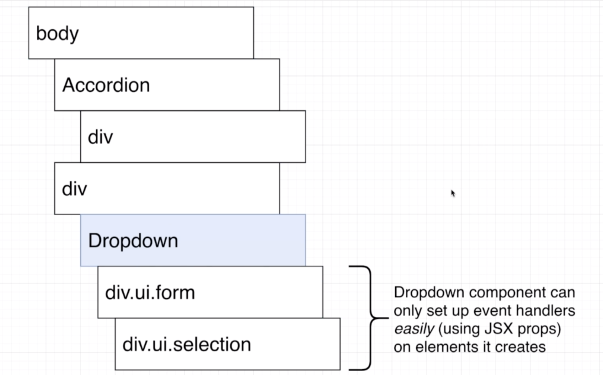
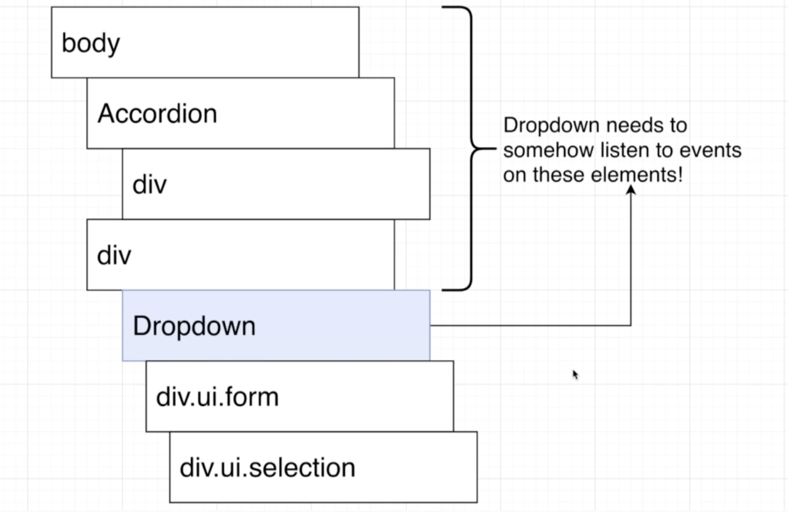
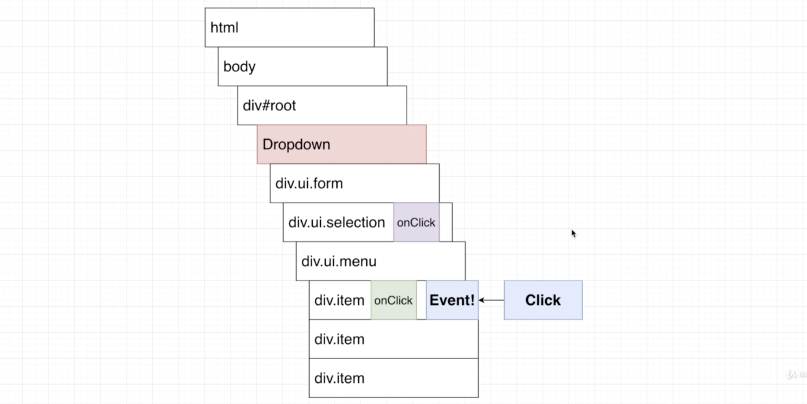
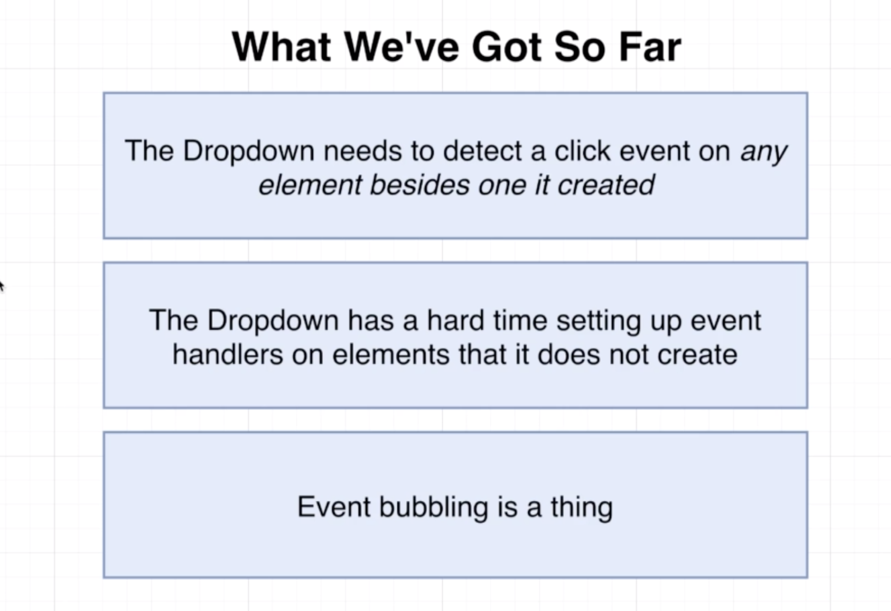

# 20200722 Understanding Hooks in React



the dropdown component itself doesn't actually get inserted into the DOM, in other words, there's not an element inside the DOM called dropdown. I only put this little block inside of here to indicate that everything underneath this represents elements created by the dropdown components.

with our dropdown component, we have a react component. Whenever we create a react component. We return some JSX, that JSX that we return, create some number of elements on the screen. And we can also optionally setup event handlers by providing some props to those elements.

And the key thing to keep in mind here is that the drop down component can only use that syntax(onClick={() => onSelectedChange(option)}) to set up event handlers on elements that it creates. The dropdown can only watch for clicks easily on these elements.



The dropdown, on the other hand, can not easily listen to click events or any kind of event on any component or any element that is not created by the dropdown. The dropdown can not easily set up a click event handler on the body, or some element that is created by the accordion or some other div that might exist inside of our app.

We are trying to click on some element on the screen that is not created by the dropdown and the dropdown just has a hard time to receive or listen to any events that are triggered by clicking anywhere else on the screen. We want to listen to click events being issued to something outside of the dropdown.

because the built in event system that we have with react, this entire feature of adding on click event handlers to particular elements only allows a component to listen to clicks on elements that are created by that component.

---

This is just how the browser works and how the DOM works.

The dropdown does not actually create an element for itself in the DOM.



So we're gonna imagine for a second that a user clicks on this item right here. The browser itself then creates an event object, the event object describes an information about the click (for example, where the user's mouse was is on the screen and what element the user just clicked on).

The browser then hands that event object off to react, react does a little bit of processing on that event and then provides an event object to our onClick event handler.

```js
<div
  key={option.value}
  className="item"
  onClick={() => onSelectedChange(option)} //this one
>
  {option.label}
</div>
```

So onClick gets invoked and the first argument to it is an event object.

Now, here's the key thing to understand, and this is where the term event bubbling comes from.

Whenever a user clicks on that element, the event does not stop there. Instead, this event object then travels up to the next parent element. So the parent element to that div, in this case, it is a div with class name ui.menu. If that element has a click event handler on it, it is automatically invoked.

The event object then goes up to the next parent element, in this case, it is the div with the class of ui.selection. If that element has an onClick event handler, it is also invoked with this event object. And then the event travels up to all these successive parent elements. And in every step the browser checks to see if that element has a click event handler. If it does, it is invoked automatically. This is referred to as event bubbling.

So we would say that this event is kind of bubbling up or kind of rising up our DOM structure.

whenever we click on an element, the dropdown closes. It is because the user is clicking on this div right here. We run that on click. We update the currently selected item, the event then bubbles up, goes to the div with class of ui.selection, which does have an onClick function tied to it. That onClick right there is executed, and we update our open piece of state, which causes the dropdown to close.


