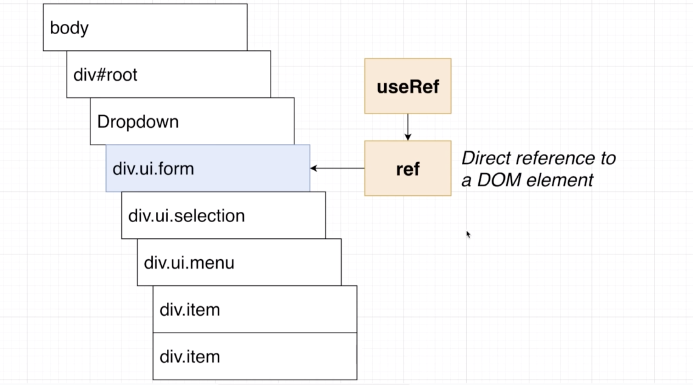
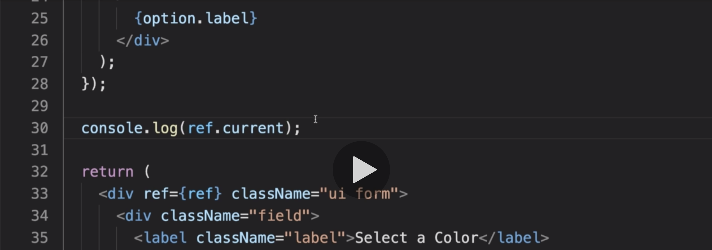
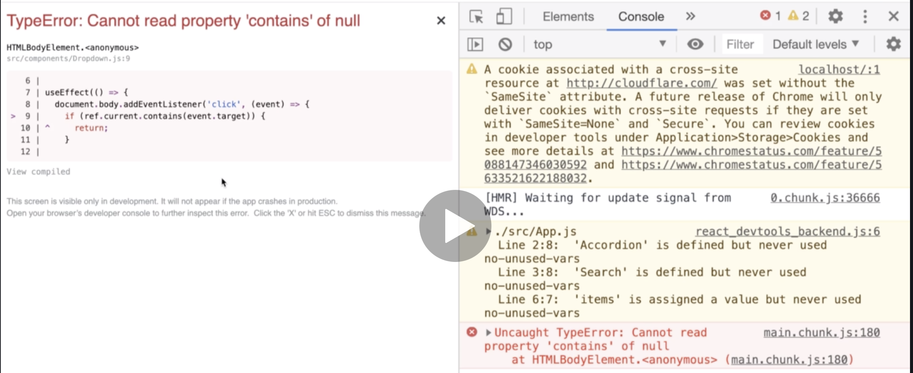

# 20200723 Understanding Hooks in React


So in scenario number one, we can imagine what should happen whenever a user clicks on an element that has been created by our dropdown component. If a user ever clicks on anything created by the dropdown, then we probably do not want any code we wrote inside that body event listener to try to open or closed the dropdown. So in other words, if I click inside of here, I don't want the body event listener to do anything at all.


On the other hand, if I click outside the dropdown anywhere outside, then I definitely want the body event listener to attempt to close the dropdown.

we are not try to interfere with this event object itself. Whenever a user clicks on an element, we are going to allow that event to propagate around our entire DOM structure. It is technically possible to cancel event bubbling, but usually that is bad practice because it can very easily break other aspects of your code. So we are not going to try to stop the event or stop the event listener from running at all.

Instead, inside of that event listener, what we really want to do is put in some code to decide whether or not to attempt to close the dropdown based upon what element was clicked. If it was inside the dropdown, we don't want the body event listener to do anything. And if the click was outside of it, we want the body event listener to attempt to close the dropdown.

We need to figure out what element was clicked and whether or not that element was inside of our dropdown.

```js
document.body.addEventListener("click", event => {
  console.log(event.target);
  setOpen(false);
});
```


we can figure out what element was clicked very easily. We'll go to our body event listener. I'm gonna receive the event object that always comes along with every event listener. And then inside of here, we'll do a console.log of event.target, that is going to be a reference to a DOM element, specifically the specific element that was clicked on. And now whenever I click on anything inside my application, I'll see a console.log of the element I clicked on. So very easy for us to figure out which element we actually clicked on.

But now we need to figure out whether or not that was an element that was rendered or created by our dropdown component.



The hook that we're going to use is called useRef. useRef is very similar to that React.createRef(). useRef allows us to get a reference to a direct DOM element. We're going to make use of useRef to get a reference to the most parent element that has been created by the dropdown. That in our case is the div with a class of ui.form.

once we get a reference to that element, we can take a look at this element and the one that was clicked on and decide whether or not the element that was clicked on is inside of this.

```js
const ref = useRef();

<div ref={ref} className="ui form">

ref.current
```

We're then going to take that ref object and assign it to one of the elements we're returning from this component. So in our case, we want to get a reference to the most parent element that we're returning from our component. That is the div with the class name of UI form.

Now, after our component is rendered for the very first time, we can get a reference to that div by making use of ref.current. It is specifically the current property on the ref that is gonna give us a reference to that div.



You'll notice that the very first time our component is rendered, we get a console.log of undefined. That is because we are console logging the value of ref.current before we return any JSX. So before the ref has been bound to this div, and before that div has even been created inside of our DOM.

However after that, anytime that we re-render our component, ref.current will refer to our top level div.

```js
useEffect(() => {
  document.body.addEventListener("click", event => {
    if (ref.current.contains(event.target)) {
      return;
    }
    setOpen(false);
  });
}, []);
```

ref.current.contains is going to see whether or not the element was clicked on(event.target) is inside of our components(ref.current).

If the element that was clicked on is inside of our component, then we're going to return early. Otherwise, it wasn't inside the component, so we should attempt to close the dropdown by doing a setOpen with false.

that contains method belongs to all DOM elements, and allows us to check if one DOM element is contained inside of another.

---

```js
export default () => {
  const [selected, setSelected] = useState(options[0]);
  const [showDropdown, setShowDropdown] = useState(true);
  return (
    <div>
      <button onClick={() => setShowDropdown(!showDropdown)}>
        Toggle Dropdown
      </button>
      {showDropdown ? (
        <Dropdown
          selected={selected}
          onSelectedChange={setSelected}
          options={options}
        />
      ) : null}
    </div>
  );
};
```

We're going to add in code to App.js to toggle the visibility of the dropdown component entirely(whether or not we show the drop down at all).

Whenever someone calls on onClick event listener, we're going to flip the value of showDropdown to the opposite of whatever it currently is.



```js
useEffect(() => {
  document.body.addEventListener("click", event => {
    if (ref.current.contains(event.target)) {
      return;
    }
    setOpen(false);
  });
}, []);
```

If I click on toggle dropdown, the dropdown goes away. And now if I click anywhere else on the screen, we get a nasty error message.

So the error message is saying that ref.current is evaluating to null, as it says we are trying to call a property contains on null.

whenever we remove a component from the DOM, all the refs that are attached to elements inside that component get set to null, or more specifically the ref.current property gets set to null, because we no longer have an element to refer to. the ref is assigned to the top level element inside of our component. So if that element is removed from the DOM, ref.current gets set to null because there is no longer an element for us to refer to.

However, we still have this body event listener set up, this event listeners still going to run whenever we click on something inside the DOM. So whenever we click on something, ref.current evaluates to null, we then tried to call the contains property on that. And we end up with that error message saying cannot refer to contains on null.

what we really need to do here is make sure that whenever we are about to remove the dropdown component from the DOM, we should turn off this body event listener. So to do so, we're going to make use of that cleanup function from useEffect once again, remember that we can return a function from useEffect. And this will be called right before the next time that first arrow function is called.

There's one other scenario when this clean up function is going to be invoked. And that is whenever we are about to stop showing the entire drop down component on the screen. So if we are about to remove the drop down component entirely, this cleanup function will also be invoked. That makes this a great location to do any kind of cleanup for the entire component that we want to do.

Instead of here, what we really want to do is make sure that we do not attempt to call this body event listener anymore. We really want to detach or remove this event listener from the body element entirely.

```js
useEffect(() => {
  const onBodyClick = event => {
    if (ref.current.contains(event.target)) {
      return;
    }
    setOpen(false);
  };

  document.body.addEventListener("click", onBodyClick);

  return () => {
    document.body.removeEventListener("click", onBodyClick);
  };
}, []);
```

We can then provide on body click as the callback to the body click event listener.

inside of our cleanup function, we're going to make sure that whenever our component is about to be removed from the DOM, we remove that callback entirely.

Inside of removeEventListener, we want to remove an event listener from the click event, and a specific event listener we want to remove is the on body click function.

So now, whenever our component is first rendered into the DOM, because we've got this array right here as the second argument (at the bottom), we're going to run the use effect function exactly one time. At that point, we're going to setup the event listener. Then whenever our dropdown is about to be removed from the DOM, react is going to automatically call our cleanup function. And that's going to remove the event listener watching for that click.

As soon as I show the drop down again, it comes back up and I rebind that event listener, so useEffect runs once again, event listener gets set up again and I can still open the dropdown.
