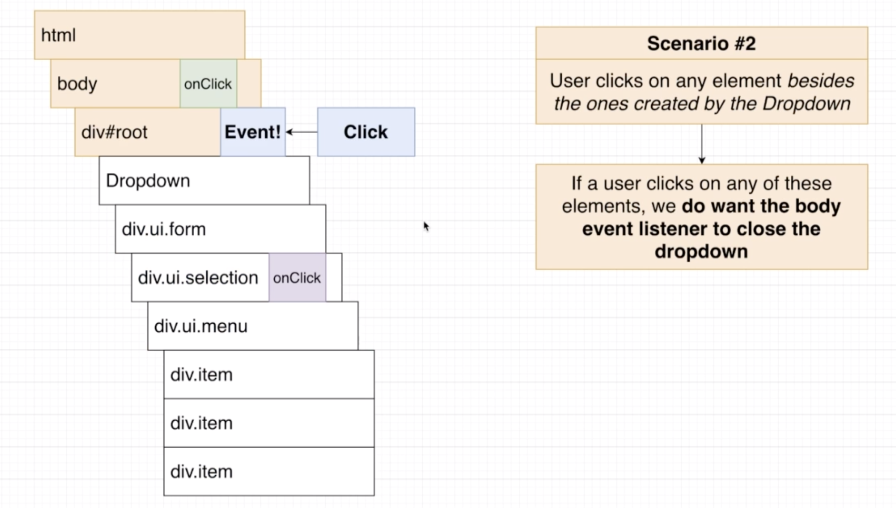

# 20200723 Understanding Hooks in React


So in scenario number one, we can imagine what should happen whenever a user clicks on an element that has been created by our dropdown component. If a user ever clicks on anything created by the dropdown, then we probably do not want any code we wrote inside that body event listener to try to open or closed the dropdown. So in other words, if I click inside of here, I don't want the body event listener to do anything at all.



On the other hand, if I click outside the dropdown anywhere outside, then I definitely want the body event listener to attempt to close the dropdown.

we are not try to interfere with this event object itself. Whenever a user clicks on an element, we are going to allow that event to propagate around our entire DOM structure. It is technically possible to cancel event bubbling, but usually that is bad practice because it can very easily break other aspects of your code. So we are not going to try to stop the event or stop the event listener from running at all.

Instead, inside of that event listener, what we really want to do is put in some code to decide whether or not to attempt to close the dropdown based upon what element was clicked. If it was inside the dropdown, we don't want the body event listener to do anything. And if the click was outside of it, we want the body event listener to attempt to close the dropdown.

We need to figure out what element was clicked and whether or not that element was inside of our dropdown.

```js
document.body.addEventListener("click", event => {
  console.log(event.target);
  setOpen(false);
});
```


we can figure out what element was clicked very easily. We'll go to our body event listener. I'm gonna receive the event object that always comes along with every event listener. And then inside of here, we'll do a console.log of event.target, that is going to be a reference to a DOM element, specifically the specific element that was clicked on. And now whenever I click on anything inside my application, I'll see a console.log of the element I clicked on.
