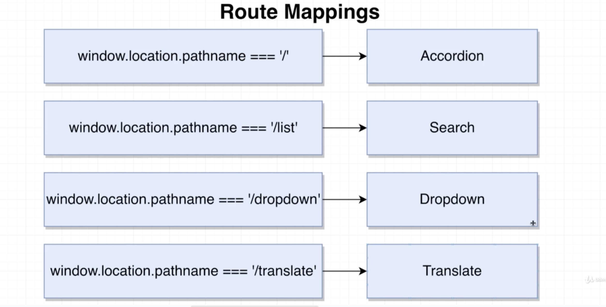

# 20200728 Navigation From Scratch


So we say that we are going to navigate a user around or implement navigation. We are saying that we are going to show different components to the user based upon the current URL that they are visiting. Our root route or the home page, whenever user goes there, we will show the accordion.

to implement navigation instead of react up, we usually make use of a very popular library called React Router.


So the first thing we need to understand is how to determine what URL we are actually at. I'm gonna go back over to my browser and go to the address bar and manually edit URL to localhost: 3000 / translate;

Then once here, I'm going to open up my console, and I'm going to type out window.location.

Window dot location is an object that is built into your browser. This object is going to be automatically updated anytime you navigate around to a different URL. Inside this object, you're going to see a lot of information that has been extracted from the current URL.


So path name is everything inside the URL after the domain(localhost) and the port(3000). So whenever we are at the root route or localhost:3000 with no path whatsoever, we still have a path name of forward slash.



We want to show the accordion whenever window location path name is equal to forward slash.

```js
const showAccordion = () => {
  if (window.location.pathname === "/") {
    return <Accordion items={items} />;
  }
};
const showList = () => {
  if (window.location.pathname === "/list") {
    return <Search />;
  }
};
const showDropdown = () => {
  if (window.location.pathname === "/dropdown") {
    return <Dropdown />;
  }
};
const showTranslate = () => {
  if (window.location.pathname === "/translate") {
    return <Translate />;
  }
};

export default () => {
  return (
    <div>
      {showAccordion()}
      {showList()}
      {showDropdown()}
      {showTranslate()}
    </div>
  );
};
```

we have now implemented some very simple, very basic routing. But there are some big downsides to this approach. For example, inside of each of these, we have some extremely repetitive logic. Every single one of them is really the same kind of check.

```js
const showComponent = (route, component) => {
  return window.location.pathname === route ? component : null;
};
```

we could probably make use of this function right here to control showing all these different functions or components that we've now wired up. But this is not really a super react style approach, rather than making some stand alone function. Maybe you could try making a component.

```js
const Route = ({ path, children }) => {
  return window.location.pathname === path ? children : null;
};

export default Route;
```

a component that would decide when to show some other component based upon the current path name that the user is visiting.

route is probably going to need two different props. The first will probably be a path. So essentially when we want to show some component and then the other prop would probably be the component that we want to conditionally display. Because we have not written out any JSX, we do not actually need to import react into this file. We only need to import react when we are writing JSX.

```js
export default () => {
  return (
    <div>
      <Route path="/">
        <Accordion items={items} />
      </Route>
    </div>
  );
};
```

So instead of four different function calls, we're going to show that new route component four separate times. For each one, we'll provide a path prop that is going to be when we want to show some components. So for the first one, the accordion, we want to show the accordion whenever user goes to a path of just forward slash.

Then to tell the route when we want to show the accordion or which component we want to show, we will provide the accordion inside of the route tag.

Whenever we provide one JSX inside of another JSX tag, that inner element is provided to the outer one as a prop called children. So right now, the accordion element would show up inside of our route component as a prop called children. That's why we are receiving a very special prop with the name of children and returning it if we want to display some inner component.

```js
export default () => {
  return (
    <div>
      <Route path="/">
        <Accordion items={items} />
      </Route>
      <Route path="/list">
        <Search />
      </Route>
      <Route path="/dropdown">
        <Dropdown />
      </Route>
      <Route path="/translate">
        <Translate />
      </Route>
    </div>
  );
};
```

So all we really did here was extract that routing logic into a reusable component.
