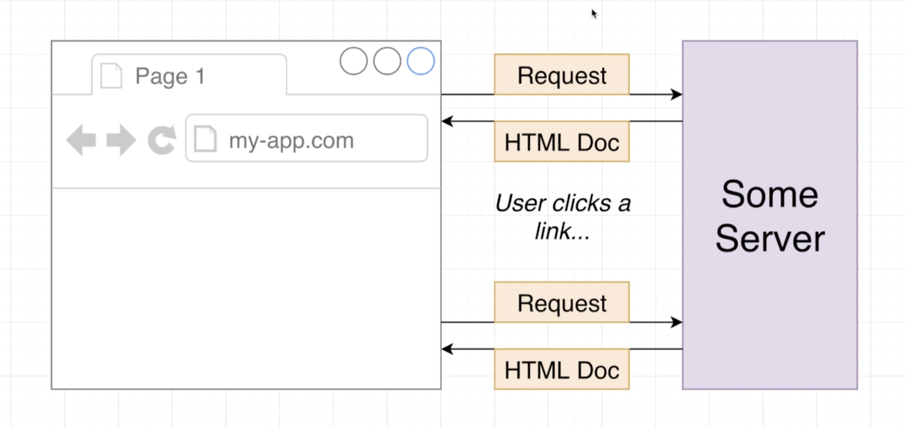
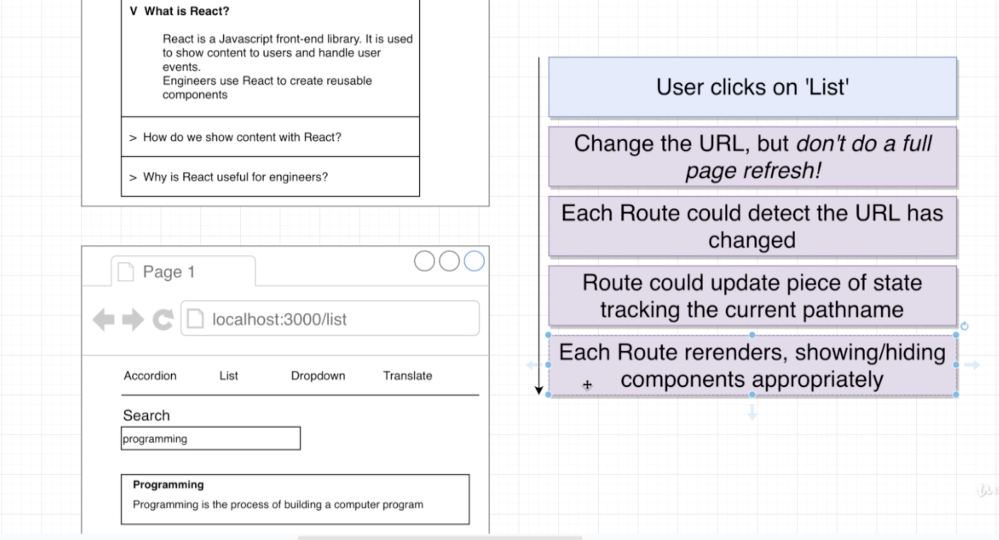
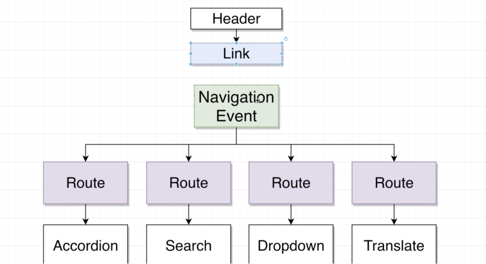

# 20200729 Navigation From Scratch

```js
import React from "react";

const Header = () => {
  return (
    <div className="ui secondary pointing menu">
      <a href="/" className="item">
        Accordion
      </a>
      <a href="/list" className="item">
        Search
      </a>
      <a href="/dropdown" className="item">
        Dropdown
      </a>
      <a href="/translate" className="item">
        Translate
      </a>
    </div>
  );
};

export default Header;
```

The headers can be very basic. We'll show anchor elements to direct the user to the appropriate URLs to show all of our different components.

even though it looks like it works. However, there is a really big downside to this approach. I'm then going to click on one these links and when I do so, you'll see that a variety of different requests are being issued. So every single time that I click on one of these links, I'm making a wide variety of different requests.



This diagram right here is meant to represent a traditional normal HTML based Web application. So not react or anything like that. In a normal Web application, kind of a traditional Web app consisting of a variety of different HTML documents you might navigate to some Web page inside of your browser. Whenever you navigate to a page, your browser makes a request off to some server and gets back in HTML document. The HTML then parsed and displayed on the screen. Any appropriate script tags are loaded up along with any appropriate CSS tags as well.

Then whenever a user clicks on a link, your browser makes an entire another request to another server, and gets back another HTML document. And again, that HTML document might have its own set of script tags and CSS. This is how a traditional Web page handles navigation. We provide normal links whenever you click on a link. You load up another HTML document.

And this is exactly what is happening inside of our app right now. Whenever we click on one of these links, we completely reload the entire index.HTML file inside of our project and reload all the JavaScript and all the CSS as well. And that is not ideal inside of a react application. We have already, when we first come to our application, loaded up our index.HTML file, all the JavaScript, all the CSS. There is no reason in a react app for us to do a hard reload of the page and reload all these different assets. Instead will be really ideal is if we could click on one these links, update the URL but not do a full page reload. Because a full page reload causes a whole bunch of network traffic that is not required just to change some very basic content on the screen.



If I clicked on that list link and went over to this other page, here is ideally what we would do inside of our app. So first, a user would click on that list link and then ideally we would change the URL but not do a full page refresh. So in other words, ideally, we would not make all these additional requests because we've already loaded up all that JavaScript and all that CSS into our app. Then each route component ideally could detect that the URL has changed. We could then possibly have each route component update some piece of state that is tracking the current path name. When we update some piece of state, each route could then re-render and show the appropriate or hide the appropriate components.

So in other words, whenever we click on some link inside of application in a react app, we just plain do not want to refresh the entire page. All we want to do is update the URL. And get all of our different routes to update as well. But we don't want to reload the index.HTML or all the associated CSS and JS.



this is a diagram of a couple of different components we've already created. Each of which are being displayed by a route component. Now, inside the header component, we are going to make a new kind of component called a link. A link is just going to display a link on the screen that's going to show a normal anchor element. But we are going to attach an onClick handler to that anchor element that is going to execute some logic whenever a user clicks on it.

Whenever a user clicks on one of those links, we're going to build a navigation event. This is going to be an object that is going to communicate to the rest of our application that the URL has just changed. This navigation event will then be sent off to all of the different route components inside of our app. When they receive this navigation event, they're going to know that the URL has just changed. They'll then take a look at the updated URL and decide whether or not they should show their respective child components.

We're going to make a new component called Link. We're going to build up an anchor element inside of it and attach an onClick handler. Whenever user clicks on that anchor element, we're going to emit navigation object and we're then going to listen for that in all of our different routes.

So we want to show a link everywhere inside of our app instead of a normal anchor element. So now whenever we display a link, we are still going to provide an href prop, a class name and some text. We should make sure first that the link component receives those different props and applies them to the anchor element that's being displayed.

```js
const Link = ({ className, href, children }) => {
  const onClick = event => {
    event.preventDefault();
  };

  return (
    <a onClick={onClick} className={className} href={href}>
      {children}
    </a>
  );
};
```

So instead, we need to make sure that we take these props to the link component and pass them through to the anchor element that is being displayed inside there. And then finally, the text inside would be this children prop. On that anchor element, I'm going to put in an onClick. Whenever a user clicks on this anchor, we're going to run a helper function called on Click. whenever we define an event handler, it's almost always going to receive an event object.

The first thing we want to do whenever user clicks on an anchor element is make sure that we do not do a full page reload. So to prevent a full page reload inside this onClick handler, we will call event.preventDefault. That is going to prevent the normal behavior of the browser, which would cause a full page reload.

now whenever I click on one of these links, you'll notice that nothing happens at all. there's no additional requests. No content changes or anything like that.

So now the next thing we need to do is make sure that we change the URL. We have to change the URL without causing a full page refresh.
