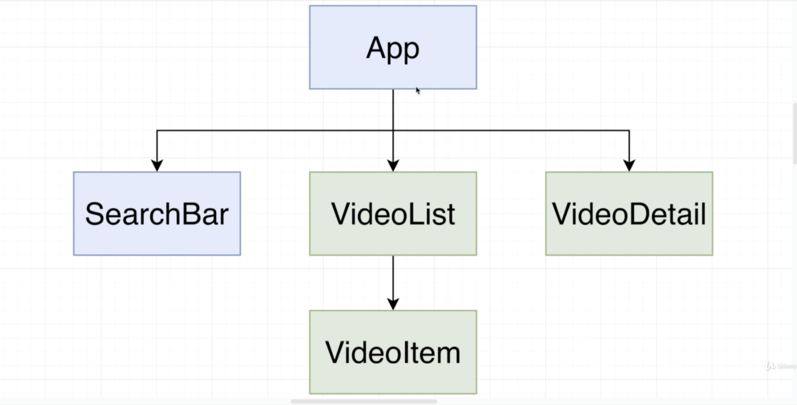
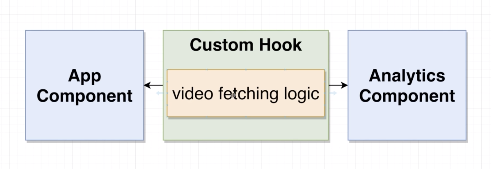
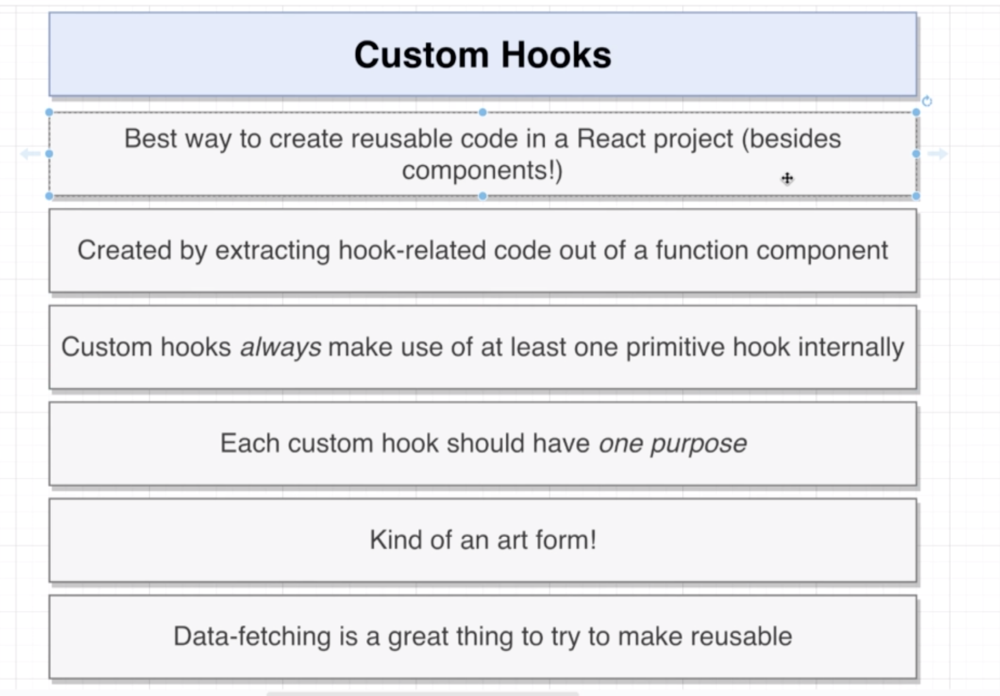
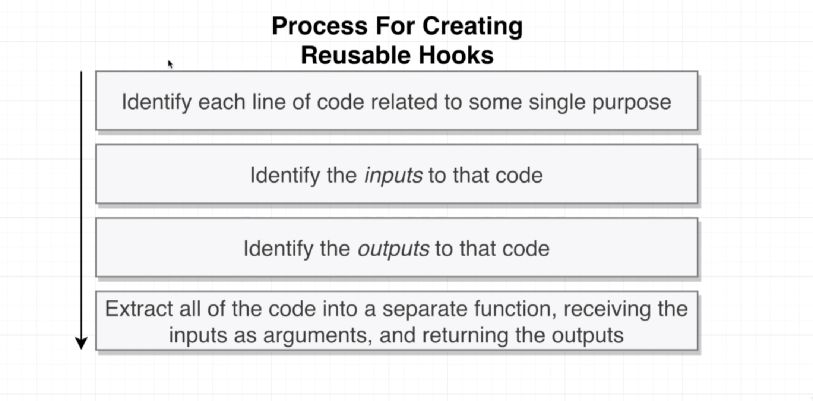
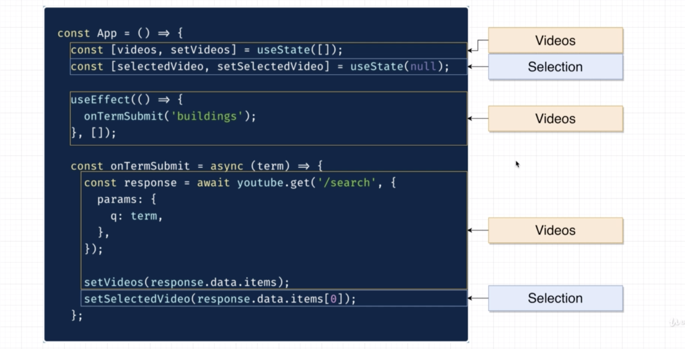
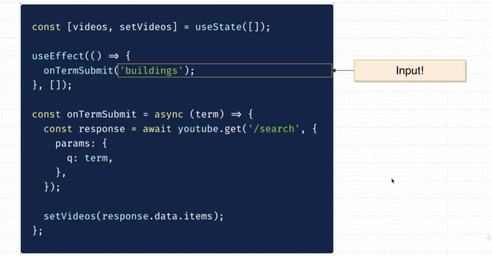
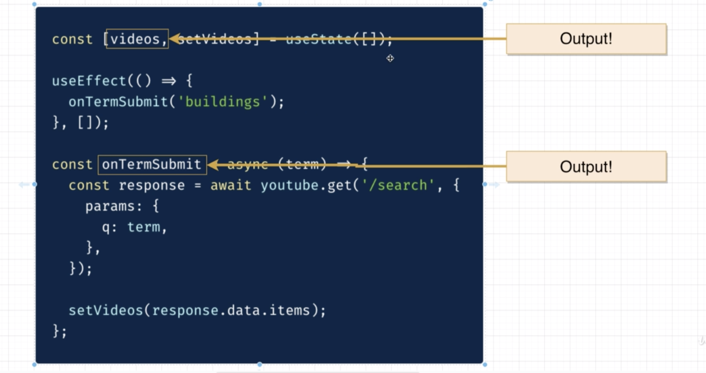
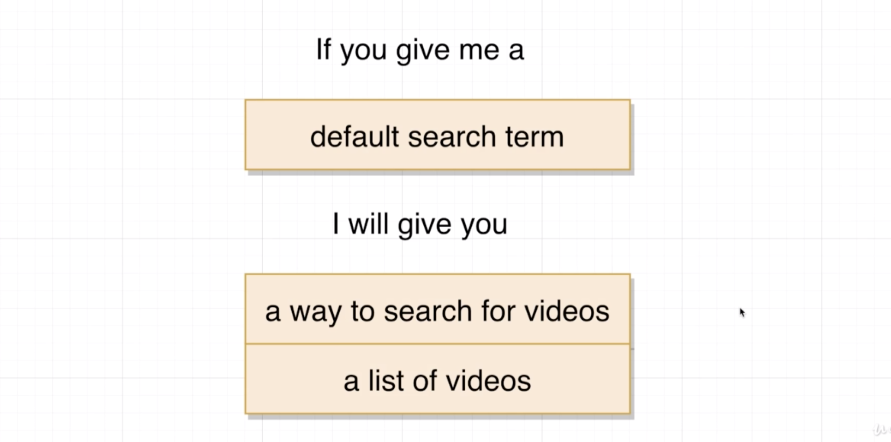

# 20200801 Hooks in Practice



video list, video detail and video item are all function components with no state tied to them. However, the app component is making use of both state and lifecycle methods and the search bar is making use of state.

search bar definitely does not make use of any life-cycle methods. And because of that, we probably do not need to make use of the use effect hook inside of here. Use effect is usually used inside of a function component to kind of emulate or simulate the use of a lifecycle method.

```js
const SearchBar = ({ onFormSubmit }) => {
  const [term, setTerm] = useState("");

  const onInputChange = event => {
    setTerm(event.target.value);
  };
  const onSubmit = event => {
    event.preventDefault();
    onFormSubmit(term);
  };
};
```

we're going to move over both of these event handlers. Whenever we move event handlers into a function like this, remember, we're going to declare them as functions inside the body of this function. So to do so, all we will have to do in this case is make sure that we put in the const keyword in front of both of those event handlers.

Then inside those event handlers, I'm gonna make sure I update the code for both them.

---

```js
const onVideoSelect = video => {
  setSelectedVideo(video);
};

return (
  <div className="ui container">
    <SearchBar onFormSubmit={onTermSubmit} />
    <div className="ui grid">
      <div className="ui row">
        <div className="eleven wide column">
          <VideoDetail video={selectedVideo} />
        </div>
        <div className="five wide column">
          <VideoList onVideoSelect={onVideoSelect} videos={videos} />
        </div>
      </div>
    </div>
  </div>
);
```

```js
return (
  <div className="ui container">
    <SearchBar onFormSubmit={onTermSubmit} />
    <div className="ui grid">
      <div className="ui row">
        <div className="eleven wide column">
          <VideoDetail video={selectedVideo} />
        </div>
        <div className="five wide column">
          <VideoList
            onVideoSelect={video => setSelectedVideo(video)}
            videos={videos}
          />
        </div>
      </div>
    </div>
  </div>
);
```

anytime we have a one line function callback, usually a good sign that we should probably just try to provide that function in line to whatever prop it is going off to. In this case, onVideoSelect is being provided to the VideoList component, rather than making a separate on video select function, we can probably just define that function or provide it in line right here instead. And that hopefully will make our overall function component just a little bit easier to read and understand.

```js
<VideoList onVideoSelect={video => setSelectedVideo(video)} videos={videos} />
```

```js
<VideoList onVideoSelect={setSelectedVideo} videos={videos} />
```

We are receiving some list of arguments in this case, just one argument. We then turn around and provide that exact list of arguments. Again, in this case, just one argument to the set selected video function. Anytime you see some code like this where you take one argument and just pass it directly through in the same order to some other function, that is a sign that we could do a little refactor. this is a hundred percent equivalent to the code we just had.

---

Naturally, any time we've got some identical code shared between two different locations inside of a project, that is usually a sign that we want to extract that code and make it a little bit more reusable in nature.



To make reusable code when we are making use of function components and hooks, we create custom hooks. rather than duplicating that code in two locations, we would instead create a custom hook. This is essentially a function that is going to have a couple of references to maybe use state use effect inside of it. Then our app component and the analytics component can make use of this custom hook to fetch a list of videos. as opposed to duplicating all that logic between the two.



So usually we make use of custom hooks any time we want to make some calls to say use state or use effect a little bit more reusable. We are always going to create custom hooks by extracting some hook related code out of an existing function component. We are usually with a custom hook, not talking about anything related to JSX. To make JSX reusable in any way, we always create another component. So custom hooks are always going to contain at least one primitive hook.

when we use the term custom hook. We're not talking about building up a primitive hook. We're not building something like use state or use effect from scratch. Instead, we're just talking about taking some existing code that is making use of use states or use effect and putting it into a reusable function. anytime you have data fetching code, that is usually a great kind of thing to try to make into a custom hook.



The first thing we're going to do when building a reusable custom hook is take a look at existing components. And inside of some existing component, we're going to identify each line of code related to some singular purpose.

So in our case, we're going to look at all the non JSX stuff inside of our app component and line by line, we're going to try to identify the purpose of that code.



inside the app component, we really have two major goals. We're working with two pieces of state and all this code is related to managing those two pieces of states. They are our list of videos and a selected video.

In our case, the currently selected video is kind of a property of or a function of the overall list of videos. If we were working with Redux, we would technically say that the selection piece of state is derived off of the overall list of videos. So even though we can't have a currently selected video if we don't fetch them. Well, nonetheless, selection is not really so much about fetching videos as it is about picking one of the currently fatch videos. setSelectedVideo doesn't really care so much about the response data as it does about the overall list of videos. So we would again say that selection is really kind of a derived property of the overall list of videos.



What are the arguments to those pieces of code? What are the outside inputs that are required to make that code run? The default search term. This is the only thing that is kind of required from the outside as input to this code to make it run correctly. If we provide a default search term, everything else inside of here is going to more or less work as expected. So in this case, you would say that this default search term is really the only input to this block of code.

The next, we are going to identify the outputs. And by output's we mean to say out of the videos related code, what do we get back? What do we take from this code and make use of inside the JSX of our application or inside this component?



in that we really have two outputs, the outputs from all the videos related code is just the video's array itself and the on term simit function. Those are the only variables inside of all this stuff that we make use of anywhere else inside of our component.

Trying to extract all that code. We want to try to take those inputs and outputs and insert them into a sentence.



If you give me a list of inputs, I will give you a list of outputs and you want to be build to take all the inputs and outputs you have identified and have the overall sentence makes sense.

So in our case, our input is a default search term and our outputs are a function to use to search for videos and a list of videos. Overall, we would read this as if you give me in this case me is the custom hook.

---

```js
const useVideos = defaultSearchTerm => {
  const [videos, setVideos] = useState([]);
  useEffect(() => {
    onTermSubmit(defaultSearchTerm);
  }, []);
  const onTermSubmit = async term => {
    const response = await youtube.get("/search", {
      params: {
        q: term
      }
    });

    setVideos(response.data.items);
  };
};
```

Our entire goal here is to extract all the videos related code into some reusable hook looking function. We're going to always place all of our custom hooks inside of a separate folder inside of our src directory.

in our case, our input was that default search term. Now, at present, having a hardcoded default search term of buildings works totally fine inside of our application. But remember, we are trying to build some reusable code here, and this reusable code might need to be used between different components. The app component might want to have a very different default search term than the analytics component. And that's why we're going to try to make this default search term a little bit more customizable. That's why I'm saying that it is technically an input. We don't really want to have it be a hardcoded string in the long term.

So I'm going to assume that the default search term will be provided as an argument to use videos. We will then take that default search term and provide it to on term simit instead of the hardcoded buildings.

```js
const useVideos = defaultSearchTerm => {
  const [videos, setVideos] = useState([]);
  useEffect(() => {
    onTermSubmit(defaultSearchTerm);
  }, []);
  const onTermSubmit = async term => {
    const response = await youtube.get("/search", {
      params: {
        q: term
      }
    });

    setVideos(response.data.items);
  };
  return [videos, onTermSubmit];
};
```

we're now going to make sure that we return all the outputs from our hook. So our outputs are our list of videos and a function that can be used to search for a new list of videos. So the very bottom of our hook, we can return these two things in one of two ways, we can either follow the convention of useStates, which is to return an array. useState returns an array that has our piece of state and a setter inside of it. If we want to, we could follow that same convention. Inside of here, we could put in our list of videos and a function that can be used to change that list of videos, more or less. This doesn't necessarily directly change list of videos. It is used to do a search, but more or less, it is a function that can be used to modify that data.

So if we want to, we can follow the same convention as the useState hook or alternatively we can do what is a little bit more common in the JavaScript community. And that would be to return an object. That has properties of videos and onTermSubmit. There's no requirements in how you return values from a custom hook. You can either follow the convention of react, which is to return array that has stuff inside them. Or you can do the more common JavaScript convention, which is to return an object.

```js
const useVideos = defaultSearchTerm => {
  const [videos, setVideos] = useState([]);

  useEffect(() => {
    search(defaultSearchTerm);
  }, []);

  const search = async term => {
    const response = await youtube.get("/search", {
      params: {
        q: term
      }
    });

    setVideos(response.data.items);
  };
  return [videos, search];
};
```

The one very small improvement we might make here would be to rename onTermSubmit function to simply search. that's what this function really does.

So this now is our custom hook. We can make use of use videos in any component. And as long as we provide a default search term, we will always get back a list of videos and a function that we can use to update that list of videos as well.

---

```js
const App = () => {
  const [selectedVideo, setSelectedVideo] = useState(null);
  const [video, search] = useVideos("buildings");

  useEffect(() => {
    setSelectedVideo(videos[0]);
  }, [videos]);

  return (
    <div className="ui container">
      <SearchBar onFormSubmit={search} />
      <div className="ui grid">
        <div className="ui row">
          <div className="eleven wide column">
            <VideoDetail video={selectedVideo} />
          </div>
          <div className="five wide column">
            <VideoList
              onVideoSelect={video => setSelectedVideo(video)}
              videos={videos}
            />
          </div>
        </div>
      </div>
    </div>
  );
};
```

Now, inside of our app component, we're going to call that hook exactly as though it were any other kind of hook, like useState or useEffect or something else. Whenever we call useVideos, we then get back an array that has two elements inside of it. Our list of videos and a function we can use to search for videos. So I'm going to destructure those two arguments out of that array using the same syntax we use with useState.

First off, we need to make sure that any time we get a new list of videos, we still select automatically the first video in that list. We also need to make sure that anytime the user submits a search term through search bar component, we continue to do an actual search of the YouTube API.

We can now just provide a reference to the search function. instead of onTermSubmit, we'll put in search. That means whenever a user submits a search term, the first argument to onFormSubmit is gonna be the term the user typed in. That will call our search function. We're going to receive that term, do our search and then update the video's piece of states. Because we are updating a piece of state and a function that is called by a component, the App component is still going to be automatically re-rendered, just the same as though we had the video's piece of state defined directly inside the App.js file. That's gonna take care of onFormSubmit. Now, we need to also make sure that we still get a selected video.

So previously we said that immediately after we got a new list of videos, we would select automatically the first video inside that list.

Here's what we can do to write out some very equivalent logic. We can call use effect. And inside of the second argument, we're going to say anytime we get a new list of videos. Any time we get a new list of videos or any time it changes, we're going to run this arrow function. So any time we complete a search and we get our new list of videos, we are going to select the very first video in that list that we will call set selected video.

---

```js
useEffect(() => {
  search(defaultSearchTerm);
}, []);

useEffect(() => {
  search(defaultSearchTerm);
}, [defaultSearchTerm]);
```

You might see a warning inside of here around React Hook useEffect has a missing dependancy: defaultSearchTerm. that means that back inside of our use videos hook, whenever we make use of some outside variable inside useEffect, react wants us to list that argument(variable) inside of this array (arrow function).

The reason for that is that it solves a lot of stale data references. Now, if we ever decide to call use videos again, but provide a different default search term, then we're going to make sure that we automatically refetch our list of default videos again.
