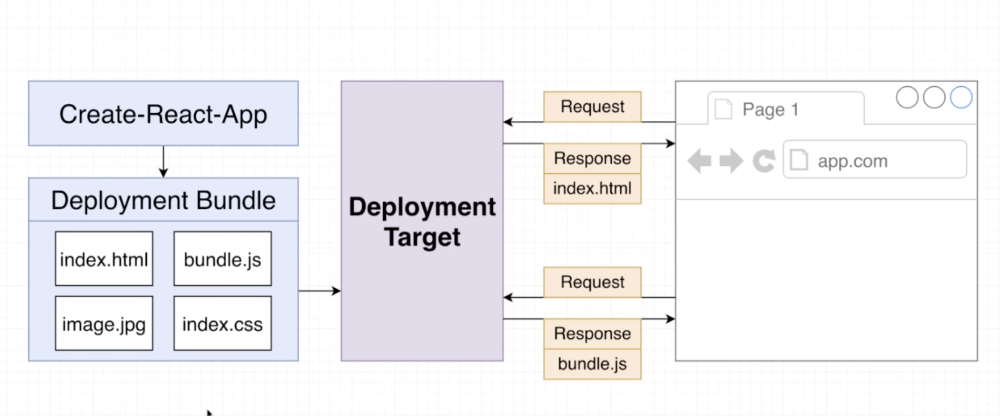
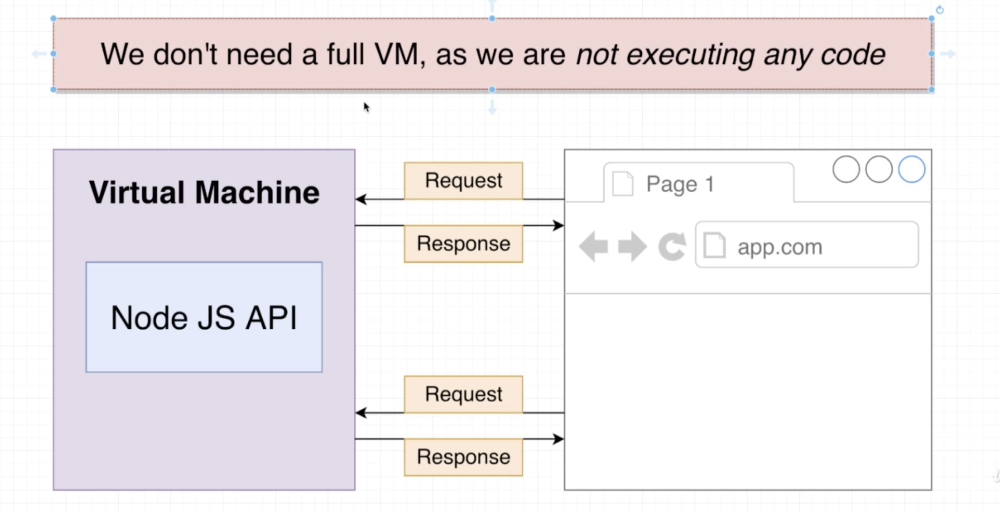
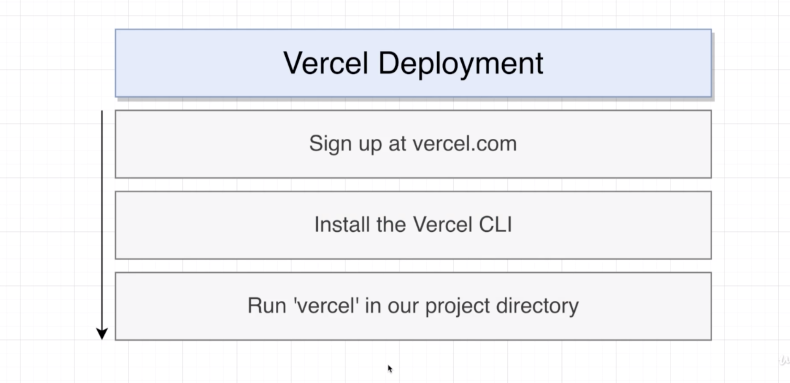
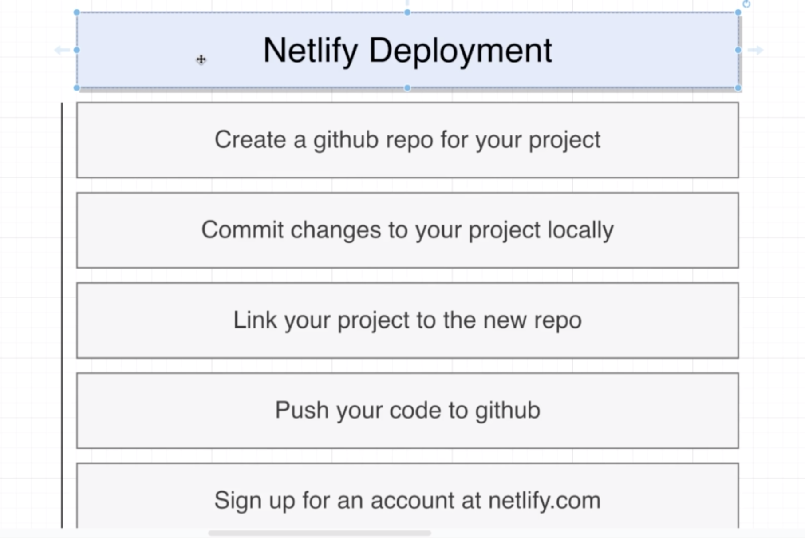
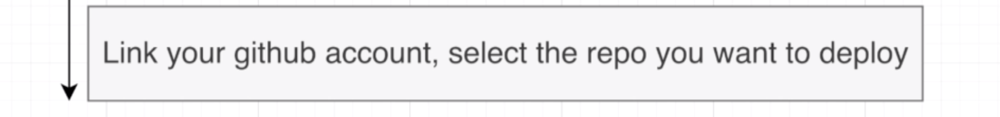

# 20200804 Deploying a React App

We've built out a variety of different applications, but right now they can only be used on our local machine. We're going to deploy our applications online, that whoever else can visit these applications and try them out on their own.



we are making use of create react app, built in to create react app is a command to build out our project. When we build our project, it creates what is called a deployment bundle. In this deployment bundle are a couple of different files that are required to run our project inside of our browser. These are all static files and these are used for the actual deployment. static files are just normal files that can exist inside of some folder or directory.

we've been running create react app in development mode, which means that there is a running development server. When we build our project and build up this deployment bundle, we no longer have a running server. Instead, we just need to load these files into a browser to run our application.

So we are going to take those files and upload them to some kind of deployment target. The deployment target right here is going to be the service that we used to deploy our application. This might be whatever service provider we decide to deploy our app to. This deployment target is going to take these files and host them.

Then whenever user types in our domain into their browser, their browser is going to make a request over to our deployment provider and they're going to immediately get back response that contains always the index.html file, that file will be loaded up inside the browser, and inside of it will be some variety of script tags, linked tags and so on. That will cause the browser to make additional requests and get some additional JavaScript files or CSS files.



the deployment of REACT application, we do not have to be running some kind of virtual machine or anything like that to deploy a react application. You only need a virtual machine if you're running some kind of active server, some kind of server that is actively running some code. So, for example, you might need a virtual machine if you're running a Node JS API. The expectation here is that this virtual machine is going to run this server process and this server will respond to incoming requests. We do not need a virtual machine to deploy a react application because we are not executing any code whatsoever on any server when we host our REACT application. The only thing we are hosting are these very plain static files. These files would be equivalent to just uploading a couple of images and then downloading them over time.

it means that it costs dramatically less to deploy a react application than it does to deploy something like a Node JS server or API. Virtual machines cost a lot of money to rent and run every month. But hosting static files like what we're going to do with our REACT application is usually very cheap or even more frequently just plain free.

The deployment process is identical for any project using create-react-app.



we can now go back over to our terminal. We're going to install the Vercel CLI and then run one or two quick commands with it.

So at my terminal, I'm going to navigate to my YouTube project directory.

```js
npm install -g vercel
vercel login
vercel
```

This is going to install the Vercel CLI onto your local machine. If you run this command in your own windows and you get an error, just make sure that you reopen your command prompt as an administrator and they can try running this command again.

I'm then going to run one command to sign into Vercel through the CLI. Then I'm going to run simply vercel. And we will see a series of different questions. And then the very last question you'll notice that it has detected that we are making use of a create react app project. After that we'll then be told that our application is being built and deployed.

403 means forbidden. You should check your YouTube API key and see if you've set it to only be used on localhost.

```js
vercel --prod
```

We might eventually make some update. So how would we redeploy our application now? to redeploy our app. We'll just go back over to our terminal.

So, again, anytime you want to deploy a project, just run vercel inside your project directory. Any time you want to redeploy it (a new update), just run vercel --prod.

---




The next provider that we're going to deploy with is called Netlify. Netlify is very similar nature to vercel. It is a little bit harder to use, but it's also got many more features tied to it.

To deploy with Netlify, we are going to create a GitHub repo for our project. We're then going to commit all of our changes locally to a git repository. We're going to link our local project with our GitHub repository and then push all of our code up. After that we'll then go over to Netlify create an account and then link our GitHub account and the repository that we want to deploy. Netlify then going to automatically pull our code out of this repository, build it and deploy it.

```js
git add .
git commit -m 'deploy'
```

I'm going to commit all the changes that I've made to my projects so far.

```js
git remote add origin git@github.com:fiona20072007/react-exercise.git

git remote -v

git push origin master
```

After that I'll then link this repository with the repository they I just created on GitHub.

now we've linked these two repositories, we're then going to push all of our code to GitHub.
