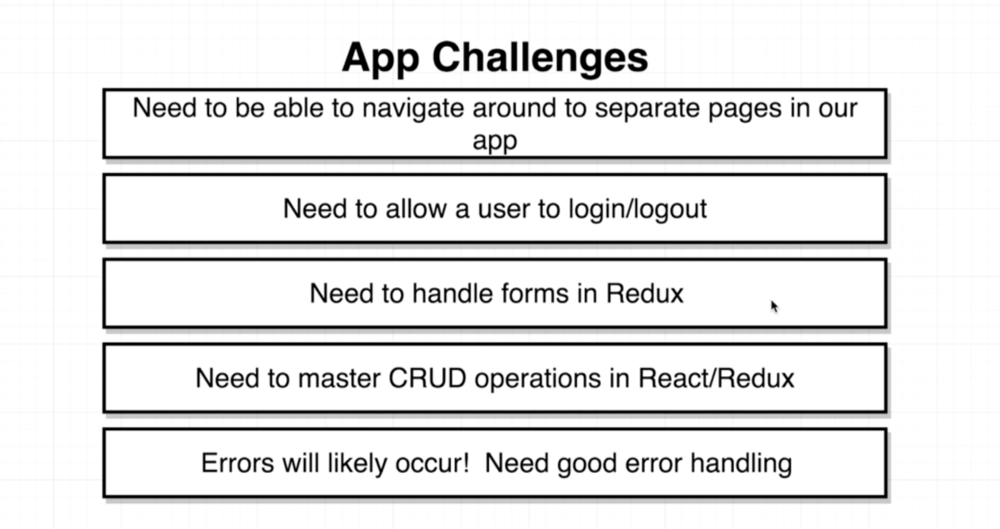

# 20200806 Navigation with React Router

Essentially we have some streamer running a computer and on their computer they are running some streaming software, very common software to be running to stream video is called open broadcaster software that is an actual program. OBS not only used for streaming video it is also used for recording your desktop to a video file as well.

So when you run OBS on your computer thats going to essentially record your desktop and stream that video to some outside server. One way of putting this video streaming server together is to create something called a RTMP server. This is a specialized server that is going to receive an incoming video feed and then broadcast that video feed out to a bunch of different viewers who can watch from their browser. a RTMP server is not limited to just one streamer at a time. So we could potentially have several different streamers all sending video to our single server right here, and then many different viewers could be watching each of these different streamers at the same time.

We are going to put together this RCMP server but we're going to use a third party package to make it easy and straightforward. So this is kind of like a very simple and straightforward approach of the video streaming process. But in a real streaming application like twitch and the one that you and I built there's actually one other server inside this mix. You see the RTMP server here is only about streaming video. That is its sole purpose. But we also have some other information that we want to share with our users.

A user is going to need to know what streams are currently broadcasting or what streams exist inside of application. So we're going to have a separate API server up here. That essentially is just going to store a list of all the different streams or channels that are available inside of application. So a user is essentially going to first inside the browser visit that server and see the list of streams that are available. Once they see an appropriate stream they can then select that stream and that will essentially make a request over to this RTMP server to get the live video feed and then show it on the screen to the user inside their browser.

So in total we're really going to have three different moving pieces here. We're going to have our react application running inside the user's browser. We're going to have a tiny API server that essentially lists out all these streams or channels that a video can watch. And then finally we're going to have this RTMP server that is actually responsible for handling the video streams itself.

First off we need to be able to understand how to navigate a user around to separate pages inside of react application. To do this, we're going to use a library called react router. Next up we need to build to allow a user to log in and log out of our application. To handle authentication, we're going to be making use of Google Oauth. Next up we need build to understand how to handle forms in redux. Now we've already seen how to handle simple text inputs inside of react and we've seen how to put a form together. But we start making use of redux the techniques that we use to generate a form that user can enter stuff into It's going to change ever so slightly.

Now crud right here is an acronym, it stands for creates read update destroy. these terms right here are talking about different operations that we might do on records inside of a web application.
